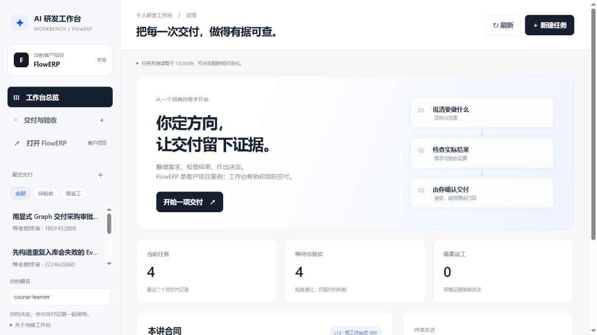
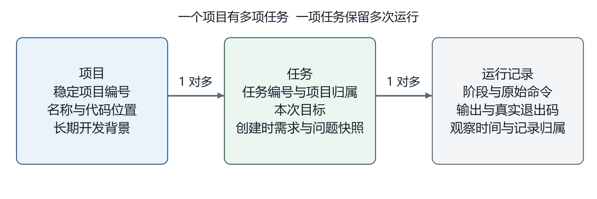

# L01｜以终为始：一次可验证的 AI 交付怎样完成？

这一讲，你会在 Codex 的帮助下，做一个保存开发任务和检查记录的小程序。读完下面的例子，再打开[实践操作手册](./实践操作手册.md)动手。

## 1 今天做什么

我们最终要用 Codex 搭建个人研发工作台，再通过工作台持续开发 FlowERP。工作台给开发者用；FlowERP 给电商企业处理库存、订单等业务。

今天先做工作台的第一版，叫 **Workbench V0.1**。它在终端里使用，能登记项目、保存任务、追加检查记录，并把这些内容查出来。网页和自动执行以后再做。L04 才开始通过工作台交付 FlowERP，本讲不修改它的业务功能。

*读图：先认出项目、任务和验收入口；本讲只做终端记录功能。*

后续要建成的工作台参考界面（2026-09-05）。先认出项目、任务和验收入口即可；今天做的是终端中的记录功能。

## 2 为什么先做这个

**工作台首先要解决开发记录不能持续保存、方便查回的问题。**

> **案例｜隔天继续开发，却找不到依据**
>
> 假设昨天你让 Codex 写了一个小工具。今天继续时，却记不清当时要求什么、哪里测试过、哪个问题还没解决，只好重新翻聊天。

第一版工作台就是用来保存这些信息的。你输入任务编号，应该能查到当时的要求和历次检查结果。

本讲抓住一个具体问题来练：**保存了任务，关闭程序后还能查回来吗？**

## 3 谁来做

工作台还没有建好，由你直接组织开发。你说明遇到的困难，Codex 帮你追问细节、提出方案、写测试和代码。你决定先做哪些功能，检查实际改动，并判断结果能否接受。

做好的第一版负责保存和查询记录，暂时不会自动指挥 Codex。

## 4 先把要求说清楚

“帮我做个工作台”还不够具体。可以先与 Codex 讨论：任务要保存哪些内容？关闭后还要保留吗？同一个编号能不能重复使用？

把自己的决定写成 **Spec，也就是本次需求说明**。例如：

> **案例｜把持久保存写成可检查的要求**
>
> 创建任务 A，保存它的要求。关闭程序后重新查询，要求仍然在。再次用编号 A 创建任务时，应拒绝，原内容不能被覆盖。

这是一个要求的示例。你还要覆盖下一节的五个操作，说明允许修改哪些文件，并签署自己的 `WORKBENCH_SPEC.md`。每个关键要求都要能说清：原来遇到了什么问题，Codex 建议了什么，自己为什么这样选。

## 5 程序需要保存什么

先分清三样东西：

| 名称 | 本讲的例子 |
|---|---|
| 项目 | 个人研发工作台，今后还会继续开发 |
| 任务 | 这次开发工作台 V0.1 |
| 运行记录 | 某次检查运行了什么命令，输出什么，成功还是失败 |

一个项目可以有多个任务，一个任务可以有多次运行记录。任务还要保存**创建时的需求副本**，否则以后改了需求文件，就查不清当时按什么要求做的。

*读图：一个项目包含多项任务，每项任务保留需求快照和多次运行记录。*

从左往右读：一个项目有多项任务，每项任务保留多次运行记录。中间的“快照”就是创建任务时保存的内容副本；右侧的“退出码”用于表示命令是否成功结束。

这版程序提供五个操作：初始化工作台、登记项目、创建任务、追加运行记录、查看状态。数据保存在本地，程序关闭后仍应保留。完整命令在实践手册中，先理解它们分别做什么即可。

## 6 怎样知道做对了

先把需求变成能运行的测试。针对“关闭后还能查询”，测试要实际创建任务、结束原进程，再启动新进程读取并比较内容。

实现前，因为缺少这项能力，测试应失败，这叫**红灯**。让 Codex 实现后，用同一测试再次检查，通过叫**绿灯**。如果失败原因是环境没装好，应先修环境；如果一开始就通过，要查清已有能力，不能补写失败记录。

通过以后，还要查看 **Diff，即修改前后的代码差异**，确认改动没有越界，也没有删掉关键检查来换取通过。

至少核对这些情况：

- 新建任务后，重启仍能读回原内容。
- 重复编号被拒绝，原任务和记录不变。
- 向不存在的任务追加记录被拒绝，没有留下多余记录。
- 缺少检查材料时，如实说明缺什么，已有材料仍在。

出现“拒绝”提示后还要查询数据，确认没有一边报错、一边改坏原记录。

## 7 用新程序记录自己的开发过程

开发时，先用手册提供的采集工具保存命令和真实输出。工作台做出来后，再登记“个人研发工作台”项目，创建“开发 V0.1”任务，把此前的失败和通过记录导入。

**用新工作台记录它自己的建设过程，本课叫“自举”。** 导入后要能查到原要求和两次结果。保存一条失败记录成功，不代表那次测试通过。

*读图：先采集记录，再建任务并导入；材料齐全后仍需人审核。*

上排是先采集、再建任务、再导入；下排比较导入前后的查询结果。图中的三份记录是红灯、代码差异和绿灯。材料齐全后仍要由人审核。这是步骤示意，不是你的运行结果。

现在打开[实践操作手册](./实践操作手册.md)，从第 1 步准备隔离练习区开始。按顺序完成需求确认、测试、实现、复验和自举；卡住时先看该步的预期结果和手册末尾的故障定位，不要跳过失败继续填“通过”。

## 8 做到什么程度算完成

你需要留下自己确认的需求、实现前失败、实际代码改动、实现后通过，以及工作台查回自身建设记录的结果。个人说明放在隔离练习区的 `lesson-01-submission/`，按手册逐步填写真实观察。

请同伴补查一项你可能漏掉的行为，保留反馈和修订。最后由你写明接受、退回或依据不足，以及理由。完整要求见[行动卡](./行动卡.md#大纲四项合同)。

提交前再做一个小练习：假如用工作台管理“文档校对”项目，哪些记录可以沿用？怎样检查引用原文没有被误改？写出一个正确例和一个错误例，说明需要怎样验证。这个练习检查你能否把本讲方法用于另一件事。

下一讲，我们再把反复需要说明的项目规则写进 `AGENTS.md`，供后续协作使用。
