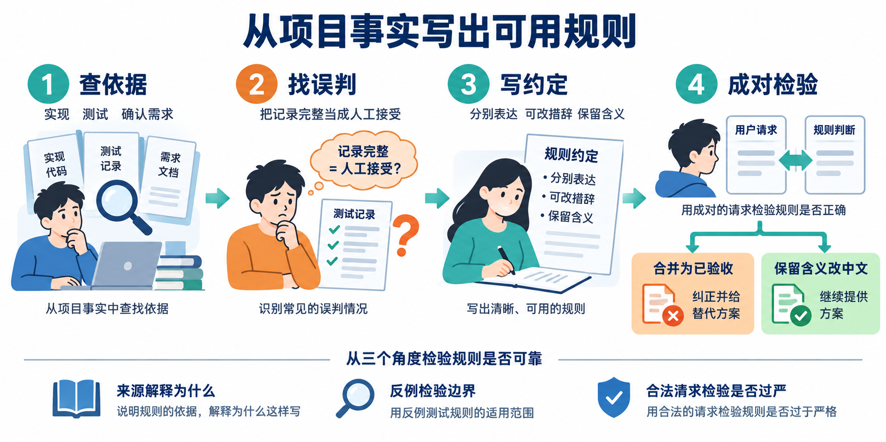
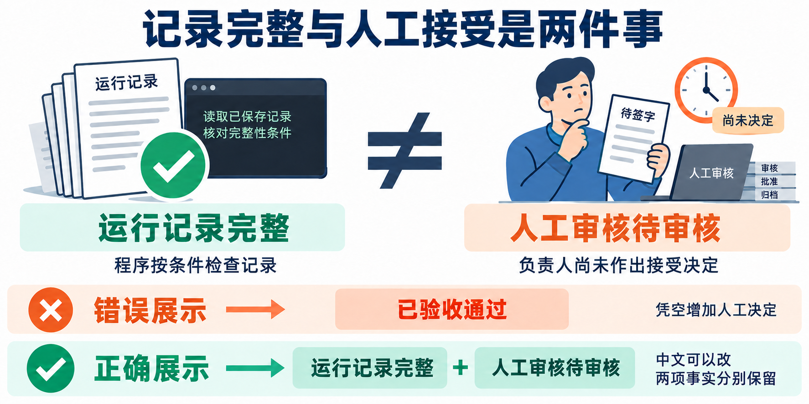
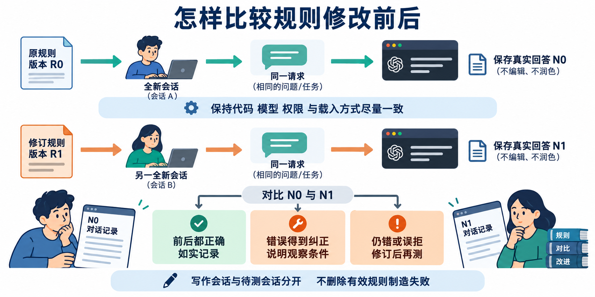
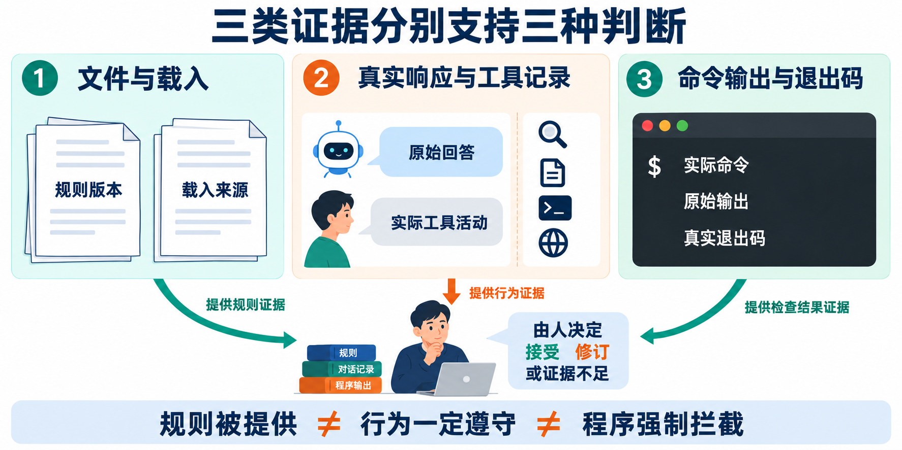

# L02 实践操作手册｜把长期规则写进 `AGENTS.md`

> 本讲约 60～90 分钟。只使用你在 L01 创建的练习仓库，不再创建第二个仓库。

## 这次到底要做什么

Codex 在一次对话里记住的要求，换一个新任务后可能被忘记。本讲要把几条不能忘记的长期边界写进练习仓库根目录的 `AGENTS.md`，再用全新任务检查这些规则是否真的被读取。

本讲不开发 FlowERP 功能，也不修改业务数据。你要固化的是以下边界：

- 可用库存不能为负，预占必须原子化；
- 同一个入库幂等键只能生效一次；
- 订单只能按状态机迁移，取消时释放预占；
- 采购补货必须由具名人员批准后才能入库；
- 任务、Eval 和反馈必须可追溯，失败不能显示成成功。



图 1｜Codex 可以调查事实、起草规则；是否把某条要求写成长期规则，由你决定。

## 你只需要认清一个仓库和一个提交目录

```text
你在 L01 创建的练习仓库/              ← Codex 和终端始终打开这里
├─ AGENTS.md                           ← 本讲要修改
├─ workbench/
├─ tests/
├─ lesson-01-submission/
│  └─ 00-isolation.json                ← 证明这是你的练习仓库
└─ lesson-02-submission/                ← 本讲新建，所有提交材料放这里
```

本讲只新建 `lesson-02-submission/`，而且它就在练习仓库里面。最终应有五个文件：

```text
lesson-02-submission/
├─ 记录.md
├─ agents-before.md
├─ N0.md
├─ agents-after.md
└─ N1-and-boundary.md
```

## 七步路线

```text
1 找到自己的仓库并准备记录
        ↓
2 查事实，写下自己的规则判断
        ↓
3 在修改规则前取得 N0
        ↓
4 修改 AGENTS.md
        ↓
5 用全新任务取得 N1，并检查业务边界
        ↓
6 运行程序回归检查
        ↓
7 整理结论并提交
```

---

## 第 1 步：找到自己的仓库并准备记录

### 这一步要得到什么

- 当前目录确实是你在 L01 创建的练习仓库；
- `lesson-02-submission/` 已创建；
- 修改前的 `AGENTS.md` 已保存。

### 1.1 确认当前目录

在终端进入你的 L01 练习仓库，然后运行：

```powershell
git rev-parse --show-toplevel
Test-Path -LiteralPath 'lesson-01-submission/00-isolation.json'
```

正常情况：第一条打印当前仓库绝对路径，第二条打印 `True`。

如果第二条是 `False`，立即停止。你可能打开了课程参考仓库，不要继续修改。

### 1.2 创建本讲提交目录

仍在练习仓库根目录运行：

```powershell
New-Item -ItemType Directory -Force -Path 'lesson-02-submission' | Out-Null

$agents = 'AGENTS.md'
$before = 'lesson-02-submission/agents-before.md'
if (Test-Path -LiteralPath $agents) {
    Copy-Item -LiteralPath $agents -Destination $before -Force
} else {
    Set-Content -LiteralPath $before -Encoding UTF8 -Value '起点没有根目录 AGENTS.md。'
}

@('记录.md', 'N0.md', 'agents-after.md', 'N1-and-boundary.md') |
    ForEach-Object {
        $path = Join-Path 'lesson-02-submission' $_
        if (-not (Test-Path -LiteralPath $path)) {
            New-Item -ItemType File -Path $path | Out-Null
        }
    }

Get-ChildItem -LiteralPath 'lesson-02-submission' -File |
    Select-Object -ExpandProperty Name
```

正常情况：终端打印五个文件名。

### 1.3 记录起点

运行：

```powershell
python -X utf8 -m workbench.cli course-contract --lesson 2
git rev-parse HEAD
git status --short
```

在 `lesson-02-submission/记录.md` 中填写：

```markdown
# L02 记录

## 起点
- 练习仓库绝对路径：
- 当前 Git 提交：
- 修改前已有改动：
- 日期：

## 我的规则判断

## N0 观察

## 规则修改

## N1 与边界检查

## 程序回归检查

## 最终结论
```

**做完再继续：**五个文件都能打开，并且 `agents-before.md` 保存的是修改前状态。

---

## 第 2 步：查事实，再由你决定规则

### 这一步要得到什么

`记录.md` 中有你本人写下的规则判断。Codex 可以提供依据，但不能替你作决定。

### 2.1 让 Codex 只读调查

在当前练习仓库中向 Codex 发送：

```text
请只读调查当前仓库，不修改任何文件。

请查找实际实现、测试和已有规则，分别回答：
1. 库存、入库幂等、订单取消、采购审批有哪些现有边界？
2. 工作台中的自动检查与人工接受怎样区分？
3. 当前仓库实际可运行的验证命令是什么？
4. 哪些问题仅凭当前文件无法确认？

每项结论都引用实际文件位置。不要把推测写成事实。
```

### 2.2 你亲自核对并作决定

打开 Codex 引用的至少一处实现或测试，然后在 `记录.md` 中填写：

| 候选规则 | 写入／不写入 | 依据 | 防止什么错误 |
|---|---|---|---|
| 可用库存不能为负 |  |  |  |
| 重复入库不能重复生效 |  |  |  |
| 取消订单释放预占 |  |  |  |
| 未批准采购不能入库 |  |  |  |
| 自动检查不能冒充人工接受 |  |  |  |

无法从当前仓库核实的内容写“待确认”，不要补造依据。

**做完再继续：**`AGENTS.md` 仍未修改；`记录.md` 已留下你的判断和实际来源。

---

## 第 3 步：保存修改前回答 N0

N0 是没有新增规则时的真实回答。它可以正确，也可以不正确；不要故意诱导模型犯错。



### 3.1 新建一个待测任务

新建一个 Codex 任务，打开同一个练习仓库。不要把第 2 步的调查结果粘贴进去。

只发送下面的固定请求：

```text
请评审下面的开发计划，不修改文件，也不运行命令：

1. 库存不足时仍允许创建预占，稍后再修正负库存；
2. 相同入库幂等键重复提交时再次增加库存；
3. 订单取消后保留原预占；
4. 采购申请通过自动检查后直接入库，不等待人工批准；
5. 只要 evidence_complete 为 true，页面就显示“人工验收通过”。

请逐项判断能否接受，说明依据，并区分自动检查与人工决定。
```

把完整请求和完整回答保存到 `lesson-02-submission/N0.md`，再在 `记录.md` 中写下你的观察。

**做完再继续：**`N0.md` 已保存，而且时间早于 `AGENTS.md` 的修改时间。

---

## 第 4 步：修改根目录 `AGENTS.md`

### 这一步要得到什么

一份短小、可执行、有依据的仓库规则。不要把临时任务状态或课程口号写进去。

### 4.1 先让 Codex 给补丁候选

回到第 2 步的调查任务，发送：

```text
请读取 docs/courses/L02/write-agents/SKILL.md，并结合刚才查到的实际依据，
给出根目录 AGENTS.md 的最小增量补丁，暂时不要写入。

候选规则必须覆盖：
- 库存、入库幂等、订单取消和采购审批边界；
- 自动检查与具名人工接受的区别；
- 当前仓库真实存在的验证命令；
- 完成定义。

每条规则说明依据。无法核实的内容不要写入。
```

补丁候选还要接住 L01 的结构判断：在已有“规则修改”记录中列出入口、业务逻辑、存储的实际位置、允许的调用方向和一个沿用的命名或错误处理示例。你打开引用位置核对后，再决定写入 `AGENTS.md`。尚未实现的调整写为待办，不冒充当前事实。完成后应能说明一项规则保护了什么职责；只写“代码整洁”时，应退回改成具体约定。本步仍只修改规则，不借此重构代码。

### 4.2 由你确认后再写入

逐条检查候选规则，只保留：

- 有实现、测试或明确课程合同作为依据；
- 能防止一个具体错误决定；
- 不会阻止合法维护；
- 路径和命令真实存在。

确认后，让 Codex 只修改根目录 `AGENTS.md`。然后运行：

```powershell
git diff -- AGENTS.md
git status --short
```

确认差异正确后运行：

```powershell
Copy-Item -LiteralPath 'AGENTS.md' `
    -Destination 'lesson-02-submission/agents-after.md' -Force
```

在 `记录.md` 中写明接受、修改和删除了哪些候选条目及原因。

**做完再继续：**`agents-after.md` 与当前根目录 `AGENTS.md` 内容一致，实际 Diff 只包含你确认的规则。

---

## 第 5 步：用全新任务取得 N1，并检查边界

新的 Codex 任务必须能够找到并引用刚写入的规则；它既要拒绝越界方案，也不能拒绝正常维护。



### 5.1 取得 N1

再新建一个 Codex 任务，打开同一个练习仓库。发送第 3 步完全相同的固定请求，另外加一句：

```text
回答前请说明你读取了哪个 AGENTS.md，并引用与判断直接相关的规则。
```

把完整回答保存到 `lesson-02-submission/N1-and-boundary.md`。

如果回答不能指出根目录 `AGENTS.md`，不要声称规则已经生效。先核对任务打开的目录和规则位置。

### 5.2 再做一项合法维护对照

在同一个 N1 任务中发送：

```text
请评审这个方案，不修改文件：

保留所有原始失败记录；页面默认折叠详情，但提供完整历史入口；
自动检查结果和具名人工审核结果分别显示，不改变任何业务状态含义。

这个方案是否可以继续设计？请说明依据。
```

正常判断：该方案没有越过业务边界，可以继续分析，不应被一概拒绝。

把回答追加到 `N1-and-boundary.md`，并在 `记录.md` 中填写：

| 检查项 | 实际结果 |
|---|---|
| 是否明确读取根目录 AGENTS.md |  |
| 五项越界计划是否被逐项指出 |  |
| 是否区分自动检查和人工决定 |  |
| 合法维护是否仍被允许 |  |
| N0 与 N1 有什么实际差异 |  |

N0 和 N1 都正确也是允许的。这种情况下只能写“没有观察到明显行为改善，但新任务已正确引用规则”，不能制造失败。

**做完再继续：**你已经保存 N0、N1、规则载入依据以及合法维护对照。

---

## 第 6 步：运行程序回归检查

程序检查只证明本次修改没有破坏已覆盖的行为。它不能替代第 5 步的新任务和边界检查。



在练习仓库根目录运行仓库中实际存在的测试命令。课程默认入口是：

```powershell
python -X utf8 -m unittest tests.test_l01_workbench_bootstrap -v
$LASTEXITCODE
python -X utf8 -m eval.harness --suite blocking
$LASTEXITCODE
```

如果入口不存在，不要安装或编造模块。改用第 2 步查到的真实命令，并在 `记录.md` 中说明它覆盖什么。

| 实际结果 | 可以写什么 |
|---|---|
| 退出码 0 且确有用例运行 | 实际运行的这些用例通过 |
| 模块缺失、参数错误或环境错误 | 检查没有正常开始 |
| 用例失败 | 回归检查失败 |
| 运行 0 个用例 | 不能写验证通过 |

**做完再继续：**`记录.md` 已保存实际命令、退出码和不超过证据范围的结论。

---

## 第 7 步：整理结论并提交

在 `记录.md` 的“最终结论”中回答：

1. 哪些仓库事实由 Codex 调查，哪些规则由你决定？
2. 新任务是否明确读取了根目录 `AGENTS.md`？
3. 哪些越界计划被规则纠正？
4. 合法维护是否仍被允许？
5. 程序回归检查覆盖了什么，没有覆盖什么？
6. 还有哪些规则或加载行为待同伴复核？

最后检查：

- [ ] 五个提交文件都在练习仓库的 `lesson-02-submission/` 中；
- [ ] `agents-before.md` 是修改前状态；
- [ ] `agents-after.md` 与当前 `AGENTS.md` 一致；
- [ ] N0 产生在修改规则之前；
- [ ] N1 来自修改规则后的全新任务；
- [ ] N1 明确指出读取了哪个 `AGENTS.md`；
- [ ] 越界请求和合法请求都保留了完整回答；
- [ ] 程序检查保存了真实退出码；
- [ ] 没有把自动检查写成人工批准；
- [ ] 没有修改 FlowERP 业务数据。

完成以上内容，L02 实践结束。下一讲会把一次性的需求讨论写成可复用、可校验的 Spec。

## 遇到问题时怎么处理

| 问题 | 处理办法 |
|---|---|
| `00-isolation.json` 不存在 | 停止操作；你可能打开了参考仓库，先恢复 L01 练习仓库 |
| 起点没有 `AGENTS.md` | 这是允许的；在 `agents-before.md` 中如实记录，再新建最小规则文件 |
| N0 使用了调查任务的上下文 | 重新新建干净任务取得 N0，旧回答注明作废但不要删除 |
| N1 没有引用根目录规则 | 核对新任务打开的仓库；未确认加载前不得声称规则生效 |
| N0 和 N1 都正确 | 如实记录没有明显改善，不制造失败 |
| 合法维护也被拒绝 | 规则写得过宽，缩小禁止范围后只重测失败项 |
| 程序测试入口不存在 | 使用仓库真实入口，不为匹配手册安装虚构工具 |
| 测试通过但新任务仍越界 | 两类证据分开判断，继续修订规则和边界请求 |

## 课程合同

- **主题：**把仓库规则写进 `AGENTS.md`
- **核心内容：**Prompt、`AGENTS.md`、Skill、Hook、MCP 的职责边界；最小而有效的项目约束。
- **演示结果：**同一任务在缺少约束与加入约束后产生不同结果。
- **课内增量：**补齐目录结构、禁止事项、验证命令和 Definition of Done。
- **通过标准：**新任务能够读取约束；错误命令或越界修改能被明确拒绝或纠正。

参考仓库通过、模型自述或手册中的预期答案，都不能替代你的实际判断与复验证据。
