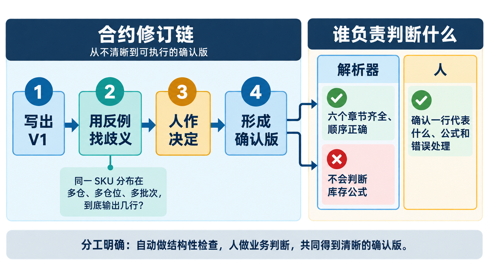
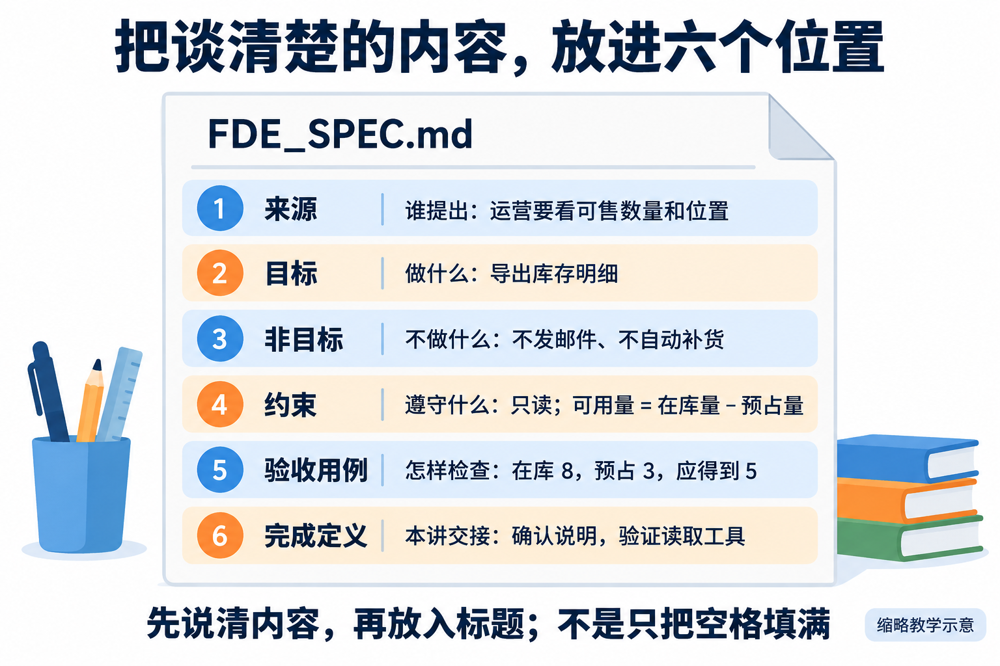
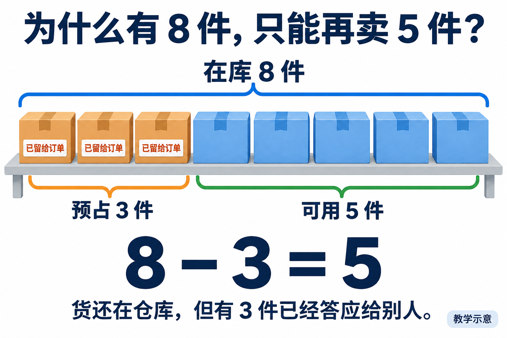
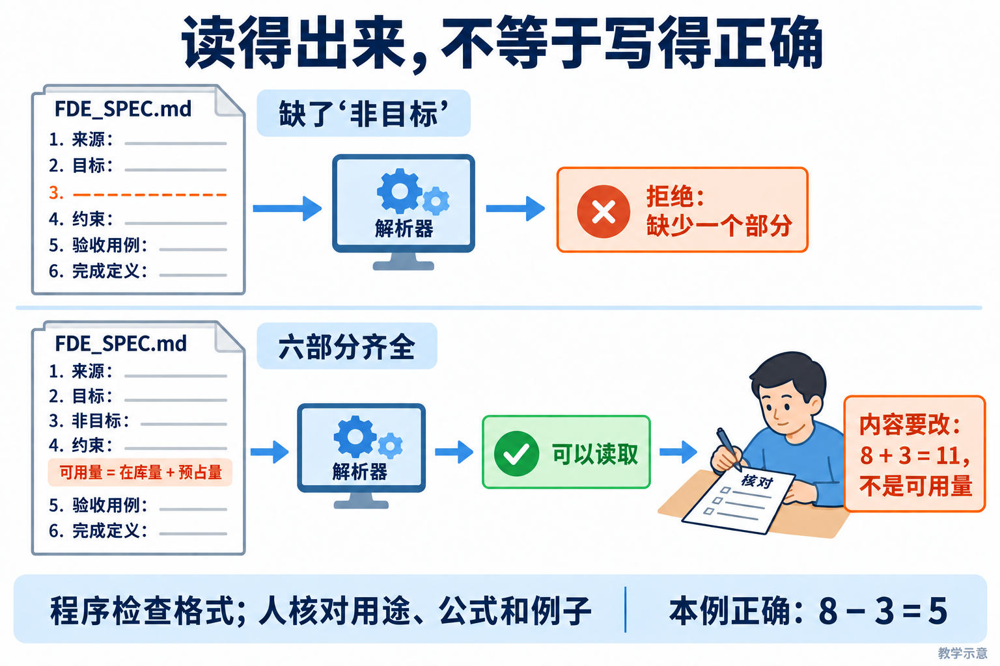
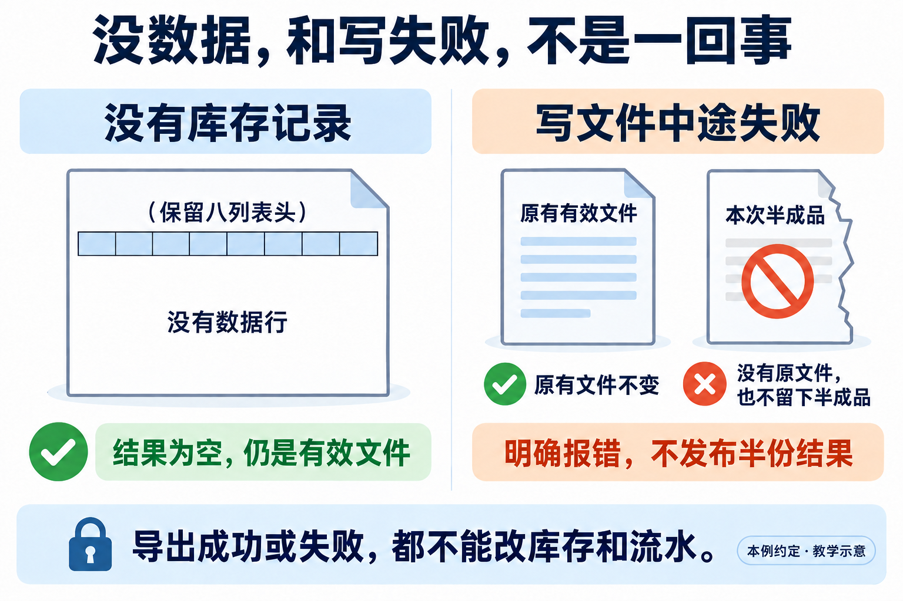

# L03 实践操作手册｜把模糊需求变成可验收 Spec

> 这是一份照着做的手册。不要先把全文看完：完成一步，看到完成标志，再进入下一步。

## 先用一句话看懂本讲

客户只说了一句：**“增加库存导出功能。”**

这句话还不能直接交给 Codex 编码，因为至少有这些问题没有答案：导出哪些列？一行代表一个商品、一个仓库还是一个批次？空库存怎样处理？写文件失败后怎么办？

所以本讲只完成三件事：

```text
模糊需求
   ↓ 你回答问题并作决定
可验收的库存导出合同 FDE_SPEC.md
   ↓ 你和 Codex 建设工作台能力
能检查合同结构的解析器
   ↓ 你用正确、缺章、业务错误三份合同复验
证明“结构检查”和“业务判断”不是一回事
```

**本讲不开发库存导出功能。**真正的业务编码留到 L04。

第一次阅读只记住两项最终成果：

1. 一份已经消除关键歧义的库存导出合同 `FDE_SPEC.md`；
2. 一个只检查合同六段结构、不会冒充业务裁判的解析器。

---

## 你在哪里操作

先在 Codex 中打开你自己的课程练习仓库。后面所有路径都以这个仓库为起点。

```text
〈你的课程练习仓库〉/                 ← Codex 打开这里，终端也从这里开始
├─ AGENTS.md
├─ lesson-01-submission/              ← 以前的材料，不修改
├─ lesson-03-submission/              ← 本讲的个人提交材料
│  ├─ decisions.md                    ← 你作出的业务决定
│  ├─ FDE_SPEC-v1.md                  ← 第 3 步保存的第一版；开始时还不存在
│  ├─ FDE_SPEC.md                     ← 修订后的确认版合同
│  ├─ procurement-draft.md            ← 用模板完成的迁移练习
│  └─ evidence.md                     ← 命令、结果和你的判断
├─ workbench/
│  ├─ templates/SPEC_TEMPLATE.md      ← 本讲新增的通用模板
│  └─ spec.py                         ← 本讲新增或修改的结构解析器
└─ tests/                             ← 解析器测试
```

不要在课程参考仓库中填写个人答案，也不要把 `lesson-03-submission/` 建到仓库外面。

---

## 六步路线


| 步骤 | 你要完成什么 | 完成后留下什么 |
|---|---|---|
| 1 | 建立本讲目录 | 4 个个人记录文件和 1 个工作台模板文件 |
| 2 | 回答需求问题 | `decisions.md` |
| 3 | 写合同并消除歧义 | `FDE_SPEC-v1.md`、`FDE_SPEC.md` |
| 4 | 抽取通用模板 | `SPEC_TEMPLATE.md`、`procurement-draft.md` |
| 5 | 建设结构解析器 | `spec.py`、测试结果 |
| 6 | 用三份合同复验并交接 | `evidence.md` |

---

## 第 1 步：建立本讲目录

> **一句话说明：**在自己的练习仓库建立 L03 专用目录，后续合同、反例和解析器都放在这里。

**在哪里：**练习仓库中的 PowerShell。

复制下面整个代码块，按一次回车：

```powershell
& {
    $repo = git rev-parse --show-toplevel 2>$null
    if ($LASTEXITCODE -ne 0 -or -not $repo) { throw '当前目录不是 Git 练习仓库。' }
    Set-Location $repo.Trim()

    New-Item -ItemType Directory -Force -Path `
        'lesson-03-submission', 'workbench/templates' | Out-Null

    @(
        'lesson-03-submission/decisions.md',
        'lesson-03-submission/FDE_SPEC.md',
        'lesson-03-submission/procurement-draft.md',
        'lesson-03-submission/evidence.md',
        'workbench/templates/SPEC_TEMPLATE.md'
    ) | ForEach-Object {
        if (-not (Test-Path -LiteralPath $_)) {
            New-Item -ItemType File -Path $_ | Out-Null
        }
    }

    python -X utf8 -c "import workbench; from pathlib import Path; print('仓库：', Path.cwd()); print('工作台源码：', workbench.__file__)"
    Write-Host '准备完成：lesson-03-submission'
}
```

**看到什么才算完成：**最后显示“准备完成”，并且打印的仓库、工作台源码都属于你的练习区。

**如果失败：**

- 提示“不是 Git 练习仓库”：在 Codex 中重新打开自己的练习仓库；
- 提示找不到 `workbench`：恢复 L01 使用的虚拟环境后重试；
- 文件已经存在：不要删除，命令不会覆盖已有内容。

完成后再进入第 2 步。

---

## 第 2 步：先回答八个问题，不写 Spec

> **一句话说明：**先用自己的话回答来源、目标、边界和验收，不要一开始就让 Codex替你写完整合同。

**在哪里：**Codex 对话窗口和 `lesson-03-submission/decisions.md`。

先把下面内容写入 `decisions.md`：

```markdown
# L03 库存导出决定记录

记录人：
日期：
业务确认人：（课堂角色练习就写“角色练习”）

| 必须决定的问题 | 来源或事实 | 我的决定 | 理由 | 状态 |
|---|---|---|---|---|
| 谁使用导出结果，用它作什么决定？ | | | | 待确认 |
| 一行代表商品、仓库、仓位还是批次？ | | | | 待确认 |
| 可用量怎样计算？ | | | | 待确认 |
| 导出哪些列，顺序是什么？ | | | | 待确认 |
| 多行按什么顺序排列？ | | | | 待确认 |
| 没有库存时输出什么？ | | | | 待确认 |
| 写出失败后怎样处理旧文件和半成品？ | | | | 待确认 |
| 成功或失败后，哪些业务数据不能改变？ | | | | 待确认 |
```

然后把下面这段话发给 Codex：

```text
请对“增加库存导出功能”进行需求访谈，先不要修改文件，也不要写代码。
请按 lesson-03-submission/decisions.md 表格中的顺序提问，每次只问一个最关键的问题。
每次说明：这个问题为什么必须由人决定，以及不同答案会产生哪两种实现。
如果仓库中能找到事实，请给出文件路径；找不到就标记“待确认”，不要猜。
```

Codex 每问一个问题，你就回答一个问题，并把结论写回表格。至少亲自打开一个 Codex 引用的文件，确认它确实支持该结论。

本课程采用的可用量示例是：

```text
在库量 8 - 已预占量 3 = 可用量 5
```

这只是需要写进合同的业务口径，不是解析器要计算的内容。

**看到什么才算完成：**八行都有来源或明确的“待确认”；不能把 Codex 建议直接写成“已确认”。

**如果卡住：**未知项保留“待确认”。有关键项待确认时可以写草稿，但不能称为确认版。

完成后再进入第 3 步。

---

## 第 3 步：生成 V1，用反例找歧义，再形成确认版

> **一句话说明：**让 Codex整理第一版合同，再用一个具体反例找出歧义，修改到不同人会得到同一判断。



先沿左侧完成合同修订，再看右侧分工：解析器只能检查六个章节是否齐全、顺序是否正确；一行代表什么、库存公式和错误处理仍必须由人确认。



先按图检查六个部分是否齐全；齐全只代表结构完整，下一步还要用反例检查语义是否明确。



**在哪里：**Codex 对话窗口、`FDE_SPEC.md` 和 `decisions.md`。

本步只按下面三小段前进，不要让 Codex 一次完成全部工作：

```text
根据已确认决定写 V1
        ↓
用“多仓库、多仓位、多批次”反例找出歧义
        ↓
你作决定，Codex 按决定修订为确认版
```

### 3.1 让 Codex 写第一版

发送下面这段话：

```text
请读取 lesson-03-submission/decisions.md，起草库存导出合同，
写入 lesson-03-submission/FDE_SPEC.md。

只能使用我已经决定或有来源支持的内容；未知项写“待确认”。
必须按以下顺序保留六个二级标题：
来源、目标、非目标、约束、验收用例、完成定义。
本讲不实现库存导出，也不修改 FlowERP 业务代码。
```

第一版写完后，在 PowerShell 保存它：

```powershell
$v1 = 'lesson-03-submission/FDE_SPEC-v1.md'
if (Test-Path -LiteralPath $v1) {
    throw 'FDE_SPEC-v1.md 已存在。请保留旧证据并换一个版本名。'
}
Copy-Item -LiteralPath 'lesson-03-submission/FDE_SPEC.md' -Destination $v1
```

如果 `FDE_SPEC-v1.md` 已存在，不要覆盖；改用 `FDE_SPEC-v2.md` 等新名字保存本次版本。

### 3.2 用一个反例检查歧义

把下面问题发给 Codex：

```text
请只读审查 lesson-03-submission/FDE_SPEC.md：
同一个 SKU 分布在两个仓库、三个仓位和两个批次时，
合同究竟要求输出几行？请指出原文中可能产生两种实现的句子。
只指出歧义，不替我决定，也不要修改文件。
```

你根据使用者的真实目的作出决定，把理由写进 `decisions.md`，再让 Codex 按这个决定修改 `FDE_SPEC.md`。

### 3.3 核对合同是否可以验收

确认 `FDE_SPEC.md` 至少明确了：

- 列顺序：`sku,name,site,location,lot_id,on_hand,reserved,available`；
- 在库 8、预占 3 时，可用量为 5；
- 一行代表什么，以及多行怎样稳定排序；
- 空库存时输出表头、空文件还是错误；
- 中文、逗号、引号和换行怎样保真；
- 写出失败后旧文件和半成品怎样处理；
- 成功和失败都不修改库存与流水。

**看到什么才算完成：**`FDE_SPEC-v1.md` 保留原歧义，`FDE_SPEC.md` 已消除该歧义；修改理由能在 `decisions.md` 找到。

**如果合同还有“待确认”：**继续标记为草稿，不要虚构确认人或确认日期。

完成后再进入第 4 步。

---

## 第 4 步：把本次合同变成通用模板

> **一句话说明：**从已经验证过的合同中抽出可复用结构，但把本次业务数据和结论留在实例里。

**在哪里：**Codex 对话窗口。

发送下面这段话：

```text
请从 lesson-03-submission/FDE_SPEC.md 抽取通用模板，
写入 workbench/templates/SPEC_TEMPLATE.md。

模板保留“来源、目标、非目标、约束、验收用例、完成定义”六个标题，
每节只写填写提示。删除库存公式、字段、仓位、人员和本次结论。

然后使用这个模板起草“采购申请导出”，写入
lesson-03-submission/procurement-draft.md。
采购对象、状态、字段和权限没有来源时写“待确认”，不要复制库存答案。
```

你只检查两件事：

1. `SPEC_TEMPLATE.md` 中不应出现 `available`、仓位、批次等库存专属答案；
2. `procurement-draft.md` 可以复用六段结构，但不能照抄库存规则。

**看到什么才算完成：**模板可以用于库存和采购两个需求，而采购稿中的未知内容仍是“待确认”。

**如果发现库存答案残留：**只删除具体答案，保留“这里应填写什么”的提示。

完成后再进入第 5 步。

---

## 第 5 步：建设只检查结构的解析器

> **一句话说明：**实现一个只检查六个章节是否存在的最小解析器，不让它假装理解业务语义。



**在哪里：**Codex 对话窗口和练习仓库。

解析器只回答一个问题：**合同的六段结构是否完整？**它不判断库存公式是否正确。

本步的正确顺序是：

```text
先查看现有入口
    ↓
先写“完整合同通过、缺章合同拒绝”的测试
    ↓
运行测试，保存实现前结果
    ↓
只在允许文件中做最小实现
    ↓
再次运行同一测试，保存实现后结果与 Diff
```

发送下面这段话：

```text
请先只读检查 workbench/spec.py、workbench/cli.py 和相关测试，告诉我当前调用路径。
然后先补测试，再做最小实现。

解析器需要：
1. 按顺序读取来源、目标、非目标、约束、验收用例、完成定义；
2. 拒绝缺章、空章、重复、乱序、未知二级标题和未闭合代码块；
3. 读取 UTF-8 文件且不修改原文件；
4. 让 python -X utf8 -m workbench.cli spec <文件> 调用同一解析器；
5. 结构错误时返回非零退出码和明确原因。

只允许修改 workbench/spec.py、对应测试，以及确有接线缺口时的 workbench/cli.py。
不要修改 FlowERP，不要把库存公式写进解析器。
如果能力已经存在，就复验并报告现状，不要故意破坏代码制造红灯。
```

开始修改前先运行一次下面的测试并保存结果；实现完成后再运行同一条命令：

```powershell
python -X utf8 -m unittest tests.test_spec_contract tests.test_spec_cli -v
$LASTEXITCODE
```

把两次实际命令、测试数量、输出、退出码和修改文件写进 `evidence.md`。如果起点已经通过，就写“现有能力复验”，不要破坏代码制造红灯。

**看到什么才算完成：**测试包含“完整合同通过”和“残缺合同拒绝”两类路径，退出码为 `0`，CLI 确实调用 `workbench/spec.py`。

**以下都不算通过：**运行了 0 条测试、导入了别处的代码、只有环境报错、只凭 Codex 说“已经完成”。

完成后再进入第 6 步。

---

## 第 6 步：用三份合同证明能力边界

> **一句话说明：**分别运行完整合同、缺章节合同和语义含糊合同，证明结构检查通过不等于业务合同合格。



**在哪里：**PowerShell 和 `evidence.md`。

这一阶段不再修改解析器。你只用三份输入回答两个问题：结构是否完整？业务内容是否正确？

### 6.1 准备三份输入

| 输入 | 故意放入什么 | 应得到什么结果 |
|---|---|---|
| `FDE_SPEC.md` | 结构完整、业务口径正确 | 解析通过 |
| `missing-section.md` | 删除“非目标”整节 | 解析拒绝 |
| `wrong-formula.md` | 六段完整，但把可用量写错 | 解析通过，人工拒绝 |

先复制两份故障文件：

```powershell
& {
    $source = 'lesson-03-submission/FDE_SPEC.md'
    $missing = 'lesson-03-submission/missing-section.md'
    $wrong = 'lesson-03-submission/wrong-formula.md'

    if ((Test-Path -LiteralPath $missing) -or (Test-Path -LiteralPath $wrong)) {
        throw '故障文件已经存在。请保留旧证据并换新文件名。'
    }
    Copy-Item -LiteralPath $source -Destination $missing
    Copy-Item -LiteralPath $source -Destination $wrong
}
```

然后手工编辑：

- 在 `missing-section.md` 中删除“`## 非目标`”及该节正文；
- 在 `wrong-formula.md` 中把公式改成“可用量 = 在库量”。

不要修改确认版 `FDE_SPEC.md`。

### 6.2 分别运行解析器

```powershell
python -X utf8 -m workbench.cli spec lesson-03-submission/FDE_SPEC.md
Write-Host "退出码：$LASTEXITCODE"

python -X utf8 -m workbench.cli spec lesson-03-submission/missing-section.md
Write-Host "退出码：$LASTEXITCODE"

python -X utf8 -m workbench.cli spec lesson-03-submission/wrong-formula.md
Write-Host "退出码：$LASTEXITCODE"
```

正确现象应是：

```text
确认版：      退出码 0       → 六段结构完整
缺章版：      非零退出码     → 解析器发现结构错误
错误公式版：  退出码 0       → 结构完整，但业务内容仍然错误
```

错误公式版通过解析器不是程序故障。解析器只检查结构；你必须根据“在库 8、预占 3，正确可用量应为 5，而错误公式得到 8”作出人工退回结论。

把三次真实输出和下面三句话写入 `evidence.md`：

```markdown
- 解析器能证明：六段结构完整或残缺。
- 解析器不能证明：库存公式和业务决定正确。
- L03 仍未证明：库存导出功能已经实现；该工作留到 L04。
```

最后运行：

```powershell
Get-FileHash -Algorithm SHA256 lesson-03-submission/FDE_SPEC.md
git status --short
```

记录确认版路径、版本、哈希、确认人、日期和“已确认／待复核”状态。

**看到什么才算完成：**三份输入出现预期的“通过、拒绝、通过但人工退回”，并且你能解释原因。

---

## 最后只检查这 8 项

- [ ] `decisions.md` 区分了仓库事实、Codex 建议和我的决定；
- [ ] `FDE_SPEC-v1.md` 保留了修订前版本；
- [ ] `FDE_SPEC.md` 六段完整，库存口径可以执行和验收；
- [ ] `SPEC_TEMPLATE.md` 没有库存专属答案；
- [ ] `procurement-draft.md` 复用了结构，没有照抄库存规则；
- [ ] 解析器既有通过用例，也有拒绝用例；
- [ ] `evidence.md` 保存了三份输入的真实输出和退出码；
- [ ] 没有声称库存导出功能已经完成。

完成 L03 后，交给 L04 的是：**确认版库存导出合同、通用模板、结构解析器和真实复验证据。**

---

## 常见问题

| 现象 | 现在怎么做 |
|---|---|
| 不知道该填什么 | 写“待确认”，不要猜 |
| Codex 一次问很多问题 | 要求它每次只问一个最关键问题 |
| `spec` 不是有效命令 | 回到第 5 步检查 CLI 接线 |
| 完整合同被拒绝 | 检查六个标题的名称、顺序和空章节 |
| 缺章合同仍通过 | 检查 CLI 是否调用了本次解析器 |
| 错误公式合同通过 | 这是预期结果；由人工业务审查退回 |
| 起点测试已经全绿 | 记录“现有能力复验”，不要制造假红灯 |
| 没有同伴复核 | 标记“待复核”，不要虚构签字 |

## 课程合同

- **主题：**把模糊需求变成可验收 Spec。
- **核心内容：**目标与非目标、正常与错误路径、边界条件、可执行验收项、最小变更原则。
- **演示结果：**把“增加导出功能”拆成结构化 `FDE_SPEC.md`。
- **课内增量：**学生监督 Codex 实现 Spec 模板与最小解析器；解析器只校验合同结构，不执行 FlowERP 业务编码。
- **通过标准：**Spec 至少包含来源、目标、非目标、约束、验收用例和完成定义；缺失必要字段时返回明确错误。
