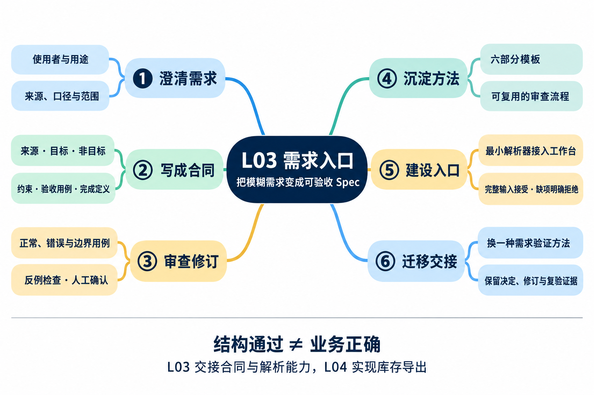
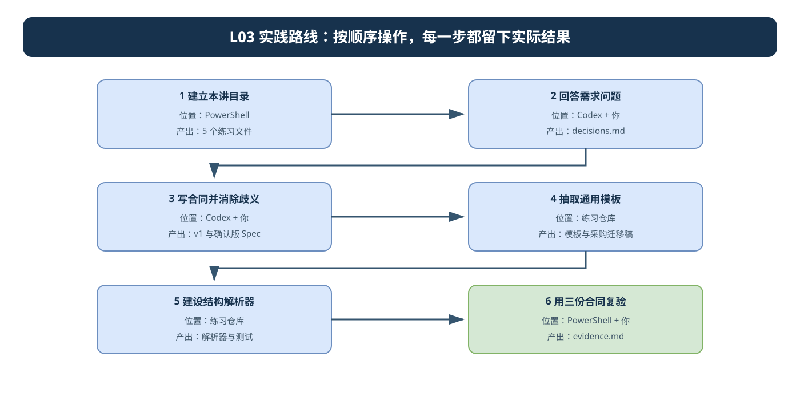
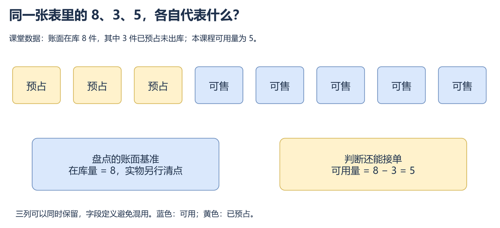
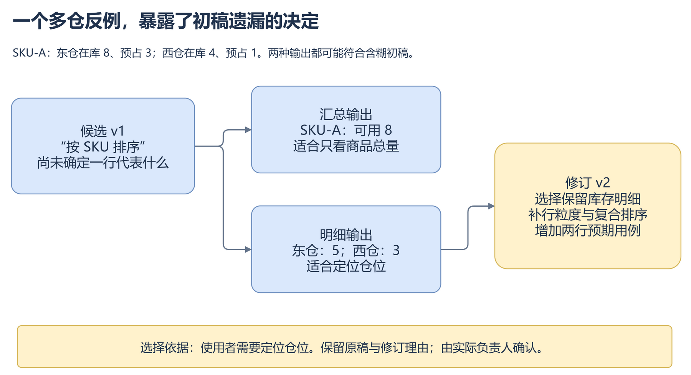
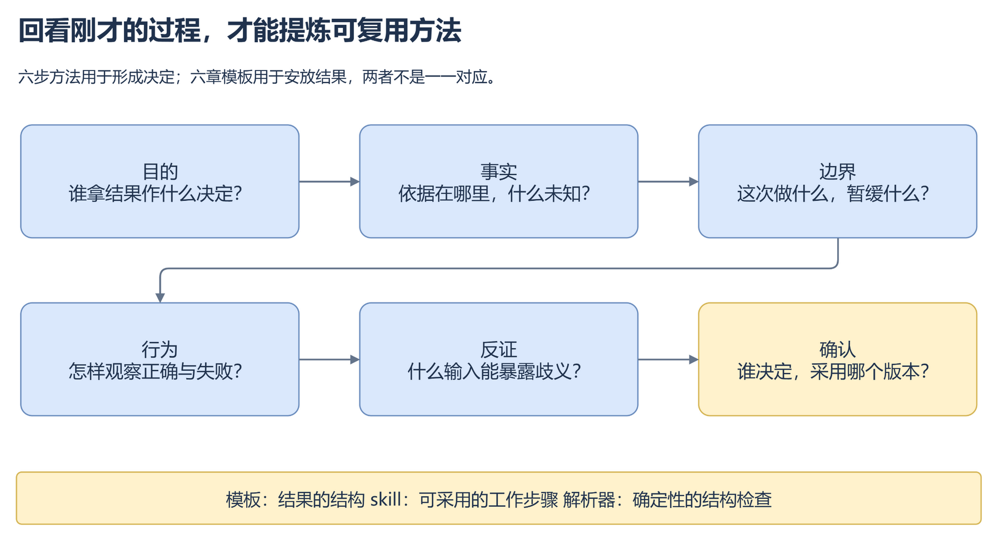
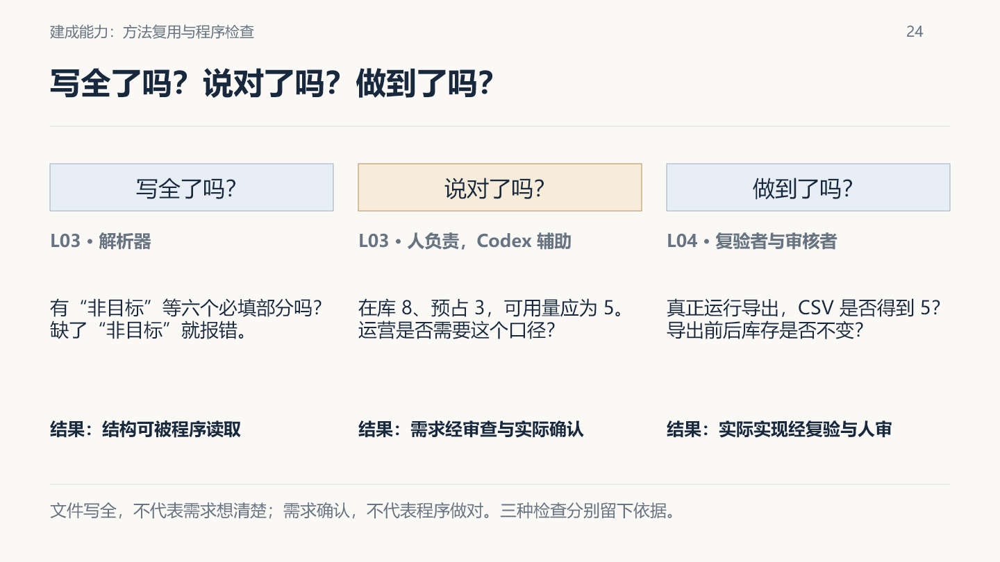
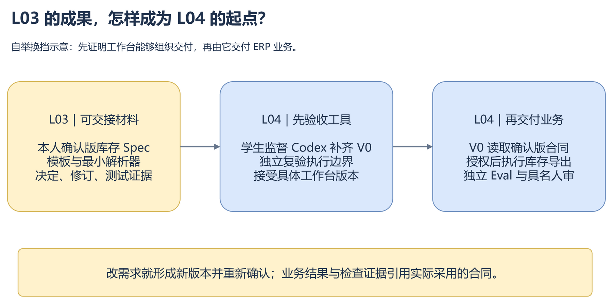

# L03 实践操作手册｜把模糊需求变成可验收 Spec

> 按顺序完成约 90～120 分钟。这里负责“怎么做”；原理见[辅导资料](./辅导资料.md)。

## 今天要交付什么

你将把“增加库存导出功能”变成确认版 `FDE_SPEC.md`，再让个人工作台能够读取完整合同并拒绝残缺合同。

本讲**不实现库存导出功能**。FlowERP 产品新增的是一份可交接的库存导出合同；工作台新增的是六段式模板和最小解析器。



*先按图从左到右看六个动作：澄清需求、写成合同、审查修订、沉淀方法、建设入口、迁移交接。最下方的“结构通过 ≠ 业务正确”是全程判断边界：解析器只能检查六段结构，业务口径仍由人确认，库存导出实现留到 L04。*

最终只检查五项成果：

```text
〈个人课程练习仓库〉/                 ← Codex 打开这里；终端也从这里开始
├─ AGENTS.md
├─ lesson-01-submission/              ← L01 材料，保留不动
├─ lesson-03-submission/              ← 本讲个人材料，在仓库里面
│  ├─ decisions.md                    首次判断、来源、取舍和确认记录
│  ├─ FDE_SPEC-v1.md                  修订前初稿
│  ├─ FDE_SPEC.md                     当前确认版库存合同
│  ├─ procurement-draft.md            使用同一模板起草的迁移稿
│  └─ evidence.md                     解析器差异、命令、输出和最终结论
├─ workbench/
│  ├─ templates/SPEC_TEMPLATE.md      本讲新增的模板
│  └─ spec.py                         本讲新增或修改的解析入口
└─ tests/                             对应测试
```

与 L02 不同，`lesson-03-submission/` 位于练习仓库**内部**。后文没有特别说明时，所有相对路径都从上图的 `〈个人课程练习仓库〉` 开始；不要在参考仓库或 L02 的同级提交目录中执行。

---

## 本手册中的 Prompt 和 Skill 怎么用

### Prompt：复制任务正文后发送

`prompts/` 中的文件保存一次任务的完整请求。打开文件，复制代码框中的正文，替换自己的路径后粘贴到 Codex；不要把 Prompt 当成 PowerShell 命令，也不要输入 `$prompt-name`。

例如：

```text
请按 docs/courses/L03/prompts/01-澄清歧义并冻结合同.md 工作。
我的决定记录是 lesson-03-submission/decisions.md，
目标合同是 lesson-03-submission/FDE_SPEC.md。
先调查和追问，不修改 FlowERP 业务代码。
```

### Skill：明确读取 `SKILL.md` 后使用

课程默认不安装 Skill。需要审查 Spec 时发送：

```text
请读取并使用 docs/courses/L03/skills/spec-acceptance-review/SKILL.md。
审查 lesson-03-submission/FDE_SPEC.md。
只做审查，不修改文件；重点找出可能产生两种实现的歧义。
```

Skill 规定这类工作怎样做，Prompt 规定这一次处理什么文件。Skill 不替负责人确认业务口径，也不把“结构通过”变成“业务正确”。

只有将完整 Skill 文件夹安装到 Codex 可发现的 `.agents/skills/` 等位置后，才直接使用 `$spec-acceptance-review`。课程默认使用明确路径，避免安装和版本差异。当前机制见 [OpenAI 官方 Skill 文档](https://developers.openai.com/zh-Hans/docs/build-skills)。

---

## 先看流程图，再开始操作



读图时先看每个节点的“位置”，切换窗口或目录后再执行动作；每一步右下方的“产出”必须真实存在，才进入下一步。可编辑源文件：[l03-practice-flow.drawio](./assets/l03-practice-flow.drawio)。

### 按图执行的完成标志

| 步骤 | 在哪里操作 | 进入下一步前必须留下什么 |
|---|---|---|
| 1. 准备文件 | PowerShell | 提交目录 |
| 2. 追问需求并作决定 | 写作会话 + 你 | decisions.md |
| 3. 写初稿并用反例修订 | 写作会话 + 你 | FDE_SPEC.md |
| 4. 抽取通用模板 | 练习仓库 | SPEC_TEMPLATE.md |
| 5. 建设最小解析器 | 练习仓库 | 解析器与测试 |
| 6. 用三种输入划边界 | PowerShell | evidence.md |
| 7. 迁移并交接 | 你 | 确认版成果 |

## 第 1 步：一次性准备文件

<!-- step-guide-1 -->
> **本步位置：**PowerShell
> **完成标志：**已经留下可打开、可复查的“提交目录”。
> **异常时：**保留实际输出和退出码，先处理本步问题，不用后一步的成功覆盖它。
> **下一步：**完成后进入第 2 步。

在 Codex 中打开自己的课程练习仓库，把下面整个代码块复制到 PowerShell，按一次回车：

```powershell
& {
    $repo = git rev-parse --show-toplevel 2>$null
    if ($LASTEXITCODE -ne 0 -or -not $repo) { throw '当前目录不是 Git 练习仓库。' }
    Set-Location $repo.Trim()

    $submission = Join-Path $repo 'lesson-03-submission'
    $templateDir = Join-Path $repo 'workbench/templates'
    New-Item -ItemType Directory -Path $submission, $templateDir -Force | Out-Null

    @('decisions.md', 'FDE_SPEC.md', 'procurement-draft.md', 'evidence.md') | ForEach-Object {
        $file = Join-Path $submission $_
        if (-not (Test-Path -LiteralPath $file)) { New-Item -ItemType File -Path $file | Out-Null }
    }

    $template = Join-Path $templateDir 'SPEC_TEMPLATE.md'
    if (-not (Test-Path -LiteralPath $template)) { New-Item -ItemType File -Path $template | Out-Null }

    python -X utf8 -c "import sys,workbench; from pathlib import Path; print('Python:',sys.executable); print('仓库:',Path.cwd()); print('源码:',workbench.__file__)"
    if ($LASTEXITCODE -ne 0) { throw '环境核对失败，请先恢复 L01 使用的虚拟环境。' }
    Write-Host "准备完成：$submission"
}
```

看到 Python、仓库、源码路径和“准备完成”后继续。重复运行不会覆盖已有记录。

**本步通过标准：**打印的仓库和源码都属于自己的练习区，四个记录文件和一个模板文件已经建立。

---

## 第 2 步：让 Codex 追问，由你作决定

<!-- step-guide-2 -->
> **本步位置：**写作会话 + 你
> **完成标志：**已经留下可打开、可复查的“decisions.md”。
> **异常时：**保留实际输出和退出码，先处理本步问题，不用后一步的成功覆盖它。
> **下一步：**完成后进入第 3 步。

先在 `lesson-03-submission/decisions.md` 独立填写：

```markdown
# L03 库存导出决定记录

记录人：
日期：
业务确认人：（课堂扮演请写“角色练习”）

## 首次判断
- 谁使用导出结果，作什么决定：
- 一行代表什么：
- 可用库存怎样计算：
- 需要哪些列，按什么顺序：
- 空库存怎样处理：
- 写出失败后怎样处理半成品：
- 成功和失败后哪些业务状态必须不变：

## 调查与决定
| 问题 | 来源或事实 | Codex 建议 | 我的决定与理由 | 确认状态 |
|---|---|---|---|---|
```

不知道的地方写“待确认”，不要猜。保存首次判断后，把下面请求发给 Codex：

```text
原始需求是“增加库存导出功能”。请只读调查当前项目并向我进行需求访谈，
目标是形成可验收的库存导出 Spec，先不要修改文件。

逐项检查：使用者与用途、可用量口径、八列字段、行粒度、排序、
空库存、CSV 特殊字符、写出失败和只读性。
每次只集中提出最关键的一组问题；对每个问题说明：
缺少什么、不确认会产生哪两种实现、应查哪个来源或由谁决定。
区分仓库事实、课堂假设、负责人决定和你的建议。
```

你逐项回答并写入表格。至少亲自打开一处 Codex 引用的实现或测试，确认来源真实存在。



*图中 8 是账面在库量，3 是已预占但尚未出库的数量，5 才是本课程口径下可继续承诺的可用量。三列可以同时保留；你的 Spec 必须写清字段含义和公式，不能只留下三个没有名称的数字。*

关键决定尚未确认时，后面的 Spec 只能标记为草稿。

**本步通过标准：**首次判断没有被覆盖；每个关键口径都有来源、本人决定或明确的待确认状态。

---

## 第 3 步：写初稿，用反例修订为确认版

<!-- step-guide-3 -->
> **本步位置：**写作会话 + 你
> **完成标志：**已经留下可打开、可复查的“FDE_SPEC.md”。
> **异常时：**保留实际输出和退出码，先处理本步问题，不用后一步的成功覆盖它。
> **下一步：**完成后进入第 4 步。

### 3.1 生成初稿

把下面六个二级标题写入 `lesson-03-submission/FDE_SPEC.md`，顺序不能改变：

```markdown
## 来源

## 目标

## 非目标

## 约束

## 验收用例

## 完成定义
```

让 Codex 根据 `decisions.md` 起草正文：

```text
请依据 lesson-03-submission/decisions.md 起草库存导出 Spec，
写入 lesson-03-submission/FDE_SPEC.md。
必须保留“来源、目标、非目标、约束、验收用例、完成定义”六个二级标题及顺序。
只采用已经有来源或由我决定的内容；未知项写“待确认”，不要自行补业务答案。
本讲只确认合同，不实现库存导出。
```

逐项核对验收用例：

| 情境 | 必须写清的结果 |
|---|---|
| 正常数量 | 在库 8、预占 3时，可用量为 5；再给一组不同数据 |
| 字段 | `sku,name,site,location,lot_id,on_hand,reserved,available` |
| 多仓／仓位／批次 | 一行代表什么，按哪些字段稳定排序 |
| 空库存 | 表头、空文件或错误，必须选一种 |
| 特殊字符 | CSV 读取后中文、逗号、引号和换行可还原 |
| 写出失败 | 明确错误，已有目标文件和半成品怎样处理 |
| 只读性 | 成功和失败后库存及流水均不变 |

### 3.2 冻结 v1，再用反例审查

在 PowerShell 运行一次：

```powershell
Copy-Item -LiteralPath 'lesson-03-submission/FDE_SPEC.md' -Destination 'lesson-03-submission/FDE_SPEC-v1.md'
```

如果目标文件已有内容，PowerShell 会拒绝覆盖；保留旧版并换一个版本名。

请同伴指出一句可能产生两种实现的话。没有同伴时，使用这个反例：

```text
同一个 SKU 分布在两个仓库、三个仓位和两个批次时，
“每个商品一行”究竟输出一行、两行、三行还是按批次输出？
```

再让 Codex 读取 [`Spec 验收审查 Skill`](./skills/spec-acceptance-review/SKILL.md)，只读审查当前 Spec。你决定接受、修改或退回，并把理由写回 `decisions.md`。



*图中同一 SKU 在东仓和西仓有两组库存。v1 的“按 SKU 排序”没有说明一行代表汇总还是明细，因此两种输出都可能自称正确；v2 必须由使用目的决定行粒度，再补复合排序和两行预期用例。保留 v1、反例、选择理由和 v2，才能证明修订来自人的决定。*

关键口径全部明确后，在“来源”和“完成定义”中写清确认人、日期、版本与状态。课堂确认必须标记“角色练习”。

**本步通过标准：**v1 和当前版都保留；当前版六节有实质内容；关键修订能够回指反例和人的决定。

---

## 第 4 步：抽取模板，并验证没有夹带库存答案

<!-- step-guide-4 -->
> **本步位置：**练习仓库
> **完成标志：**已经留下可打开、可复查的“SPEC_TEMPLATE.md”。
> **异常时：**保留实际输出和退出码，先处理本步问题，不用后一步的成功覆盖它。
> **下一步：**完成后进入第 5 步。

让 Codex 从确认版 Spec 抽取模板：

```text
请从 lesson-03-submission/FDE_SPEC.md 抽取通用六段式模板，
写入 workbench/templates/SPEC_TEMPLATE.md。
保留六个标题和每节填写提示，删除库存公式、字段、仓位、人员和本次结论。

再用该模板起草“采购申请导出”，写入
lesson-03-submission/procurement-draft.md。
采购对象、状态、字段和权限没有来源时必须写“待确认”，不得照搬库存规则。
```

你亲自检查：

- 模板能否同时用于库存和采购；
- 模板中是否残留 `available`、仓位、批次等库存答案；
- 采购稿是否把未知内容如实标为待确认。



*这张图展示的是形成决定的六步方法，不是六段模板的标题映射。模板保存结果结构；方法依次追问目的、事实、边界、行为、反证和确认。迁移到采购稿时复用这套提问顺序，不复制库存字段和公式。*

**本步通过标准：**复用了六段结构，没有复用库存业务答案。

---

## 第 5 步：建设最小解析器

<!-- step-guide-5 -->
> **本步位置：**练习仓库
> **完成标志：**已经留下可打开、可复查的“解析器与测试”。
> **异常时：**保留实际输出和退出码，先处理本步问题，不用后一步的成功覆盖它。
> **下一步：**完成后进入第 6 步。

本步允许修改：

- `workbench/spec.py`；
- 对应测试；
- 确有接线缺口时的 `workbench/cli.py`。

不要修改 FlowERP 业务代码。把下面请求发给 Codex：

```text
请建设工作台的最小六段式 Spec 解析器。
先只读检查 workbench/spec.py、workbench/cli.py 和现有测试，报告当前能力与调用路径。

然后先补测试，再做最小实现。解析器必须：
1. 返回 source、goal、non_goals、constraints、acceptance、done 六字段原文；
2. 拒绝缺章、空章、重复、乱序、未知二级标题和未闭合代码围栏；
3. 读取 UTF-8 文件且不修改输入；
4. 让 `python -X utf8 -m workbench.cli spec <文件>` 实际调用同一解析器；
5. 结构错误返回非零退出码和明确原因。

不要把库存公式写进通用解析器。保存实现前结果、范围内 Diff、实现后同一测试结果。
如果当前能力已经存在并通过，报告“参考能力复验”，不要制造失败。
```

参考测试入口是：

```powershell
python -X utf8 -m unittest tests.test_spec_contract tests.test_spec_cli -v
$LASTEXITCODE
```

把调用路径、修改文件、实现前后输出、用例数和退出码写入 `evidence.md`。测试零条、环境错误或参数错误都不能记为通过。

**本步通过标准：**CLI 调用本次解析器；测试覆盖接受和拒绝路径；实际修改没有越出允许范围。

---

## 第 6 步：用三种输入划清能力边界

<!-- step-guide-6 -->
> **本步位置：**PowerShell
> **完成标志：**已经留下可打开、可复查的“evidence.md”。
> **异常时：**保留实际输出和退出码，先处理本步问题，不用后一步的成功覆盖它。
> **下一步：**完成后进入第 7 步。

把下面整个代码块复制到 PowerShell。它会创建两个故障副本并依次运行；不会覆盖已有副本：

```powershell
& {
    $source = 'lesson-03-submission/FDE_SPEC.md'
    $missing = 'lesson-03-submission/missing-section.md'
    $wrong = 'lesson-03-submission/wrong-formula.md'

    if (-not (Test-Path -LiteralPath $source)) { throw '找不到确认版 FDE_SPEC.md。' }
    if ((Test-Path -LiteralPath $missing) -or (Test-Path -LiteralPath $wrong)) {
        throw '故障副本已经存在，请保留旧证据并先改用新的文件名。'
    }

    $text = Get-Content -Raw -Encoding UTF8 -LiteralPath $source
    $missingText = [regex]::Replace($text, '(?ms)^## 非目标\s*.*?(?=^## 约束)', '')
    Set-Content -Encoding UTF8 -LiteralPath $missing -Value $missingText
    $wrongText = $text -replace '可用量\s*=\s*在库量\s*-\s*预占量', '可用量 = 在库量'
    Set-Content -Encoding UTF8 -LiteralPath $wrong -Value $wrongText

    foreach ($file in @($source, $missing, $wrong)) {
        Write-Host "`n=== $file ==="
        python -X utf8 -m workbench.cli spec $file
        Write-Host "退出码：$LASTEXITCODE"
        Get-FileHash -Algorithm SHA256 -LiteralPath $file | Select-Object Path, Hash
    }
}
```

预期结论：

| 输入 | 解析器结果 | 你的判断 |
|---|---|---|
| 确认版 | 退出码 0，返回六字段 | 结构有效，仍需业务确认与后续实现 |
| 缺少“非目标” | 非零退出，明确指出缺章 | 结构闸门有效 |
| 六段完整但公式错误 | 通常退出码 0 | 结构有效但业务错误，必须人工退回 |

如果错误公式没有被替换成功，打开 `wrong-formula.md`，只把公式改成“可用量 = 在库量”，再运行该文件。不要改确认版。

用第 3 步的审查 Skill 检查 `wrong-formula.md`。即使 Codex 漏判，你也要用“在库 8、预占 3，正确结果应为 5，错误公式得到 8”说明退回依据。



*对照三列判断结果：解析器回答“六段写全了吗”，人和 Codex 辅助审查回答“业务口径说对了吗”，L04 的复验者与审核者才回答“产品真正做到了吗”。所以错误公式可能通过结构解析，但仍必须由业务审查退回。*

把三种输入的实际输出、退出码、文件哈希和人工结论写入 `evidence.md`。

**本步通过标准：**你能解释“解析器检查结构，人审检查业务含义，L04 检查产品实现”。

---

## 第 7 步：完成迁移与交接

<!-- step-guide-7 -->
> **本步位置：**你
> **完成标志：**已经留下可打开、可复查的“确认版成果”。
> **异常时：**保留实际输出和退出码，先处理本步问题，不用后一步的成功覆盖它。
> **下一步：**完成后按本讲提交要求交接。

在 `evidence.md` 末尾回答五个问题：

1. **Codex 如何协作：**它追问、起草、审查和实现了什么？哪些决定由你作出？
2. **产品状态：**库存导出合同确认了什么？为什么不能说导出功能已经完成？
3. **工程问题：**原始需求允许出现哪些互相冲突的实现？
4. **工作台增量：**模板和解析器新增了什么需求入口能力？
5. **学习证据：**初稿、歧义标注、修订稿和采购迁移怎样证明你能复用方法？

最后运行：

```powershell
python -X utf8 -m workbench.cli spec lesson-03-submission/FDE_SPEC.md
$LASTEXITCODE
Get-FileHash -Algorithm SHA256 lesson-03-submission/FDE_SPEC.md
git status --short
```

记录确认版路径、版本、SHA256、实际确认人和日期。尚无同伴或教师复核时写“待复核”，不要虚构签字。



*左侧是本讲真实交付：本人确认版库存 Spec、模板、最小解析器，以及决定、修订和测试证据。中间和右侧是 L04 的后续工作：先验收工作台 V0，再由它读取确认版合同并授权实现库存导出。本讲不能提前声称右侧业务结果已经完成。*

### 提交前自查

- [ ] 首次判断、来源、Codex 建议和本人决定能够区分；
- [ ] `FDE_SPEC-v1.md` 与确认版差异有反例和理由；
- [ ] 六段内容完整，正常、空数据和失败路径可观察；
- [ ] 通用模板没有库存专属答案；
- [ ] 解析器有接受和拒绝测试，CLI 调用同一实现；
- [ ] 三种输入都有真实输出和退出码；
- [ ] 没有把结构通过写成业务正确；
- [ ] 没有声称库存导出功能已经交付。

交给 L04 的是：**确认版库存 Spec、通用模板、已接入的解析器和真实复验证据。**

---

## 遇到问题时再看

| 现象 | 处理 |
|---|---|
| 环境核对失败 | 恢复 L01 使用的虚拟环境，再重跑第 1 步命令 |
| `spec` 不是有效命令 | 检查第 5 步的 CLI 接线是否完成 |
| 完整合同被拒绝 | 检查六个标题、顺序、空章节、额外二级标题和代码围栏 |
| 缺章副本仍通过 | 检查 CLI 是否调用了本次解析器，以及测试导入路径 |
| 错误公式也通过 | 这是预期的结构结果；应由业务审查退回 |
| 起点测试已经全绿 | 记录参考能力复验，不破坏实现制造红灯 |
| 没有同伴 | 完成个人反例审查，并把互评状态写成“待复核” |

## 课程合同

- **主题：**把模糊需求变成可验收 Spec
- **核心内容：**目标与非目标、正常与错误路径、边界条件、可执行验收项、最小变更原则。
- **演示结果：**把“增加导出功能”拆成结构化 `FDE_SPEC.md`。
- **课内增量：**实现 Spec 模板与最小解析器，只负责生成和校验结构，不执行编码。
- **通过标准：**Spec 至少包含目标、非目标、约束、验收用例和来源；缺失必要字段时返回明确错误。
