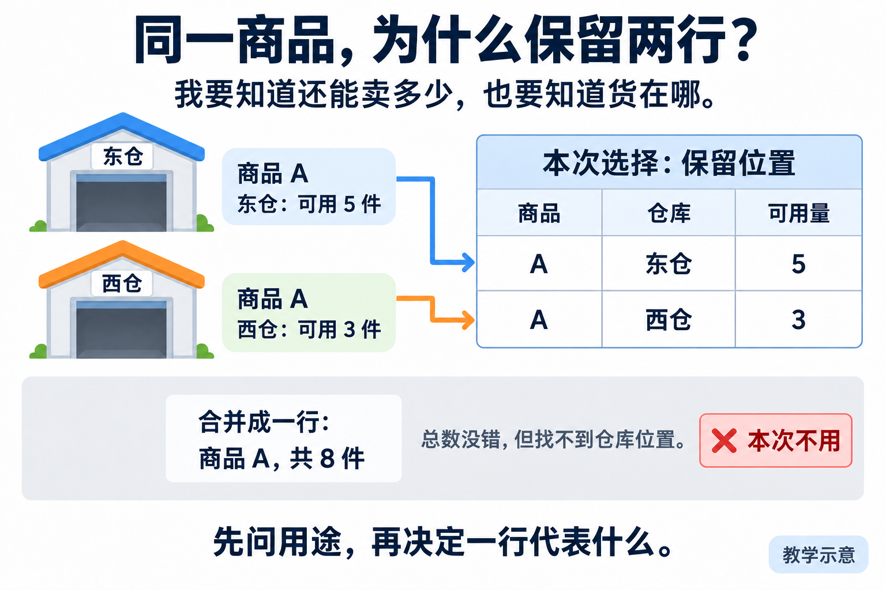
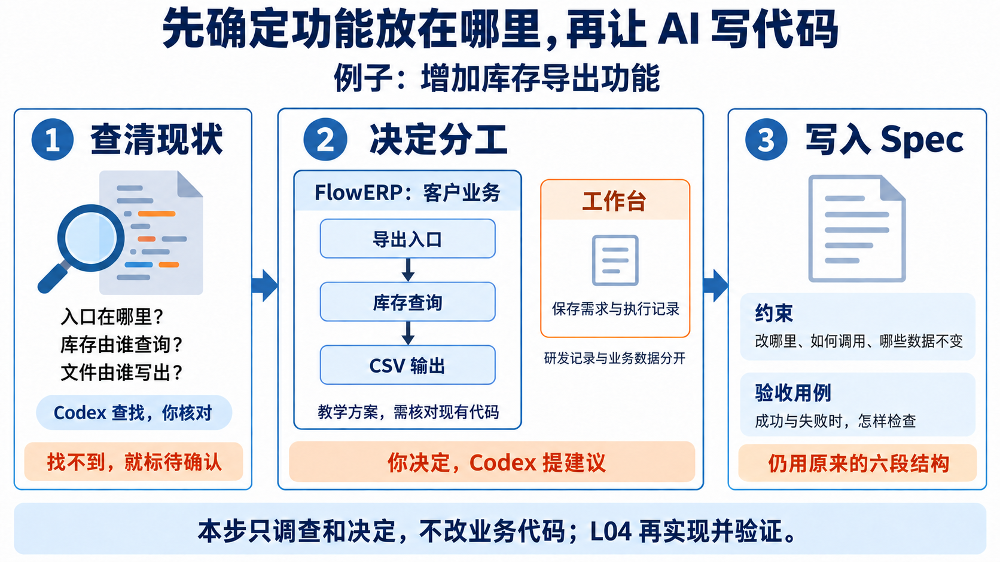

# L03｜把模糊需求变成可验收 Spec

上一讲写了项目长期遵守的规则。这一讲，先说清业务需要，再看清系统分工，最后确定**这次改什么、怎样改、怎样检查结果**。这份书面约定叫 Spec，保存为 `FDE_SPEC.md`。

本讲交付一份包含业务要求与设计约束的需求说明、一个可复用模板，以及读取说明的小程序。Codex 协助追问需求、调查代码和提出方案；你核对依据，作出业务与设计决定。**库存导出留到 L04 开发，本讲不改 FlowERP 业务功能。**

## 1 先问清楚，使用者要看什么

**先确认数字的业务含义，再确定导出字段和计算方法。**

> **案例｜仓库里有 8 件，为什么只能卖 5 件？**
>
> 运营提出：“帮我导出库存，我要看看还有多少货能卖。”商品 A 在东仓有 8 件，其中 3 件已经留给订单，还能继续分配的是 5 件。数字用于教学说明。

*读图：在库 8 件减去预占 3 件，得到可用 5 件。*

橙色的 3 件还在仓库里，但已经留给订单，叫“预占”；蓝色的 5 件叫“可用”。本例：可用量＝在库量－预占量。

如果文件只写“库存 8 件”，使用者可能以为这 8 件都能卖。所以先确定数字表示什么，再写计算方法。

**是否合并数据，要由使用目的决定。**

> **案例｜总数正确，为什么仍要保留明细？**
>
> 同一商品在西仓还有可用库存 3 件。文件应该合并成“共 8 件”，还是分别列出东仓 5 件、西仓 3 件？
>
> 运营补充：“我还要知道去哪里找货。”因此，本例保留明细，不合并不同仓库、仓位或批次的记录。

*读图：总数相同不代表信息完整；两行明细保留货物位置。*

两条箭头对应两行明细。合计 8 件没有算错，但丢失了位置，不符合这次用途。图中只列三列解释这个区别。

现在可以写出一项能检查的要求：

> **案例｜一项可验收的导出要求**
>
> 商品 A 在东仓的在库量为 8、预占量为 3，西仓为 4、1。导出应保留两行，可用量分别为 5 和 3，导出前后库存不变。

有了准备条件、操作和预期结果，才能把实际输出拿来比较。这就是“可验收”。不知道的业务事实要查来源或问负责人，暂时没有答案就标“待确认”。

## 2 先看清平台，再决定这次怎么改

知道“要导出什么”，还不能马上写代码。假如库存页面、订单页面和导出程序各自计算可用量，一次规则调整就可能要改三个地方。即使每个页面都能操作，系统也会越来越难维护。

因此，动手前还要看清：**平台有哪些模块，各自负责什么，数据由谁管理，模块之间怎样协作。** 这些关系构成系统的架构。梳理架构，就是查清实际关系；设计架构，则是在此基础上决定哪些关系保留、哪些需要调整。

### 2.1 先认清整个平台有哪些模块

模块按业务职责划分。例如，“库存”负责数量和预占，“订单”负责订单及其状态。一个模块可能包含多个页面、接口和数据表，不能把菜单上的每一页直接当成一个模块。

下面用电商平台说明怎样划分职责。这是教学示例，**不代表你的仓库已经这样实现**。

| 模块 | 负责什么 | 与其他模块怎样协作 |
|---|---|---|
| 商品资料 | 商品身份、名称等基础信息 | 库存与订单引用商品标识 |
| 库存 | 在库量、预占量和库存变化 | 接收订单的预占或释放请求，提供库存查询 |
| 订单 | 订单内容和状态变化 | 下单时请求预占，取消时请求释放 |
| 采购 | 采购申请和审批过程 | 审批完成并满足收货条件后，按约定办理入库 |
| 账号与权限 | 用户身份和操作权限 | 各业务入口按统一约定检查访问权限 |

这里最重要的决定是“谁负责修改什么”。例如，订单取消需要释放预占，但不宜在订单代码里再写一套库存更新规则；应通过双方约定的调用入口完成。这样，库存规则变化时有明确的修改位置。

这些模块可以存在于同一个应用中，数据也可以放在同一个数据库中。先分清职责，不意味着马上拆成多个服务或数据库。

个人研发工作台位于客户产品之外，负责需求、开发任务和检查记录。FlowERP 负责客户的订单、库存等业务。不要把工作台当成平台中的库存管理模块。

### 2.2 对照代码，区分现在怎样和准备怎样

接手已有项目时，页面和业务说明提供线索，实际关系还要到代码中核对。请 Codex 只读追踪一条业务，例如“取消订单后释放预占”，列出入口、调用的函数以及最终修改的数据。你打开关键位置，核对它引用的代码是否支持结论。

先粗略列出全平台模块，再深入调查本次需求涉及的部分。没查到的关系标成“待确认”，不必为了一个小需求读完所有代码。

在已有的 `decisions.md` 中保留一张关系简图，明确标注当前实现和拟调整关系。图可以用文本箭头或纸笔表达，重点是讲清依据。例如：

| 调查发现（假设） | 准备怎样处理 | 为什么 |
|---|---|---|
| 订单代码直接更新库存表，绕过已有库存校验 | 记录风险，安排单独修复；本次导出不扩大到订单重构 | 问题需要处理，但不应夹带进无关需求 |
| 已有库存查询入口能够提供所需明细 | 本次导出复用它 | 避免再实现一套库存口径 |
| 现有文件写出遇到失败会留下半成品 | 将文件保护纳入本次方案与验收 | 这直接影响导出结果能否使用 |

表中的发现需要真实调查才能成立。既不能把现有做法一律视为正确，也不能把理想设计写成已经实现的事实。

### 2.3 再把库存导出放进这些边界

整体职责清楚后，才安排本次功能。库存导出属于 FlowERP；工作台负责组织这次开发。导出内部需要分清三项职责：

| 职责 | 这次负责什么 |
|---|---|
| 导出入口 | 接收参数，检查调用者是否有权限，向调用者报告结果 |
| 库存查询 | 按确认的业务口径提供明细；复用经过核对的现有能力 |
| 文件输出 | 将明细写成 CSV，并处理特殊字符与写出失败 |

这三项可以由现有模块中的少量函数承担，不要求每项新建一个文件夹。入口组织查询和文件输出；库存查询不应承担写文件的责任。以后增加网页入口时，也应复用业务能力，避免把规则复制到页面中。

*读图：这是库存导出的局部示例，不是整个平台架构图。中间箭头表示处理顺序，具体由谁调用谁，需要对照代码确定。*

方案确认前，用两个问题检查边界：没有权限的人能否绕过入口导出？写文件失败后，库存和流水是否仍然不变？如果回答依赖猜测，就继续调查，而不是直接让 Codex 开发。

最后，在 `decisions.md` 中写下采用方案、理由和未解决问题。把确认的模块归属、调用约定和修改范围写入 Spec 的“约束”，把权限、正常结果和失败后状态写入“验收用例”。沿用的命名、接口格式和错误处理方式，也应引用具体示例，而不是只写“代码要规范”。

本讲完成这些设计决定，并建设工作台的模板与解析器。L04 再用实际改动和运行结果验证方案；本讲不实现库存导出，也不借此重构整个平台。

## 3 把决定写进六个部分

课程约定一份 Spec 按下面顺序组织。在文件中，用 `## 来源` 这样的二级标题分开各部分，再填写正文。

| 标题 | 要回答什么 | 本例 |
|---|---|---|
| 来源 | 谁提出，哪些已经确认？ | 运营要查看可售数量和位置；课堂练习须注明 |
| 目标 | 做成后能做什么？ | 得到库存明细文件 |
| 非目标 | 这次不做什么？ | 不发邮件、不自动补货、不修改库存 |
| 约束 | 必须遵守什么？ | 在库减预占，保留明细；复用已核对的查询入口，导出不修改库存 |
| 验收用例 | 怎样检查？ | 东仓 5 件、西仓 3 件，保留两行，库存不变 |
| 完成定义 | 交接时检查什么？ | L03 确认说明并验证读取工具；L04 再验收实际导出 |

架构调查和选择理由留在 `decisions.md`，确认后的技术要求放进“约束”。Spec 仍保留六个二级标题，不另加第七个架构章节。

注意：“可用量＝在库量－预占量”是规则，“8－3＝5”是检查例子，两者都需要。

先保留自己的初稿，再请 Codex 找歧义。例如初稿写“每个商品一行”，就用“同一商品分放两个仓库”追问。保留原句、修订句和理由，说明为什么选择明细，而不是只留下最后答案。

## 4 再补上容易遗漏的情况

本例用 CSV 保存结果，它是可以用表格软件打开的文本表格。需要约定八列：商品编码、名称、仓库、仓位、批次、在库量、预占量、可用量。按商品编码、仓库、仓位、批次排序。

还要写清：

- 没有库存记录：仍生成八列的表头，没有数据行。
- 名称含中文、逗号或换行：用 CSV 工具读回后，文字保持完整。
- 写文件失败：明确报错，保留原有有效文件，不留下半成品。
- 无论成功或失败：库存及库存变动记录都不能被导出操作改变。

完整列名和样例见[库存导出修订样稿](examples/inventory-export-v2.md)。本讲把这些要求写清楚，下一讲才检查导出程序是否做到。

## 5 为什么还要写一个读取工具

以后工作台会不断接收 Spec，需要自动找到六个部分，发现缺项。这个读取工具叫**解析器**：取出每部分原文，格式不符合约定时说明原因。

用三份文件就能理解它的边界：

| 输入 | 程序应怎样处理 |
|---|---|
| 六部分齐全、正文完整 | 读取六部分内容 |
| 删除“非目标”整节 | 拒绝并指出缺少哪一节 |
| 六部分齐全，但库存公式写错 | 仍能读取；业务错误由人检查并退回 |

*读图：解析器检查结构，人仍需核对业务公式。*

上排缺少一节，程序拒绝。下排结构齐全，但公式错写成相加，人用 8、3 的例子发现错误。实践手册使用另一种错误公式“可用量＝在库量”，同样需要人核对。

解析器还应拒绝空正文、重复标题、顺序错误、未知二级标题和未结束的代码块。代码块中的示例标题不能被误认成正式章节，读取也不能修改原文件。

你直接监督 Codex 建设这个工具：先写完整与错误输入的测试，保存实现前结果，再实现、复测。检查修改前后的代码差异，并确认工作台实际入口调用的是自己的解析器。已有能力通过就如实记录，不人为制造失败。

不要把库存公式写死在通用解析器里。换成采购需求，它仍只负责检查结构。

## 6 现在开始实践

打开[实践操作手册](./实践操作手册.md)，在自己的课程练习仓库中按六步完成：准备记录、回答需求问题、修订 Spec、抽取模板、建设解析器、用三份输入复验并交接。其中第 3 步的 3.0 对应第二节的设计判断：先列出平台模块，再调查导出涉及的关系。具体路径、请求和命令以手册为准。

个人材料放在 `lesson-03-submission/`，保留首次判断、当前与拟调整的关系简图、设计理由、Spec 初稿与确认版，以及真实检查结果。把六个标题及提问方式抽成模板，再用它写一份“采购申请导出”草稿；重新确认采购字段和规则，不照搬库存公式。

提交前对照[行动卡](./行动卡.md)，核对交接的 Spec 与实际检查的是同一份文件，留下同伴反馈；没有反馈就注明待互评。课堂角色确认也要如实标注。

做完后，你应能解释：为什么本例导出两行、可用量是 5 和 3；为什么导出复用库存查询、工作台不保存客户库存；以及为什么解析通过仍可能需要退回。L04 会用这份说明组织库存导出的实际开发。
