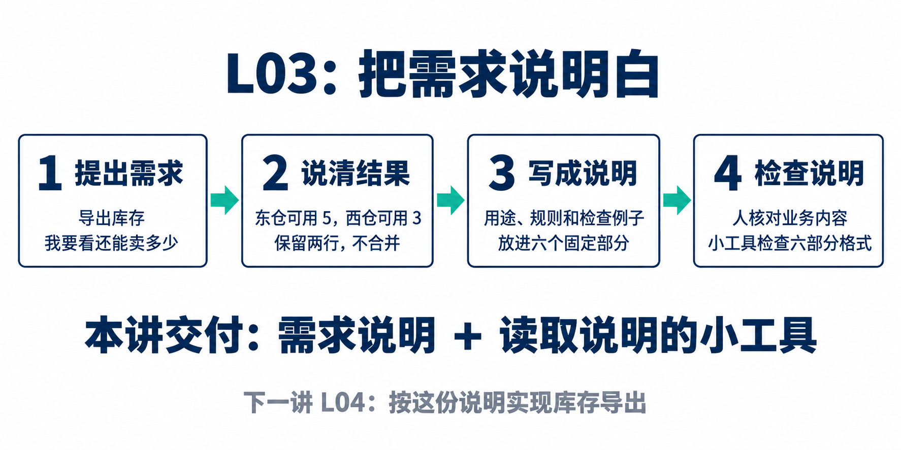

# L03｜把模糊需求变成可验收 Spec

> 这份资料用一个库存导出的例子，解释每一步为什么要做。读懂后，再按[实践操作手册](./实践操作手册.md)完成文件、命令和提交。第一次阅读不需要先记住英文名词。

## 先弄清楚：这一讲到底做什么

上一讲，你已经给 Codex 写下项目中要遵守的规则。这一讲要进一步告诉它：**这次具体要做什么，做到什么样才算完成。**

例如，你说“增加库存导出功能”。Codex 可以很快写出程序，但它还不知道你想看总库存，还是想看每个仓库里的库存。若这个问题没有说清，程序能运行，结果也可能不合用。

本讲有两个成果：

- **一份需求说明**：把导出用途、数据要求和检查方法写清楚，保存到 `FDE_SPEC.md`。这种说明称为 **Spec**，你可以先把它理解成“这次要做什么、怎样检查”的书面约定。
- **一个读取这份说明的小工具**：让工作台找到规定的六个部分，缺少部分时指出错误。这个工具称为 **解析器**，第 4 节会用具体输入解释它。

**本讲会建设模板和解析器；库存导出功能留到 L04 实现。** 现在写下“应该导出两行”，是在确定下一讲要做到的结果，还没有真的导出文件。

下面先跟着一个例子把需求说清，再看为什么工作台需要读取它。可以先顺着正文中的五张图读：**数清货 → 保留位置 → 写进六部分 → 想到失败情况 → 分清程序和人的检查**，再看图下的解释。五张图都是教学示意，不是已经运行出的导出结果。

## 1 一句“导出库存”，为什么还不能直接开工

下面是虚构的课堂情境。运营周宁提出需求，学员林舟与 Codex 一起澄清。数字用于教学推演，不是实际客户记录。

周宁说：“帮我把库存导出来，我要看看还有多少货能卖。”

林舟查到，商品 A 在东仓有 8 件，其中 3 件已经留给订单。这里需要先分清三个数量：


**图 1 怎么看：**先数货架上的全部箱子，共 8 个；橙色的 3 个已经留给订单，蓝色的 5 个才可以继续分配。橙色箱子还在仓库里，所以“预占”不是“已经出库”。在库量是整体，预占量和可用量是这个整体里的两部分。

| 名称 | 这句话是什么意思 | 本例数量 |
|---|---|---|
| 在库量 | 账上现在还有多少件 | 8 |
| 预占量 | 已经为订单留出、还没出库的数量 | 3 |
| 可用量 | 还可以继续分配给新订单的数量 | 8 − 3 = 5 |

如果导出文件里只写“库存：8”，周宁可能把已经留给别人买的 3 件也算进去。因此，林舟首先要确认她想看哪个数量，并把计算方式写下来。

这就是资料中常说的“**口径**”：一个数字具体表示什么，怎样算出来。本例采用“可用量 = 在库量 − 预占量”。

### 1.1 再问一句：你还需要知道货在哪里吗

现在发现，商品 A 在西仓还有一条记录：

| 商品 | 仓库 | 在库量 | 预占量 | 可用量 |
|---|---|---:|---:|---:|
| A | 东仓 | 8 | 3 | 5 |
| A | 西仓 | 4 | 1 | 3 |

导出可以有两种结果：合并成一行，写“商品 A 可用 8 件”；也可以保留两行，分别写“东仓 5 件、西仓 3 件”。

哪一种合适，取决于周宁拿文件做什么。她补充：“我既要知道还能卖多少，也要找到货在哪个仓位，别把明细合起来。”

于是，本例选择保留库存明细。**一行表示一条库存记录，不把不同仓库、仓位或批次合并。** “仓位”是仓库内的位置，“批次”用于区分不同批的货。以后看到“行粒度”这个词，就把它读成“一行到底代表什么”。


**图 2 怎么看：**蓝色箭头把东仓的 5 件送到第一行，橙色箭头把西仓的 3 件送到第二行。底部合计 8 件的数字并没有算错，但它无法回答“去哪个仓库找货”，所以不符合这次用途。图中只画三列来解释行的含义，实际文件的八列见第 3.1 节；仓库图标不表示实际箱子数量。

### 1.2 把谈话改成能检查的句子

原话是：

> 增加库存导出功能。

第一次改写可以是：

> 导出库存明细，供运营查看可用数量和库存位置。可用量按在库量减预占量计算，不合并不同仓库、仓位和批次的记录。

再加上一个具体检查：

> 商品 A 在东仓的在库量为 8、预占量为 3，西仓为 4、1。导出应保留两行，可用量分别为 5 和 3，不合并成一行 8。

现在，开发者知道要做什么，检查者也知道应该看到什么。资料中“**可验收**”的意思就是：拿实际结果与写下的预期比较，能判断是否符合要求。

你在这里负责确认用途和选择。Codex 可以帮忙发现遗漏、展示两种方案，但不知道的业务事实仍需要查来源或问负责人。暂时没有答案，就写“待确认”。

## 2 把已经说清的话，放进六个固定部分

谈话内容容易散落，所以课程约定把 Spec 写成六个部分。文件 `FDE_SPEC.md` 是普通文本文件，`.md` 表示使用 Markdown 格式；在本讲中，先会写标题和正文就够了。

先看这张缩略说明，再用下表查每一部分的具体含义。


**图 3 怎么看：**从上到下是同一份文件的六个部分，不是六份文件。重点比较第 4、5 条：第 4 条写普遍规则“在库减预占”，第 5 条写可以手算的例子“8 减 3 得到 5”。第 6 条写的是 L03 交接说明和读取工具，并不表示库存导出已经实现。

下面六个标题看起来像术语，实际是在问六个日常问题：

| 标题 | 用普通话理解 | 本例可以怎样写 |
|---|---|---|
| 来源 | 谁提出的，哪些内容已经确认？ | 运营要核对可售数量和位置；这是课堂样例，实际负责人待确认 |
| 目标 | 做成以后，使用者能做什么？ | 得到库存明细文件，查看可用数量和库存位置 |
| 非目标 | 顺便想到的哪些事，这次不做？ | 不发邮件、不自动补货、不修改库存 |
| 约束 | 做的时候必须遵守什么？ | 可用量按差值计算，导出过程只读 |
| 验收用例 | 用什么例子检查，应该看到什么？ | 东仓 8、3 得到 5，西仓 4、1 得到 3，并保留两行 |
| 完成定义 | 交接时，谁检查哪些材料？ | 本讲确认说明并验证解析器，下一讲检查实际导出结果 |

“**只读**”表示只查看或导出数据，不修改库存；“**非目标**”帮助大家约定这次先做到哪里，避免边做边增加需求。

### 2.1 规则和例子怎样配合

约束写：“可用量等于在库量减预占量。”

验收用例写：“给定在库 8、预占 3，导出的可用量应为 5；换成 12、4，应为 8。”

前一句告诉开发者一般规则，后一句让检查者能动手核对。只写“数据正确”，检查者仍不知道拿什么结果比较；只写一组数字，开发者也可能没理解普遍适用的公式。

一个验收用例按这三件事写就可以：

1. **准备什么**：在库 8 件，预占 3 件。
2. **做什么**：执行库存导出。
3. **检查什么**：文件中的可用量是 5，导出前后库存记录没有变化。

L03 先写出这些用例。L04 才对真正的库存导出程序运行它们。

### 2.2 看一份文件长什么样

下面是用于理解结构的缩略教学稿，包含六个标题。它还没有写全字段、排序和失败处理，不能直接当作本人的确认版提交。

```markdown
## 来源
课堂样例：运营希望查看可售数量和库存位置。
目前是讨论稿，实际负责人待确认。

## 目标
导出库存明细，供运营查看可用数量和库存位置。

## 非目标
本次不发邮件、不自动补货、不修改库存。

## 约束
可用量 = 在库量 - 预占量。
保留不同仓库、仓位和批次的明细，导出过程只读。

## 验收用例
商品 A 在东仓的在库量为 8、预占量为 3，西仓为 4、1。
导出保留两行，可用量分别为 5 和 3；库存记录不变。

## 完成定义
L03 由学员记录业务决定，确认说明，并检查六部分可以被读取。
L04 实现后，再检查实际文件和业务数据，由实际人员验收。
```

其中 `##` 后面的文字是二级标题。本课程的小工具按这些标题找内容，所以标题和顺序要与示例一致。你主要修改的是每个标题下面的正文。

完整例子可在读完下一节后查看：[库存导出修订样稿](examples/inventory-export-v2.md)。样稿供比较；你的决定和确认状态，要按自己的实践如实填写。

## 3 用一个“如果……”找出还没说清的地方

有了六个标题，内容仍可能含糊。最直接的检查方法，是拿一个具体情境试一试：照这句话做，会不会得到两种不同结果？

例如，初稿写“每个商品导出一行”。你问：“**如果同一商品分别在东仓和西仓，应该合起来吗？**”这就是一个反例：它把原来没有说清的问题暴露出来。

修改时保留这三项即可：

| 要保留的内容 | 本例 |
|---|---|
| 原句 | 每个商品导出一行 |
| 发现的问题 | 同一商品跨仓存放时，合并和保留明细都说得通 |
| 修订与理由 | 因为使用者要找库存位置，所以保留两条明细，预期可用量为 5、3 |

这样后来的人能看懂为什么改，学员也能说明自己作了什么判断。Codex 提出的审查建议需要你逐项判断；课堂扮演负责人时标注“角色练习”。

### 3.1 再补齐文件内容和顺序

本例导出 CSV 文件。**CSV** 是一种保存表格的文本格式，通常可以用表格软件打开；第一行是列名，后面是数据。课程案例约定以下八列，英文只是文件中的列名：

| 文件列名 | 中文含义 |
|---|---|
| `sku` | 商品编码，用来区分商品 |
| `name` | 商品名称 |
| `site` | 仓库 |
| `location` | 仓位 |
| `lot_id` | 批次编号 |
| `on_hand` | 在库量 |
| `reserved` | 预占量 |
| `available` | 可用量 |

顺序也需要写清。课程修订样稿依次按商品编码、仓库、仓位、批次编号升序排列：先比较商品编码，相同就比较仓库，再相同才继续比较后面的字段。检查时故意打乱输入顺序，看输出是否仍按约定排列。样稿还说明了可选文本为空时的比较方式，实际哪些字段允许为空要查项目资料。

### 3.2 没有数据、写到一半失败，分别怎么办

正常导出只是一个情境。下面是课程修订样稿采用的预期，用来演示需求怎样写具体，并非所有项目都必须选择相同方案。


**图 4 怎么看：**左边是“没有可导出的记录”，文件仍保留表头，表示结果确实为空；右边是“没能完整写出文件”，必须报错。右边完整的旧文件要保留，破损纸张代表不能发布的半成品。不要把“空结果”和“执行失败”都写成一句“没导出来”。

| 情境 | 本例写下的预期 | 为什么需要提前说清 |
|---|---|---|
| 没有任何库存记录 | 文件只有八列的表头，没有数据行 | 使用者能看出“结果为空”，而非误以为没生成文件 |
| 名称含中文、逗号、引号或换行 | 用 CSV 读取工具打开后，原文字仍能完整还原 | 文本中的逗号不能误变成新的列 |
| 写出文件中途失败 | 返回明确错误，不把半份文件发布为结果 | 使用者不能把不完整数据当成完整清单 |
| 目标位置原来已有有效文件 | 写出失败后，原文件保持原样；原来没有文件则不留下半成品 | 失败不能破坏原有结果 |
| 导出成功或失败 | 库存和库存变动记录都保持原样 | 导出是读取操作，不应改业务账目 |

库存变动记录也叫“流水”，记录入库、出库等数量变化。“空数据”“含特殊字符”“写文件失败”都可能在使用时发生，写进 Spec 后，下一讲才知道需要实现和检查哪些情况。

到这里，一份说明才逐渐具备了明确的用途、范围、规则和检查例子。请回看第 1 节最初那句“增加库存导出功能”，比较现在多了哪些可判断的信息。

## 4 为什么还要做一个解析器

人已经把需求写清了，为什么要再写程序？因为后续工作台需要反复接收这样的文件。它首先要知道内容放在哪里，缺了什么，而不是每次都让人手工找六个部分。

解析器就做这件事：**读入文件，找到六个标题，把每个标题下面的原文取出来；格式不符合约定时，指出原因。**

### 4.1 用两个输入看懂它的工作

输入一：第 2 节那份六部分教学稿。

预期：解析器能分别取出“来源”“目标”“非目标”“约束”“验收用例”“完成定义”的正文。例如，取出的“目标”是“导出库存明细，供运营查看可用数量和库存位置”。

输入二：把整段“非目标”删掉，再读取。

预期：程序拒绝这份文件，并指出缺少“非目标”。你据此补齐后重新检查。其他格式错误，例如有标题没正文、标题重复、顺序颠倒，也要给出原因。

在实践中，你直接监督 Codex 建设这个小工具。工作台的命令入口应调用你实际检查的那份解析器；不能只让一个孤立的小函数通过测试，实际入口却用另一份实现。具体接入方法见手册第 5 步。

### 4.2 格式通过以后，谁检查业务内容

再做第三种输入：保留六个部分，却把公式改成“可用量 = 在库量 + 预占量”。

这份文件结构完整，解析器仍可以读出来。但代入 8、3，会得到 11；它显然违背了本例“还可分配多少”的用途。你需要用业务例子退回这份说明。


**图 5 怎么看：**上面一行少了第三部分，解析器就应指出缺项。下面一行六部分都有，所以程序能读取；但人在右侧代入数字，发现“8 + 3 = 11”不是本例的可用量，仍要退回修改。绿色“可以读取”只代表格式通过。纸张上的灰线代表这里省略的正文，不是可以提交的空内容；实际标题写法见第 2.2 节。

| 输入 | 解析器应该怎样处理 | 人还要判断什么 |
|---|---|---|
| 六部分齐全、公式正确 | 取出六部分原文 | 用途、数据和确认状态是否可靠 |
| 缺少“非目标” | 拒绝并指出缺项 | 先把文件补齐 |
| 六部分齐全、公式写成相加 | 可以取出原文 | 用 8、3 的例子找出错误并修订 |

因此，**“读得出来”只说明格式符合约定。** 业务内容由人结合来源和例子判断，导出功能是否正确则等到 L04 检查实际结果。

不要把库存公式固定写进通用解析器，否则将来读取“采购申请导出”时，它还会错误地要求库存公式。

### 4.3 怎样证明这个工具真的有用

测试就是把一些输入交给程序，再比较实际结果与预期结果。本讲至少用上表中的完整文件和缺项文件测试接受、拒绝两种行为。

如果起点还不能拒绝缺项文件，测试就应该报失败，这常被称为“红灯”。Codex 修改解析器后，再用同一测试检查，符合预期才是“绿灯”。修改前后哪些代码发生变化，叫做 **Diff，也就是代码差异**。

红灯帮助你证明原来确实缺这个能力；绿灯帮助你证明本次修改解决了这个问题。如果起点已经能正确处理，就记录实际复验结果，不必人为破坏程序制造失败。

程序通常还会返回一个数字表示成功或失败，这叫“退出码”。本讲要求结构错误返回非零退出码，同时给出可读的原因。你现在先理解它的用途，查看和记录的命令都在实践手册中。

## 5 做完以后，留下什么，下一步做什么

先保存本次已经确认的说明，再把六个标题和提问提示抽出来，就得到下一次可以复用的模板。**模板可以保留“验收用例：准备什么、做什么、检查什么”这类提示；具体库存数字、字段和公式属于本次需求。**

例如，换成“采购申请导出”时，仍然填写六个部分，但要重新问谁使用、导出哪些采购状态、哪些人有权限，以及结果怎样检查。这正是手册中模板迁移练习的目的。

### 5.1 接到实践手册时怎么走

| 你刚理解的内容 | 实践手册对应位置 | 做完应该留下什么 |
|---|---|---|
| 为什么先问用途与数据 | 第 1–2 步：准备文件、追问并决定 | 本人的首次判断，后来补充的来源与决定 |
| 六部分怎样写，反例怎样改 | 第 3 步：起草、审查与修订 | 初稿、确认版和至少一项修订理由 |
| 哪些内容能放进模板 | 第 4 步：抽取模板 | 六部分模板和采购申请导出草稿 |
| 解析器接受什么、拒绝什么 | 第 5–6 步：建设并复验 | 实际修改、完整与错误输入的输出记录 |
| 下一讲怎样继续使用 | 第 7 步：迁移与交接 | 确认版文件及其对应的检查证据 |

“确认版”表示本次内容由相应的人核对过。尚未确定的关键问题仍要标明待确认；课堂角色练习也要如实标注。交接时检查的是同一份文件，可以核对路径、版本和内容指纹。内容指纹是由文件内容计算出的校验值，手册中的 SHA256 用于帮助确认文件内容是否相同。

材料无需写成长报告。用已有文件说明“最初怎么想、发现什么问题、为什么修改、实际检查结果怎样”即可，具体提交格式见[个人提交模板](SUBMISSION.md)。

### 5.2 读完后，试着回答三个问题

1. 东仓在库 8 件、预占 3 件，为什么本例的可用量是 5？
2. 同一商品在东仓和西仓各有一条记录，本例为什么保留两行？
3. 六个标题都有，但公式写成相加，为什么解析器能读过，人仍要退回？

如果第 1 题说不清，回到第 1 节的三个数量；第 2 题回看使用者要拿文件做什么；第 3 题回看解析器负责什么。能用自己的话回答后，再打开[实践操作手册](./实践操作手册.md)，从第 1 步开始。

L03 结束时，你得到的是确认过的需求说明，以及工作台读取、检查结构的能力。L04 会先补齐并验收工作台的受控执行能力，再使用这份 Spec 组织库存导出实现，核对真正生成的文件和业务数据。

## 读完后回看：这一讲按什么顺序做



从左到右读四步即可：

1. **提出需求**：使用者说“导出库存，我要看还能卖多少”。
2. **说清结果**：追问以后，确定东仓可用 5 件、西仓可用 3 件，并且要保留两行明细。这些是未来输出的预期。
3. **写成说明**：把用途、规则和检查例子写进六个固定部分，保存为本次需求说明。
4. **检查说明**：你核对用途、公式和例子；本讲建设的小工具检查六个部分是否齐全、格式是否正确。

图底部写的是本讲完成时应得到的两样东西：需求说明，以及读取说明的小工具。真正生成库存导出文件，是下一讲 L04 的工作。

## 查阅：解析器需要处理哪些格式错误

首次阅读到这里，已经理解了为什么要检查结构。编写解析器时再用下面清单核对，不必在开头背下来。

| 输入问题 | 程序应指出什么 |
|---|---|
| 少了一个必要标题 | 缺少哪个部分 |
| 标题存在，下面没有正文 | 哪个部分为空 |
| 同一标题出现两次 | 哪个标题重复 |
| 六个标题顺序不对 | 应有顺序与实际顺序 |
| 加了约定以外的二级标题 | 哪个标题无法识别 |
| 示例代码块没有结束标记 | 代码块未闭合，需要补齐结束标记 |

代码块是正文中单独展示示例的区域，通常用一行三个反引号开始，再用同样一行结束。解析器要识别这个范围，避免把示例里的标题误当作正式章节；读取过程中也不能修改原文件。

## 课程合同

以下是本讲正式要求，用于最后核对。

- **主题：**把模糊需求变成可验收 Spec
- **核心内容：**目标与非目标、正常与错误路径、边界条件、可执行验收项、最小变更原则。
- **演示结果：**把“增加导出功能”拆成结构化 `FDE_SPEC.md`。
- **课内增量：**由学生在外循环直接监督 Codex 实现 Spec 模板与最小解析器，只生成和校验合同结构，不执行 FlowERP 业务编码。
- **通过标准：**Spec 至少包含目标、非目标、约束、验收用例和来源；缺失必要字段时返回明确错误。

这里的“外循环直接监督”指你直接与 Codex 协作、检查它的建议与改动。最小变更指只完成本次范围内的模板和解析能力，不顺便扩大到其他功能。本讲对应 CLO-2，学习目标是把模糊需求写成可以核对的约定，并证明工作台能正确读取它。
