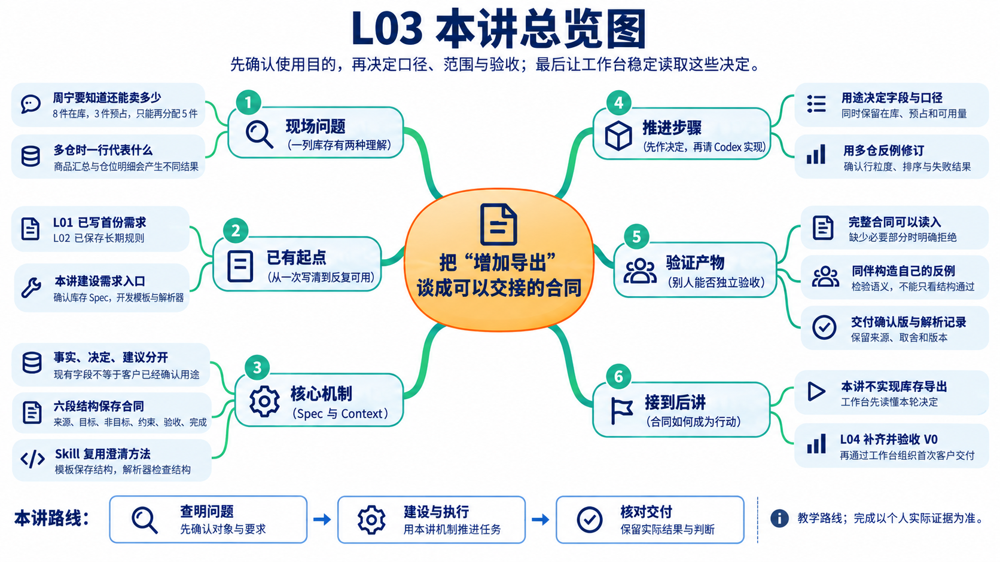
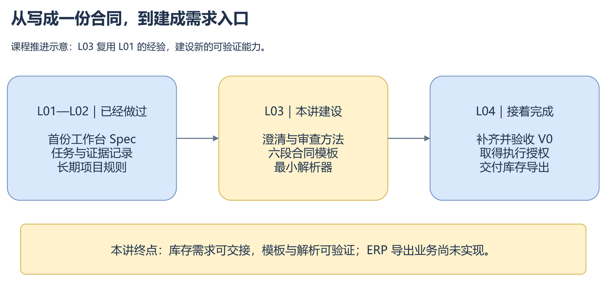
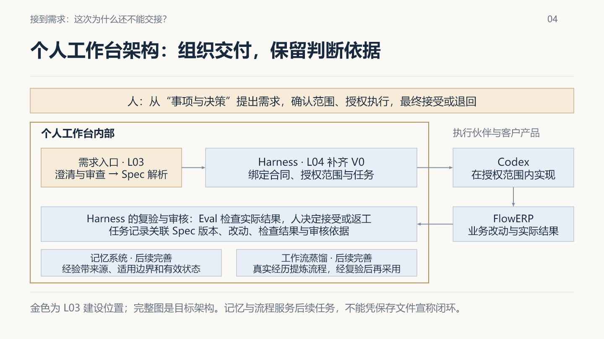
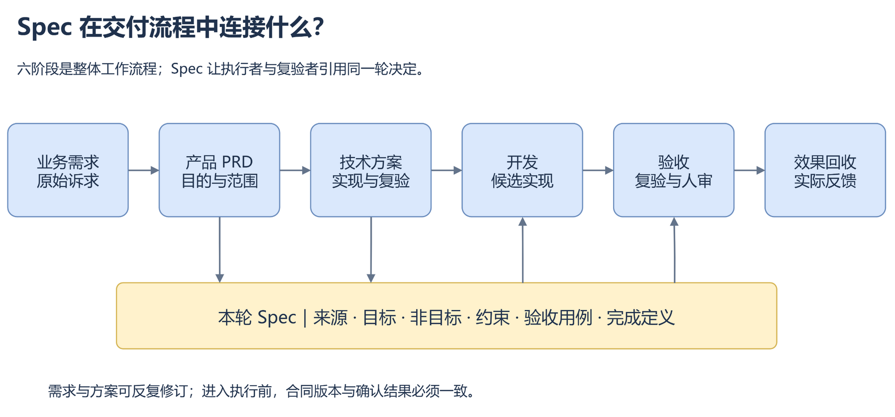
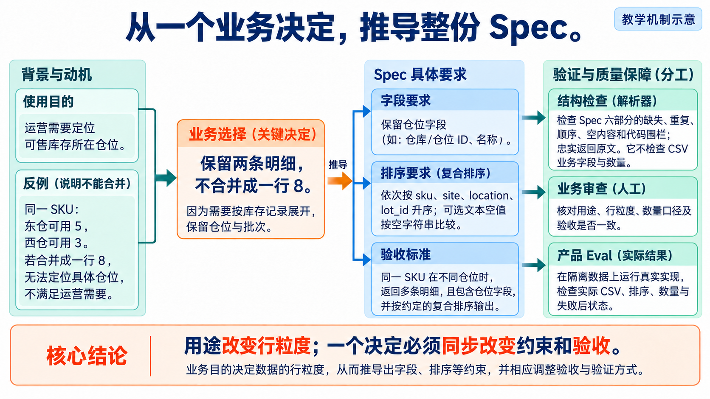

# L03｜把模糊需求变成可验收 Spec

## 本讲总览图



## 本讲总览

从“增加导出”到可交接合同，本讲依次讨论用途、字段、正常与错误路径、反例修订，再由你监督 Codex 建设六段模板和最小解析器。L01 已经写过首份需求，今天进一步形成可重复使用的需求入口。结束时应有确认版库存导出 Spec 和解析检查；产品编码接到 L04。

## 林舟的项目手记

周宁来催库存表。林舟原想直接让 Codex 加一个导出按钮，陈珂却问：“一行是一个商品，还是一个仓位？”周宁又补了一句：“我要知道还能接多少订单。”

林舟拿出一条教学库存记录：在库 8 件，其中 3 件已经预占。导出 8 并没有抄错账，却可能让周宁多接订单。他把编码任务放回待办，先与周宁确认用途、数量口径和行粒度。这一次，他还要把澄清方法留给工作台，让下一份需求不必重新摸索。

人物与开场对话为虚构教学情境；实测材料按原注释辨认来源。人物关系与连续路线见[讲义阅读导航](../讲义阅读导航.md)。



*图 1　L03 的进步是把一次做成的经验变成可重复使用的能力。图中“已做过”描述课程前置成果，仍需核对自己的真实起点。*

## 1. 为什么工作台需要一份受控合同

在开始写库存导出 Spec 之前，先看清这份合同为什么必须进入工作台。只有明确合同解决的协作问题、工作台的系统边界和设计思想，后面的写法、审查与解析才会落在同一条建设主线上。

### 1.1 聊天记录为什么不够

直接与 Codex 对话，已经可以讨论问题、修改代码和运行测试。我们为什么还要建设工作台？可以先想一个很小的变化：昨天讨论的是按商品汇总，今天运营改成了按仓位保留明细。此时，实现者看到的是哪份要求？复验者使用的是哪套标准？昨天的确认，能否直接搬到今天的内容上？

聊天记录里可能保留了所有句子，但句子存在，并不自动说明哪一句仍然有效。工作台需要把这些关系明确下来：本轮采用哪个需求版本，谁作过确认，允许在哪个工作区改哪些文件，实际改动是什么，检查结果对应哪个候选版本，最终由谁接受或退回。我们建设的，是让这些决定与证据可以被重复核对的研发协作系统。

### 1.2 个人工作台的目标架构

从架构上看，日常事项统一从工作台首页的“事项与决策”进入。需求入口帮助人与 Codex 澄清目的、形成 Spec 并检查结构；受控执行机制 Harness 将确认后的合同、授权范围和执行记录关联起来，组织 Codex 的实现、Eval 复验与具名人审。Eval 是可重复运行的检查，具名人审是由实际审核者记录接受或退回的判断；FlowERP 承接实际业务改动，并把结果与使用反馈送回事项。记忆系统和工作流蒸馏服务后续任务的经验与方法复用。这是逐步建设的目标架构：L03 建需求入口，下一讲补齐并验收 V0 后首次组织库存导出交付，跨事项复用仍需后续完善与验证。

### 1.3 四个核心设计思想

设计这套工作台，有四个贯穿始终的判断。第一，明确决定，再执行：实现与复验必须引用同一份有效合同，改口径需要重新确认。第二，人掌握判断与授权：Codex 可以提出建议和实现候选，但范围、代价与接受结果必须有人负责。第三，用证据判断完成：修改记录、Eval 和人审共同支持结论。第四，从真实任务中复用：保留失败和修订，提炼有来源与适用边界的经验和流程，下一次采用时仍须复验。L03 的模板与解析器，就是这些思想在需求入口上的第一次落实。

在这个系统里，人、Codex、工作台与 FlowERP 各自承担不同责任。人确认使用目的，决定范围与代价，授予权限，并对验收作判断。Codex 协助查资料、读代码、提出方案、编写实现和检查遗漏。工作台组织这些活动，约束执行，保存可追查的材料。FlowERP 则是客户产品，库存、订单、采购等业务变化发生在那里。

这也解释了为什么任务证据与库存数据需要分别保存。工作台里“某次导出需求已确认”，不能增加一件库存；FlowERP 中“文件成功生成”，也不能自动把研发事项标成已经验收。两套系统相互关联，判断依据各有归属。



*图 2　个人工作台的系统边界与目标架构。边框内是需求入口、Harness、记录与复用机制；Codex 是执行伙伴，FlowERP 是客户产品。金色突出 L03 的建设位置，完整机制由课程逐步实现。*

### 1.4 Harness、记忆系统与工作流蒸馏

图中的 Harness 可以理解为包住执行过程的控制机制。它使任务在确定的合同、工作区、权限和预算内运行，记录工具调用与结果，再将候选交给独立检查和人审。模型输出“完成了”，只是一条待核对的信息；实际交付是否成立，要看对应的改动、运行结果与审核。

记忆系统解决另一个问题：下一项任务怎样找到前一次有用的经验？例如，本次库存导出曾因数量口径不清被退回，我们可以保留原始材料，再形成一条结论：“涉及库存数量时，先确认结果用于实物盘点还是可售判断。”这条结论需要来源和适用边界。它适合提醒后续库存需求，却不能直接替采购申请决定状态口径。

工作流蒸馏进一步把有效的做法提炼成可重复执行的步骤，例如先问使用目的，再检查来源，然后构造业务反例。这里的“蒸馏”是工程流程提炼，不是训练模型权重。整理出的流程还需要复验、具名审核与版本管理；后续任务采用后若失败，应保留原因，推动修订或停用。

三者的完整闭环，需要跨事项证据：前一事项留下的经验被后一事项召回，流程版本被明确采用，后一事项仍接受 Harness、Eval 和人审的检查。本讲使用一次 Skill、保存一份讨论，尚不能证明这个闭环已经完成。课程后续会继续建设并验证跨事项复用。

### 1.5 Spec 在交付流程中的位置

再沿着一次交付看，工作台组织的顶层流程是“业务需求 → 产品 PRD → 技术方案 → 开发 → 验收 → 效果回收”。PRD 是产品需求文档，说明谁使用、为什么值得做、范围到哪里、结果怎样才有用。技术方案解释如何利用现有能力实现，准备改哪些部分，怎样检查结果和副作用。Spec 则把本轮需要共同遵守的目标、边界、验收与完成条件整理为稳定的交接合同。



*图 3　Spec 供后续执行与复验共同引用。初稿可以随着调查修订，进入执行前必须与确认后的需求和方案对齐。*

这三个对象可以很短。库存导出的 PRD 可能只需说明运营的使用场景、数量口径、本轮范围与验收；技术方案可能只需解释复用哪个查询入口、怎样写出 CSV、怎样比较库存前后状态。本讲把这些判断合并保存在 Spec 与决定记录中，不要求额外制作三份重复附件；各自承担的决定仍需说清楚。

尤其要注意产品范围与当前活动权限的区别。“这次只读调研源码”限制的是此刻的调查活动；“导出不得修改库存”规定的是产品行为。如果把前一句抄进业务非目标，写成“本需求不实现修改、不运行验收”，就把后续交付也取消了。判断一个约束时，要先问它约束谁、约束哪一阶段、持续到什么时候。

现在，我们知道了合同将流向哪里。接下来仍须回到最初的疑问：库存导出究竟要做成什么？

## 2. 从使用目的确定业务口径

林舟先问周宁拿表之后会做什么，而没有请她列字段。她要判断还能接受多少订单，仓库同事却可能拿同一张表核对实物。用途不同，数字的解释就必须写清。

### 2.1 先问“给谁作什么决定”

假设运营拿到一张表，其中“库存数量”写着 8，于是准备继续接受订单。但这条库存记录已经有 3 件被订单预占、尚未出库。按本课程的简化业务口径，尚可分配的数量是 5。文件可以正确生成，账面在库量也没有写错，含糊的字段却让使用者作出了错误判断。

问题不在于表里只能保留 8 或 5。后面的八列合同会同时保留在库量 `on_hand=8`、预占量 `reserved=3` 和可用量 `available=5`，让运营既能读到可用量，也能核对它的计算依据。需要澄清的是各列代表什么、使用者依据哪一列作决定。仓管盘点时，8 可以作为账面核对基准，实际实物数量仍须现场清点。

因此，最有价值的第一个问题通常不是“需要几个字段”，而是“谁拿这份结果，作什么决定”。目的改变口径，口径改变字段与验收。一旦这个顺序颠倒，我们可能先做出漂亮的表，再发现它支持不了使用者的工作。


*图 4　在库、预占与可用可以同时出现在一张表中。用途决定判断口径，字段定义让这些数字不被混用。*

在本讲设定中，运营需要核对还能销售的数量，于是我们形成第一个决定：可用量等于在库量减去预占量，即 `available = on_hand - reserved`。这一决定既有业务目的，也有具体例子。把在库量换成 12、预占量换成 4，预期应变成 8；第二组数据能帮助我们区分“遵守规则”和“只输出了示例中的 5”。

### 2.2 把仓库事实、业务决定和模型建议分开

Codex 可以帮助调查当前仓库提供了什么数据，也可以列出会改变结果的问题。但仓库事实与业务决定要分开记录。现有代码包含 `on_hand` 字段，是事实；仓管需要以它作为盘点的账面核对基准，是用途判断；模型建议顺便加入定时邮件，是建议。把这些信息都写成“需求已确认”，会使后续实现失去可靠依据。

调查也可能说明根本不需要新增代码。例如，已有报表经过配置就能满足使用者，最小变更可能是调整配置和工作方法。本讲为了建设合同与解析能力，继续采用“确实需要新增库存导出”的课堂前提。实际项目中，决定暂缓开发也可以是有效结论。

### 2.3 用非目标控制首轮范围

确定目的以后，我们再讨论本轮边界。一次性只读 CSV 可以先验证运营能否取得准确数据；邮件、自动补货和库存调整会带来调度、收件权限、采购审批等额外问题。因此，本次暂缓这些能力。这种选择降低了首轮交付的范围，同时也意味着运营暂时仍需手动取得文件。把收益与代价一起写清，非目标才是一项可解释的决定，而不只是“不做”的列表。

### 2.4 输出格式也会影响结果可用性

这里的 CSV 是用分隔符组织行列的文本格式。接收方可能用表格软件，也可能用程序读取。一个字段本身含有逗号、引号或换行时，简单拼接就可能破坏列结构。因此，“标准 CSV 读取后能还原原字段”属于影响结果可用性的要求，不能被一句“先做简单版”含糊带过。

到这一步，我们已经有了用途、口径与范围。下一位复验者仍然会问：“你说的正确，我具体怎样检查？”

## 3. 把业务决定写成可验收要求

周宁已经说明要核对可用库存，陈珂接着要求林舟给出能重建的输入和预期：有数据时看哪些列，空库存时留下什么，读取失败时怎样表示。用途到这里才成为别人能执行的验收。

### 3.1 把愿望改成可观察结果

先看一句常见写法：“正确导出库存，保证数据准确。”

它表达了愿望，却没有给复验者提供判断办法。我们可以沿着刚才的决定逐步改写：在库 8、预占 3，执行导出，用 CSV 读取器读取实际文件，对应记录的可用量应为 5。最后再补一个容易漏掉的条件：导出前后库存记录与库存流水保持不变。

这段话同时说明了前提、操作、预期和必须保持的状态。前提让检查可以被重建，操作说明怎样触发行为，预期规定观察什么，不变状态则保护那些本来就不应被触碰的数据。文件正确但库存被意外修改，同样是不合格的交付。

“可执行验收”不要求 L03 已经写好库存导出的全部自动测试。它要求别人能够按照约定构造条件、执行操作、读取结果并作出一致判断。业务功能及其真实验收由后续交付完成；本讲先把检验依据写清楚。

### 3.2 正常、空数据和失败路径都要写

正常路径只是第一步。没有任何库存时，导出空文件、输出表头，还是报告错误？这三种选择都可能被实现，但接收方的处理方式不同。本次选择输出固定表头、没有数据行，便于下游沿用同一读取逻辑。字段含中文和特殊字符时，需要通过实际读取检查还原结果，而不是只看文件能否打开。

失败路径还要多问一步：报告失败以后，留下了什么？假设写出到一半发生错误，屏幕显示失败，目标路径却留着半份 CSV。另一个人可能误用它。于是，我们约定写出失败要返回明确错误，不发布部分结果；已有有效目标文件保持原样，没有旧文件时不留下目标半成品。库存与流水无论成功失败都不应改变。这个约定是待实现的行为标准，不能据此声称当前程序已经具备相应处理。

实际项目还可以提出性能或权限要求，但它们同样需要条件。“性能优秀”无法检查；“在指定环境、给定数据量下，耗时不超过双方确认的阈值”才有判断依据。没有确认过规模和阈值时，应记录待确认，不能为了让 Spec 显得完整而编造数字。

### 3.3 六部分 Spec 各自回答什么

现在，我们可以形成六段式候选合同。六个章节分别是来源、目标、非目标、约束、验收用例和完成定义。来源让人追到要求的依据，目标表达用途，非目标保留范围取舍，约束说明不可突破的规则，验收用例把行为变成可观察结果，完成定义约定需要哪些证据、由谁接受。

这是本课程为稳定读取选择的局部格式，不是所有软件项目都必须采用的通用标准。`examples/inventory-export-v1.md` 展示了刚才的决定怎样进入六个章节。它已包含数量公式、固定列、空集和失败行为，却仍留着一句看起来很正常的话：“按 SKU 升序输出。”

接下来，一个简单反例会说明它为什么还不能交接。

## 4. 用反例修订并确认 Spec

陈珂把同一商品放进两个仓位，请林舟按 Spec 画出导出结果。若合并成一行与分成两行都说得通，六个标题写齐也没有消除歧义。他们需要回到周宁的用途，决定行粒度，并同步修订排序与检查。

### 4.1 多仓反例暴露行粒度

同一个商品 SKU-A，在东仓有一条记录：在库 8、预占 3；在西仓有另一条记录：在库 4、预占 1。

如果按商品汇总，可用量是一行 8；如果保留两条库存明细，结果是东仓 5、西仓 3。初稿虽然列出了仓位字段，仍未明确一行代表什么，汇总后的这些字段如何表达也没有约定。有人会选择保留明细，也有人会汇总后留空仓位。只写“按 SKU 排序”，没有消除这种分歧。


*图 5　反例将隐藏的业务选择暴露出来。修订理由来自使用目的，不能仅因为一种方案更容易编写就认定它正确。*

### 4.2 从行粒度推导排序和验收

此时有效的讨论是：“运营需要定位哪一个仓位还有可售量吗？”如果需要，保留明细更合适；如果只关心商品总量，汇总可能更简洁。本讲选择前者，因为使用者需要定位仓位。代价是文件行数更多，同一个 SKU 会重复出现。

这次决定还会影响排序。只有 SKU 不能确定同商品各行的先后，于是我们约定依次按 `sku、site、location、lot_id` 升序输出；可选文本为空时按空字符串比较。完全相同排序键的记录不再承诺额外次序。至于实际字段是否允许为空，需要查仓库并记录依据；教学中的选择不能冒充当前数据事实。

“保留仓位明细”一旦确认，就会同时改变三处：字段必须能辨认仓位，排序必须处理同 SKU 的多条记录，验收必须拒绝把东仓 5 和西仓 3 合成一行 8。只在目标里添一句“支持多仓”，其余章节不动，会让实现者和复验者继续采用不同解释。



*读图：从用途出发，追到行粒度、字段和排序，再追到能区分两种实现的反例。结构检查与语义审查在末端分别把关。*

陈珂可以把输入顺序倒过来：先给西仓，再给东仓。若约定按复合键排序，输出顺序不应跟着输入偶然变化；若仍为两行但漏了批次字段，也不能算完成。这两组检查分别观察“保留了哪些信息”和“结果怎样稳定排列”。Spec 的完整性来自这些决定彼此一致，而不只是六个标题齐全。

### 4.3 修订稿怎样成为确认版

下面是修订后的 v2 教学样稿。它可以作为练习起点，完整文件位于 `examples/inventory-export-v2.md`。只有实际负责人完成审查与确认，它才成为该次任务的确认版。

```markdown
## 来源
课堂需求：运营核对可售数量，并需要定位库存所在仓位。
D1：采用可用量；D2：本次只读 CSV；D3：固定列及失败行为；
D4：按库存记录展开。取舍依据见本次决定记录。
版本为 v2 教学样稿，待实际负责人确认，不视为业务批准。
## 目标
提供库存 CSV，供运营核对可售数量并定位库存明细。
## 非目标
本次不发送邮件、不自动补货、不调整库存。
## 约束
只读；available = on_hand - reserved；复用库存数据，不手填结果。
按库存记录展开，不跨仓位或批次汇总。
依次按 sku、site、location、lot_id 升序排序。
可选文本为空时按空字符串比较；完全相同排序键不承诺额外次序。
实际字段的可空性由仓库调查核对并记录。
## 验收用例
A1：列依次为 sku,name,site,location,lot_id,on_hand,reserved,available。
A2：在库 8、预占 3 时可用量为 5；换成 12、4 时为 8。
A3：空库存只输出表头；中文、逗号、引号和换行可被 CSV 读取还原。
A4：导出成功或失败，库存与流水均不变。
A5：模拟写出失败时返回明确错误，不发布部分结果；
已有有效目标文件保持原样，无旧文件时不留下目标半成品。
A6：同一 SKU 的东仓记录为 8、3，西仓记录为 4、1；
导出保留两行，可用量分别为 5、3，不合并为一行 8。
使用倒序输入及同 SKU 不同仓位、批次，复验约定排序。
## 完成定义
L03 完成需求审查、实际版本确认和合同结构检查。
后续交付对实际实现独立运行上述业务验收，保留修改范围、结果和限制，
由实际人员验收。本样稿不表示业务已实现或已经获得执行授权。
```

把这份稿子交给没有参与讨论的人，请他只凭文档解释怎样检查两仓记录、空库存和写失败。如果他仍需要你口头补充关键规则，就将必要信息写回合同。也可以请他指出一个反例，讨论它是否属于本轮范围。并非所有反馈都要采纳，但采纳或暂缓应有理由。

确认时保存实际版本、实际决定人与日期。后续若修改口径，保留旧稿，重新审查变化，不把旧署名复制到新内容上。这样做不仅帮助追责，也保护正确的历史判断：旧版本的结果应依据当时采用的合同理解，新版本则依据新的决定复验。

经过这次修订，我们做成了一份更清楚的合同。可是，下次遇到采购申请导出，是否还会记得先问用途、状态和行粒度？工作台能力建设从这里继续。

## 5. 把一次做法沉淀为可复用方法

得到一份确认版合同只解决了当前任务。为了让个人工作台在下一次需求中继续采用这套做法，还要把判断过程沉淀为方法，把结果结构保存为模板，并让审查方法本身接受复验。

### 5.1 六步方法不是六个标题

回看刚才的过程，我们并没有一开始就逐格填写六个标题。先确定使用目的，再查现有事实，决定范围，写出可观察行为，借反例寻找遗漏，最后让实际人员确认。把这段过程归纳起来，就是“目的、事实、边界、行为、反证、确认”。

这六步是一条写作与判断路径；六个章节是一种结果结构。它们并不一一对应。一个“保留仓位明细”的决定，会同时影响目标、约束和验收；一次写失败的反例，可能迫使我们回到边界讨论，而不是照顺序向下填完。好的方法允许回头修订，同时保留为什么回头。


*图 6　方法帮助形成决定，模板保存决定，skill 组织可重复采用的步骤，解析器检查结果结构。四者相互配合。*

### 5.2 模板保存结构，不保存答案

把方法变成能力，还要留下可以再用的模板。在自己的工作台中保存 `workbench/templates/SPEC_TEMPLATE.md`：保留六个固定标题，用提示说明每部分需要作什么判断，删除库存数量、仓位和本次人员等专属内容。填写过的库存 Spec 是一次任务的合同，这份模板则是下一次起草的起点。

判断模板是否有效，可以从同一模板起草库存导出与采购申请导出。两份文档结构一致，但库存公式不能进入采购稿，采购的状态、字段和权限需要重新确认。不要用“文件已经保存”证明复用；真正的证据是它支持了另一种需求，同时没有把旧业务规则错误带过去。模板里的“待填写”即使能被解析，也仍未形成可以执行的需求。

### 5.3 Skill 组织可重复审查

仓库已有调查与澄清提示词，用于先调查、追问，再起草候选稿；也已有 Spec 验收审查 Skill，用于检查结构、来源、范围、业务含义和验收。Skill 在这里是一份可复用工作指引，说明拿到什么输入、按哪些步骤检查、需要给人留下什么判断材料。

你可以把原始诉求、初稿 v1、项目规则和这份 Skill 一起交给 Codex，请它返回“审查结论、依据、关键发现、下一步”。这样，反馈可以直接对应合同中的具体位置。相比一句“帮我优化需求”，这种输入让审查目标和输出形式更明确，也更容易比较它有没有漏掉关键问题。

使用现有 Skill，不等于本讲已经开发了自动调度服务。这里仍由学生组织协作：选择输入，明确采用哪份方法，审查返回结果，决定是否修订。Codex 可以建议“按仓位展开”，却不能代替使用者确认这一选择，更不能把审查结论写成业务执行授权。

### 5.4 审查方法本身也要复验

配套练习案例中有一份六个必填部分都已写全、但把可用量写成在库量的候选稿。先写下自己的预测，再观察 Codex 使用 Skill 后的实际反应。如果它只检查六个标题就宣布通过，说明这次审查没有守住业务含义。你需要保留真实响应，决定采用、修订或退回哪些建议，再换一组数据复验。如果第一次已经正确指出问题，就如实记录成功，不为作业人为制造失败。

此时，开头的记忆与蒸馏有了具体含义：原始输入、返回意见和修订稿是经历；“只检查标题会漏掉数量口径”是有来源的经验；“先检查目的，再构造数量反例”是可以提炼的步骤。现有 Skill 承载这些步骤，后续采购任务可以尝试采用。但它是否有帮助，仍须由后续实际使用、检查和人审来证明。

现在，人的需求准备有了可以重复采用的方法。要把合同交给工作台，还缺一个更朴素的条件：程序能否每次都准确找到这些内容？

## 6. 让工作台稳定读取 Spec

林舟已经能写清一份合同，但工作台不能靠猜测从长段文字里找出目标与验收。他选择固定六部分结构，让解析器检查缺项和格式；业务口径是否合理，仍由人和反例审查。

### 6.1 为什么先固定六个标题

对人来说，“本次不做”“暂缓事项”“非目标”可能表达相近意思；对最小解析器来说，如果允许随意命名，就需要额外规则判断它们是不是同一章。课程先选择固定的六个二级标题和顺序，以较少实现复杂度换取明确的读取结果与错误定位。

这项选择有代价：作者不能任意添加同级章节，必须把内容放进约定位置。它也有直接收益：程序可以明确报告缺少哪一章，后续模块可以稳定获得来源、目标、约束和验收文本。设计最小版本时，解释这种取舍比堆叠更多格式能力更有价值。

### 6.2 解析器负责哪些结构检查

在仓库中，`workbench/spec.py` 负责这项结构解析。它识别真正的二级标题，检查缺失、重复、未知、顺序与空内容，再将六段原文放入对应字段。正文中的代码示例可能也含有“## 目标”，所以解析器需要识别成对的代码围栏，避免把示例误当章节。围栏没有闭合时，后续内容的解释变得不可靠，应明确报错。

解析结果用固定字段保存原文，后续程序按字段取用，不必重新猜测标题含义：

| Spec 必填部分 | 解析后的字段 | 后续用途 |
|---|---|---|
| 来源 | `source` | 追查要求从哪里来 |
| 目标 | `goal` | 确定要达到什么结果 |
| 非目标 | `non_goals` | 避免扩大本轮范围 |
| 约束 | `constraints` | 核对必须遵守的条件 |
| 验收用例 | `acceptance` | 为实际测试提供输入与预期 |
| 完成定义 | `done` | 核对交接证据与接受条件 |

### 6.3 结构通过不等于业务正确

返回六段原文，意味着程序知道了内容放在哪里，不代表它理解了每项业务含义。即使把“可用量等于在库量”写进一份结构完整的合同，解析器也可能通过。它同样不会因为找到“验收用例”，就自动产生可靠测试。真实测试还需要构造数据、调用实际功能、读取输出、比较预期，并检查失败后状态。


*图 7　三种判断并列对照：程序检查结构，人检查需求含义，产品验收检查实际实现。文件写全不等于需求正确，需求确认不等于程序已经做到。*

可以交给解析器两份稿子作对照：第一份数量公式正确，但缺少“非目标”；第二份六段齐全，却写成“可用量等于在库量”。前者应在结构入口被拒绝，后者可能被忠实读入，却应在语义审查中被退回。两个判断都合理，因为检查的对象不同。模型协助解释用途和提出反例，解析器稳定提取已约定的字段，产品 Eval 再检验实际程序。把三层接起来，才不会把“读懂文件格式”误当成“业务已经做对”。

### 6.4 解析器 Spec 与库存 Spec 不是同一份

开发解析器本身，也应该先把要求写清。它的输入是一份六段文本，输出是六个原文字段或明确错误；失败时原输入保留，结构解析不启动 FlowERP 业务。这是工作台能力建设的要求，与刚才库存 CSV 的业务 Spec 是两个不同对象。前者指导你现在实现解析器，后者指导后续交付库存导出，不能互相覆盖。

可以用一个问题区分两者：“我现在改的是读取合同的程序，还是合同要求的库存功能？”本讲允许修改的是解析模块和相关测试；库存合同中的数量、排序、空集和写失败要求，先用于检查需求是否清楚，实际业务验收在后续执行。这样，写 Spec 与开发解析器才会汇成同一条建设主线。

### 6.5 从个人实现接回工作台入口

在自己的隔离练习工作区，先围绕这些行为写测试。完整文件应被接受，缺“非目标”应被拒绝，代码围栏中的示例标题应被忽略。确认测试实际调用自己的目标模块，在真实缺少对应能力时观察失败，再请 Codex 在允许范围内补齐实现。随后审查 Diff，运行同一组测试，比较修改前后的行为。

如果你打开的是已经具备解析器的参考终态，测试本来就可能通过。此时应该如实说明起点，并按实践操作手册在独立练习位置建设自己的版本。解释器没装好、文件路径错误、零项测试运行，都不能证明解析器缺能力；故意破坏正确实现，也不能替代建设证据。

个人解析器测试通过后，还需要完成接入。在自己的学习仓库中，让 `workbench/spec.py` 的 `load_spec(path)` 实际使用个人实现的 `parse_spec(text)`，并向工作台入口返回六字段对象。沿 CLI 分支、文件读取函数、解析函数检查调用关系，再通过真实入口运行完整合同与缺项副本。独立模块正确，证明它能解析；工作台入口正确调用它，才证明这项能力已经进入工作台。

同一入口还应读取从模板起草的采购稿。假如它忠实返回了“采购状态待确认”，结构读取是成功的，业务确认仍未完成。接入测试验证的是程序连接和数据保真，不会替人消除业务未知。具体路径与检查方法见实践操作手册第 5 节。

## 7. 用通过与拒绝验证需求入口

解析能力接入工作台以后，需要用真实入口验证它的接受与拒绝行为。本节先读取完整合同，再构造缺项副本，并区分结构拒绝、建设前后测试和人工语义退回三类证据。

### 7.1 先读取完整合同

下面使用课程参考仓库的 `workbench.cli spec` 演示输入与输出。先确认已进入仓库虚拟环境，按实践手册将自己的实际确认版保存为 `lesson-03-submission/FDE_SPEC.md`。下面的命令用于读取合同结构，执行位置是仓库根目录：

```bash
python -X utf8 -m workbench.cli spec lesson-03-submission/FDE_SPEC.md
```

如果你在独立练习目录实现解析器，这条命令仍可能调用参考模块。个人建设结果要用实际导入自己模块的测试核对，具体步骤见实践手册第 5 节。

正常情况下，应得到解析后的字段并正常结束。你要检查的不是屏幕上有没有“成功”，而是字段内容是否与输入一致，有没有漏掉验收条目，有没有把代码块里的示例标题当成章节。

### 7.2 再用缺项副本验证拒绝

接着复制一份输入，删除整个“非目标”章节，再对这个副本运行相同读取操作。预期是获得可定位的结构错误和非零退出码；原文仍保留，错误可以复查，解析过程没有启动业务编码或改动库存。恢复缺失章节后再试，应该回到可读取状态。这一对照检验的是接受与拒绝是否符合约定。

下面是 2026-09-06 在参考仓库中，对 `examples/inventory-export-v2.md` 及删除“非目标”后的副本实际运行所得的节选。完整输入返回六字段 JSON，以下只展示其中一项，退出码为 0：

```text
"non_goals": "本次不发送邮件、不自动补货、不调整库存。",
```

缺项副本的错误输出末行为以下内容（调用栈省略），退出码为 1：

```text
ValueError: Spec 缺少必要章节：非目标
```

两次运行前后的输入文件均未改变。这是参考仓库行为的演示；自己的提交仍须保留实际输入、输出和个人建设证据。

### 7.3 三类证据不能混淆

这里有三类容易混淆的证据。坏输入被拒绝，证明程序正在正确执行拒绝规则；测试在缺能力起点失败、实现后通过，证明你经历了可复核的建设；结构完整的合同被业务反例退回，证明人的审查发现了语义问题。第三种判断没有程序退出码，不应为了统一“红绿”记录而虚构一个。

### 7.4 参考 Eval 只能证明实际检查的内容

还可以运行本讲已有的针对性检查：

```bash
python -X utf8 -m eval.harness --suite blocking --case spec_contract_rejects_ambiguity
```

这个名字指向仓库的特定验收用例。解释报告时，要读清它实际检查哪些输入，不能把名称中的 ambiguity 扩大成“程序已经理解所有业务歧义”。完整通过情况、退出码和实际命令应一起保存。

到这里，我们可以回答“工作台新增了什么”：它有了统一模板与可验证的解析规则，能读取完整合同，对残缺结构给出明确反馈。我们也可以回答“人新增了什么能力”：能从目的推导范围和验收，解释取舍，用反例修订，并检查 skill 的建议。两者共同构成本讲的需求入口。

## 8. 用迁移检验能否交接

结构检查和语义审查都通过后，还要确认别人能否离开原始对话继续工作。本节用同伴复述、版本交接和采购场景迁移，检验这套需求入口是否真正具备可交接性。

### 8.1 让未参与讨论的人复述

最后一次检查，可以故意减少自己的解释。把确认版合同和相关证据交给一位没有参与讨论的同学，请他回答：表中的 8、3、5 各代表什么，运营为什么依据可用量判断？同一 SKU 两个仓位应输出几行？空库存是什么样？写出失败时哪些状态必须保留？他依据的是哪一版合同？

如果这些问题仍要靠你临时补充，交接还没有完成。把缺口写回材料，留下反馈与修订；如果没有同伴参与，就标记个人推演或待互评，不让 AI 代签。你的提交需要保留原始诉求、首次判断、决定与依据、初稿和修订稿、实际确认状态、skill 使用记录、解析器差异和前后测试。关键不在材料数量，而在别人能否沿着它们复核你的判断。

### 8.2 交给下一讲的不是一句话


*图 8　下一讲的换挡点：先证明工作台可以组织交付，再由它在授权下交付业务。两次验收分别针对工具能力和 ERP 产品结果。*

下一讲接收的，是你本人实际确认的库存导出合同、经两种需求验证的模板，以及已经接入工作台入口的解析能力。接下来，学生仍先监督 Codex 补齐执行入口、写集检查、最小 Eval 和结果摘要，独立验收具体工作台版本。只有工具具备了这些条件，才由它读取确认版 Spec，在授权工作区组织 Codex 实现库存导出。需求变更需要新版本和重新确认，业务结果与检查证据也应指向实际采用的版本。

这时回看整讲，库存导出的歧义迫使我们建设合同，交接需求迫使我们检验方法与格式，格式要求又推动解析器实现。FlowERP 提供了真实可讨论的业务问题，工作台因此获得一项可重复使用的能力。产品主线与工具建设就在这里相互推动。

### 8.3 换成采购场景检验迁移

最后换一个场景：“导出未完成的采购申请，格式和库存一样。”六段结构与六步方法可以继续使用，但“未完成”包含哪些状态、谁使用、需要哪些字段、是否涉及敏感信息、如何排序，都应重新确认。库存可用量公式与仓位明细不能原样搬过去。请先写出自己的判断，再采用审查方法，保留实际反馈与修订。能说明什么可以复用、什么必须重问，才说明你掌握了本讲能力的适用边界。

当你能够完成这次迁移，L03 的价值便不再局限于一份库存表。你正在为自己建设一种工作方式：让重要决定有来源，让合同可以被反驳，让程序可靠承担明确的检查，再把可复核的成果交给下一步执行。

### 8.4 形成可交接成果

进入实践时，请选择一个真实需求，形成确认版 Spec；用反例推动至少一次修订；再让工作台接受完整合同、拒绝缺项合同。最后请另一位执行者只依据确认版说明要做什么、哪些不做、怎样验收。能完成这四步，才说明这份合同已经可以交接。

## 离开这一讲之前

陈珂没有参加全部讨论，因此林舟请她只读确认版 Spec，复述行粒度、数量口径和失败时应发生什么。仍要靠口头补充的地方，就回到文档修订。她能够独立构造反例后，这份合同才适合交给下一讲的执行入口。


## 大纲四项合同

以下逐项引用现行课程大纲，正文示例不替代当讲通过标准。

- **核心内容**：目标与非目标、正常与错误路径、边界条件、可执行验收项、最小变更原则。
- **演示结果**：把“增加导出功能”拆成结构化 `FDE_SPEC.md`。
- **课内增量**：由学生在外循环直接监督 Codex 实现 Spec 模板与最小解析器，只生成和校验合同结构，不执行 FlowERP 业务编码。
- **通过标准**：Spec 至少包含目标、非目标、约束、验收用例和来源；缺失必要字段时返回明确错误。

配套执行与个人提交见[实践操作手册](实践操作手册.md)。
