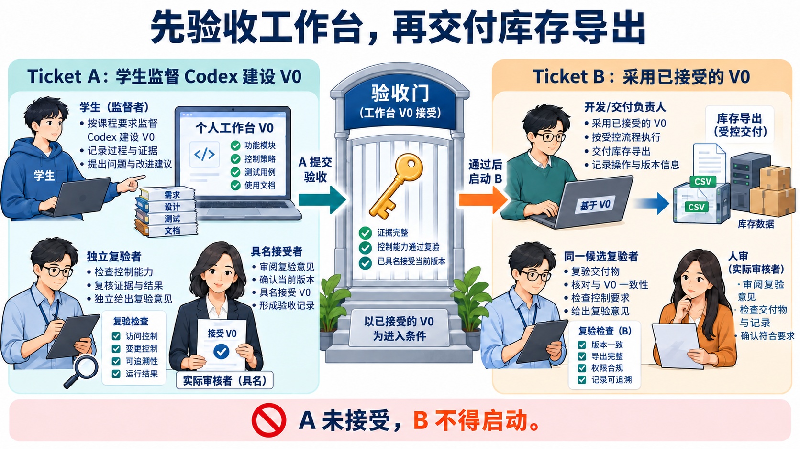
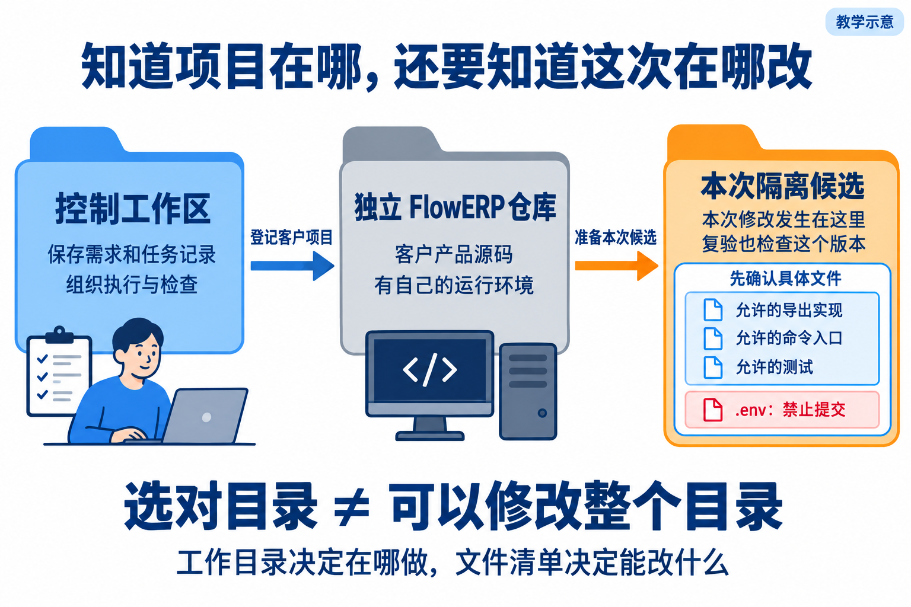
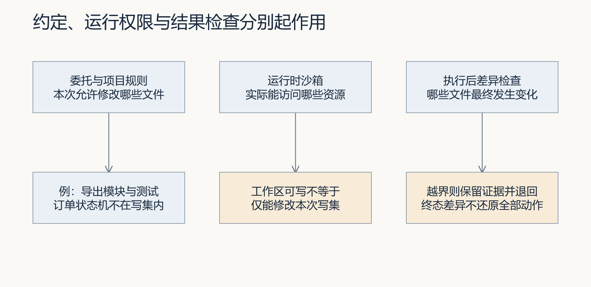
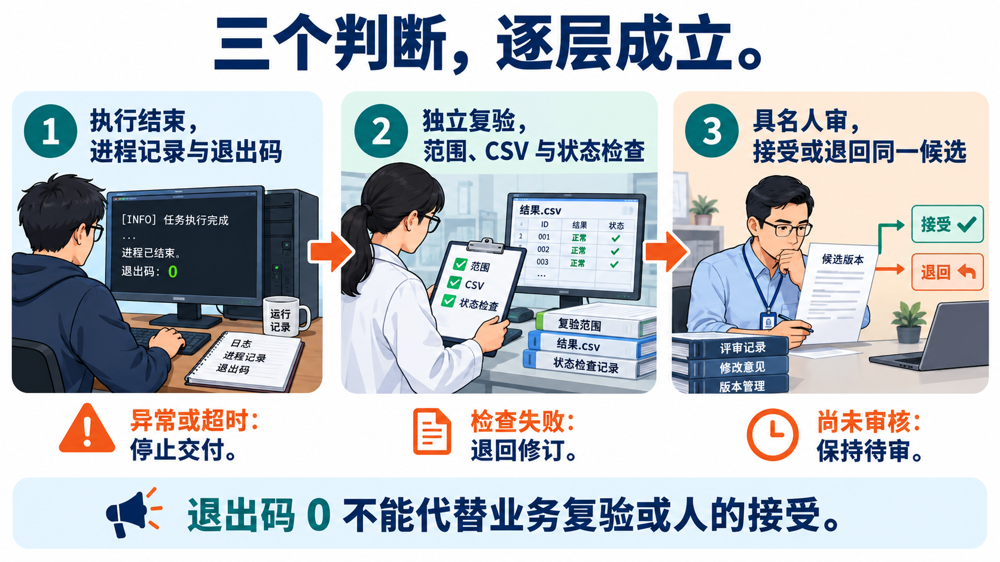
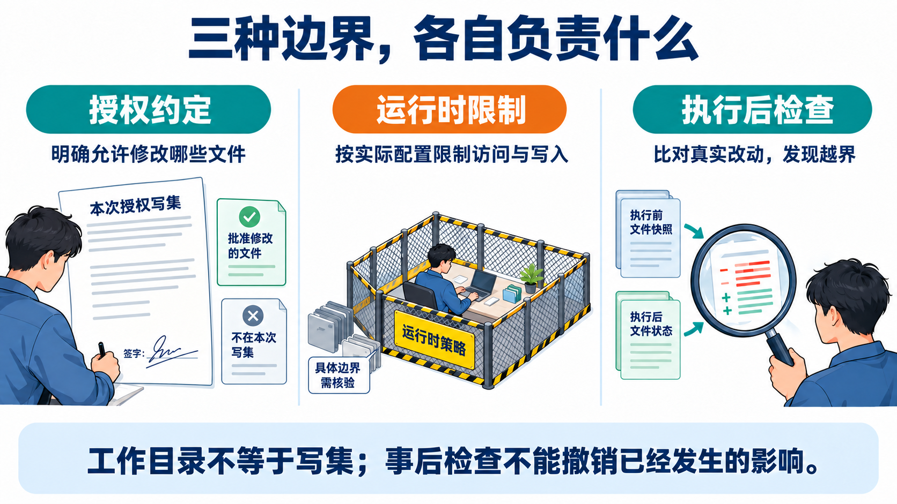
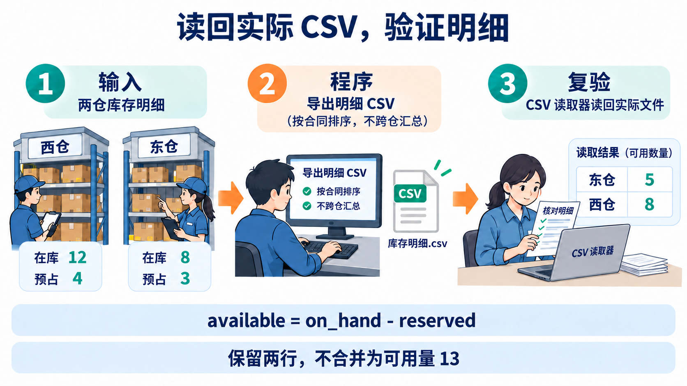
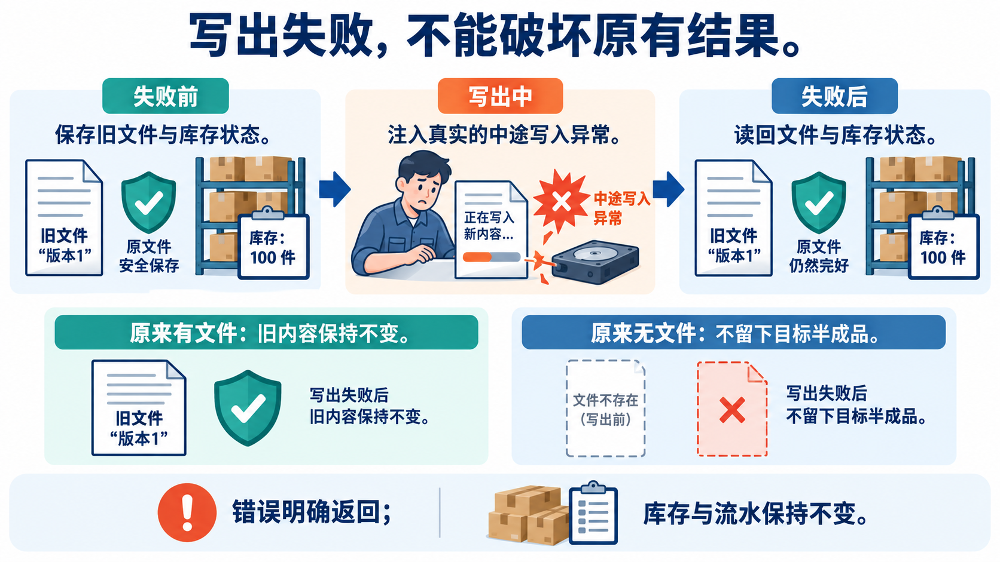
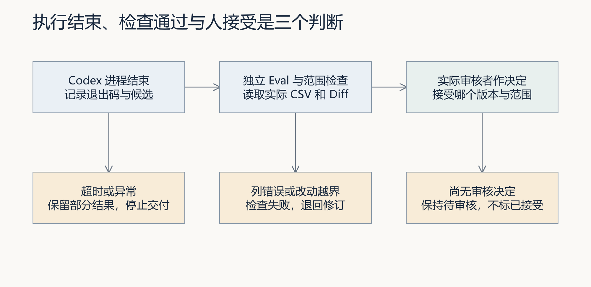

# L04 实践操作手册｜委托 Codex 执行一次最小变更

本讲只做一件事：**先把个人研发工作台 V0 补齐并验收，再用这个工作台交付 FlowERP 的库存导出。**

完成后，你应当留下两张相互独立的任务单：

- **Ticket A：建设工作台。**你直接监督 Codex 补齐受控执行、范围检查、最小 Eval、结果摘要和人工复核入口。
- **Ticket B：使用工作台。**已经通过验收的工作台读取 L03 Spec，在隔离候选中实现库存导出。



> **唯一顺序：A 建设 → A 独立复验 → B 执行 → B 独立复验。**
> A 没有通过，不启动 B；B 自动检查变绿，也不能跳过人工验收。

---

## 一、开始前先认清三个位置

本讲会看到多个目录，但它们不是三套项目。

```text
你的课程练习仓库/                     ← 你一直操作的控制仓库
├─ AGENTS.md
├─ lesson-03-submission/
│  └─ FDE_SPEC.md                    ← B 的需求合同
├─ lesson-04-submission/             ← 你本讲填写的证据
├─ workbench/                        ← A 要补齐和复验的工作台代码
└─ .runtime/l04-learning/            ← 任务记录，不提交

独立 FlowERP 仓库/                   ← 客户产品的事实来源

工作台为 Ticket B 创建的隔离候选/     ← 临时实现区，路径由任务事件给出
├─ flowerp/
├─ eval/
├─ tests/
└─ .course/
```

三条边界必须记住：

1. 你始终从**课程练习仓库**发起命令。
2. Ticket B 只修改工作台创建的**隔离候选**，不要把其中的 `flowerp/` 复制回课程练习仓库。
3. `.runtime/` 是运行证据，不是课程源码，不要提交。



---

## 二、全程路线图

```text
第 1 步：准备证据文件
    ↓
第 2 步：写清 Ticket A 的建设合同
    ↓
第 3 步：直接监督 Codex 补齐工作台 V0
    ↓
第 4 步：由另一人独立复验并决定是否接受 A
    ↓ 只有 A=accepted 才能继续
第 5 步：让工作台创建并执行 Ticket B
    ↓
第 6 步：独立复验库存导出的正反路径
    ↓
第 7 步：人工接受或打回 B，整理交接证据
```

每一步都提供四个信息：**本步目标、你要做什么、正常结果、异常时怎么办**。不要跨步执行。

---

## 第 1 步：建立本讲证据区

### 本步目标

创建四个只用于记录判断和证据的 Markdown 文件。此时还不改工作台，也不改 FlowERP。

### 你要做什么

在课程练习仓库终端执行：

```powershell
New-Item -ItemType Directory -Force lesson-04-submission | Out-Null
New-Item -ItemType File -Force lesson-04-submission/WB-L04-BOOTSTRAP.md | Out-Null
New-Item -ItemType File -Force lesson-04-submission/A-evidence.md | Out-Null
New-Item -ItemType File -Force lesson-04-submission/B-evidence.md | Out-Null
New-Item -ItemType File -Force lesson-04-submission/handoff.md | Out-Null
```

确认本讲依赖仍然存在：

```powershell
@(
  'AGENTS.md',
  'lesson-03-submission/FDE_SPEC.md',
  'workbench/spec.py'
) | ForEach-Object {
  if (-not (Test-Path -LiteralPath $_)) { throw "缺少必需文件：$_" }
}

python -X utf8 -c "import workbench; print('workbench import ok')"
```

### 正常结果

- 出现 `lesson-04-submission/` 和四个空文件。
- 终端显示 `workbench import ok`。

### 异常时怎么办

- 缺少 `lesson-03-submission/FDE_SPEC.md`：返回 L03 完成需求合同，不要继续。
- 无法导入 `workbench`：确认当前终端位于课程练习仓库，并使用该仓库的虚拟环境。
- 不要为了“继续上课”新建一个假的 `FDE_SPEC.md`。

**完成标志：**四个证据文件和三个依赖文件都存在。

---

## 第 2 步：写清 Ticket A 到底要补什么

### 本步目标

先写建设合同，再让 Codex 动手。Ticket A 的对象是**工作台 V0**，不是库存导出。



### 你要做什么

打开 `lesson-04-submission/WB-L04-BOOTSTRAP.md`，至少写清以下六项：

```markdown
# WB-L04-BOOTSTRAP

## 来源
L04：委托 Codex 执行一次最小变更。

## 目标
补齐并复验工作台 V0，使其能够绑定 Spec、创建任务、限制写入范围、
调用 Codex、保存执行证据、运行最小 Eval，并把结果停在人工复核前。

## 非目标
- 本 Ticket 不实现库存导出。
- 本 Ticket 不把自动检查通过写成业务验收通过。
- 本 Ticket 不修改独立 FlowERP 仓库。

## 约束
- 必须声明工作目录、允许写集和超时。
- 越界、失败或超时必须停止，并保留证据。
- 已经存在的能力只复验，不重复实现。

## 验收用例
- 正常任务能保存调用、输出、退出码、Diff 和验证命令。
- 越界写入会被拦截或标记失败。
- 命令失败和超时不会被写成成功。
- Eval 通过后状态仍停在人工复核。

## 完成定义
由非执行者核对当前版本、实际 Diff、命令结果和剩余风险，并具名接受。
```

然后让工作台解析这份合同：

```powershell
python -X utf8 -m workbench.cli spec lesson-04-submission/WB-L04-BOOTSTRAP.md
```

### 正常结果

- 命令退出码为 `0`。
- 输出能识别需求编号、目标、约束、验收用例和完成定义。
- 合同中明确写着“本 Ticket 不实现库存导出”。

### 异常时怎么办

- 解析失败：根据错误补齐缺失章节，再运行一次。
- 如果合同同时要求“补工作台”和“做库存导出”，立即拆开；不要把 A、B 合成一张任务单。

**完成标志：**Ticket A 的边界能够被人读懂，也能被工作台解析。

---

## 第 3 步：直接监督 Codex 补齐工作台 V0

### 本步目标

这一阶段还不能依赖尚未验收的工作台。你要**直接监督 Codex**，让它只补齐合同中缺失的能力。

### 先调查，不要立刻改代码

把下面这段话交给 Codex：

```text
请阅读 AGENTS.md、lesson-04-submission/WB-L04-BOOTSTRAP.md、workbench/ 和相关测试。
先不要修改文件。逐项说明当前是否已经具备：
1. 绑定并读取 Spec；
2. 创建任务；
3. 区分“只复验”和“允许改代码”；
4. 限定工作目录、允许写集和超时；
5. 保存调用、输出、退出码、Diff；
6. 在越界、失败或超时时停止并留下证据；
7. 运行最小 Eval 并生成结果摘要；
8. 自动检查通过后停在人工复核状态。
每一项都给出文件或测试依据，并列出真正缺失的最小项。
```

核对调查结果。只有“有文件或测试依据”的能力才算已存在。

### 再实施最小修改

确认缺口后，把下面这段话交给 Codex：

```text
根据 WB-L04-BOOTSTRAP.md 和刚才确认的缺口，补齐 Workbench V0。
要求：
- 你正在 Ticket A 中工作，不得实现库存导出；
- 先补或运行能暴露缺口的测试，再做最小实现，再运行同一组测试；
- 已存在的能力只复验，不重复重写；
- 不得修改独立 FlowERP 仓库；
- 最后报告实际修改文件、修改前失败证据、修改后结果、Diff 摘要，
  以及越界、失败、超时和人工复核边界的证据。
```

如果你使用课程提供的分段提示词，可按顺序打开 `prompts/01` 到 `prompts/04`；不要一次把四段混在一起发送。

### 复查 Codex 的结果

在课程练习仓库执行：

```powershell
python -X utf8 -m unittest tests.test_workbench tests.test_execution_streams tests.test_bootstrap_handoff -v
$LASTEXITCODE
git status --short
git diff --check
```

将以下内容写入 `lesson-04-submission/A-evidence.md`：

```markdown
## Ticket A 实施证据
- 实际执行者：
- 修改前的失败或能力缺口：
- 实际修改文件：
- 验证命令与退出码：
- Diff 摘要：
- 越界、失败、超时如何处理：
- 仍未证明的事项：
```

### 正常结果

- 相关测试通过，退出码为 `0`。
- `git diff --check` 没有格式错误。
- 实际修改只覆盖 Ticket A 的工作台范围。
- 证据中同时保留“修改前”和“修改后”，而不是只写一句“已完成”。

### 异常时怎么办

- 测试失败：保留输出，继续修 A，不进入第 4 步。
- 出现库存导出代码：说明 A 越界，先撤销该部分后再复验。
- 只看到 Codex 自述、看不到实际 Diff 或命令结果：证据不足，不能送审。

**完成标志：**Ticket A 已实施，但此时只叫“待复验”，还不能叫“已接受”。

---

## 第 4 步：由非执行者独立复验 Ticket A

### 本步目标

让没有执行第 3 步的人根据实际代码和命令作决定。**执行者不能自己批准自己。**



### 启动工作台

打开一个终端并保持运行：

```powershell
python -X utf8 -m workbench.cli serve-workbench `
  --host 127.0.0.1 `
  --port 8001 `
  --runtime-dir .runtime/l04-learning
```

浏览器访问 `http://127.0.0.1:8001/`，确认能够看到工作台首页。

再打开第二个终端，创建 Ticket A 的复验任务：

```powershell
python -X utf8 -m workbench.cli task-create `
  --runtime-dir .runtime/l04-learning `
  --requirement-id WB-L04-BOOTSTRAP `
  --request '独立复验本讲补齐的 Workbench V0' `
  --spec-path lesson-04-submission/WB-L04-BOOTSTRAP.md `
  --actor '实际构建者姓名'
```

记下输出中的真实任务编号，例如 `TASK-……`。下文的 `TASK-实际A编号` 必须替换成它。

### 由另一人运行和复核

```powershell
python -X utf8 -m workbench.cli task-run TASK-实际A编号 `
  --runtime-dir .runtime/l04-learning `
  --actor '实际复验者姓名'
```

复验者应核对：当前代码版本、实际 Diff、执行命令、退出码、越界与失败证据、未解决风险。

全部满足时才执行：

```powershell
python -X utf8 -m workbench.cli task-review TASK-实际A编号 `
  --runtime-dir .runtime/l04-learning `
  --reviewer '实际复验者姓名' `
  --decision approve `
  --note '已核对当前版本、范围、命令、结果和剩余风险'
```

不满足时将 `approve` 改为 `reject`，在说明中写清具体缺口。

### 正常结果

- Ticket A 的最终状态为 `accepted`。
- 复验者与实际执行者不是同一人。
- 接受说明能对应到具体 Diff 和命令结果。

### 异常时怎么办

- 找不到非执行者：把 A 保持在待复核状态，停止本讲；不能虚构姓名或代签。
- A 被拒绝：返回第 3 步修复，再产生新的复验结果。
- 仅测试变绿但状态仍为 `review`：这是正确状态，说明还在等人审。

**完成标志：**Ticket A 明确显示 `accepted`。只有现在才能启动 B。

---

## 第 5 步：让已验收的工作台执行 Ticket B

### 本步目标

用 Workbench V0 读取 L03 的真实 Spec，在隔离候选中调用 Codex 实现库存导出。

### 先确认 L03 合同没有被偷偷改掉

库存导出至少应规定：

- 八列：`sku,name,site,location,lot_id,on_hand,reserved,available`；
- `available = on_hand - reserved`；
- 每个 SKU、站点、库位、批次一行；
- 按 `sku,site,location,lot_id` 稳定排序；
- 覆盖空库存、特殊字符、文件写入失败和只读性；
- 写明由谁确认需求及其结论。

执行：

```powershell
python -X utf8 -m workbench.cli spec lesson-03-submission/FDE_SPEC.md
if ($LASTEXITCODE -ne 0) { throw 'L03 Spec 无效，不能启动 B。' }
Get-FileHash -Algorithm SHA256 lesson-03-submission/FDE_SPEC.md
```

把哈希记录到 `B-evidence.md`，用于证明 B 执行和验收依据的是同一份合同。

### 核对本次设计约定

在已有 Ticket B 记录中引用 L03 `decisions.md` 的关系简图和 Spec 约束，核对独立 FlowERP 候选的实际入口、库存查询、数据归属与 CSV 输出位置。只读确认权限与错误返回的现状，再确定最小写集。缺少关键依据时补调查；方案变化时保留旧版、修改理由和重新确认的合同及摘要，再提交。

执行后、第 6 步复验时，逐项记录“约定 → 实际文件或调用 → 检查结果”：至少核对无重复库存规则、无绕过既定权限、成功与写出失败后库存及流水不变。引用同一候选的 Diff 和实际运行证据；未覆盖项写未验证。发现偏离则打回修订，不以测试绿灯替代设计审查。

### 提交并执行 Ticket B

```powershell
python -X utf8 -m workbench.cli course-submit `
  --lesson 4 `
  --execute-code `
  --bootstrap-task-id TASK-实际A编号 `
  --requirement-spec lesson-03-submission/FDE_SPEC.md `
  --actor '实际构建者姓名' `
  --runtime-dir .runtime/l04-learning `
  --execution-timeout 900

$LASTEXITCODE
```

记录输出中的真实 B 编号，然后查看详情：

```powershell
python -X utf8 -m workbench.cli task-show TASK-实际B编号 `
  --runtime-dir .runtime/l04-learning
```



### 正常结果

- A 的编号被记录为 B 的前置验收依据。
- B 的事件中出现隔离候选目录、调用信息、实际写集、验证命令和结果。
- 自动执行结束后，B 停在 `review`，等待独立复验。

### 异常时怎么办

- 提示 A 未接受：不要绕过门闩，返回第 4 步。
- 执行失败或超时：保留任务和输出，不要把状态改写成成功。
- 实际写集越界：直接打回 B；不要手工复制“看起来正确”的文件。
- B 已经显示 `accepted` 且没有具名人审：属于状态错误，应先修工作台。

**完成标志：**B 有可定位的隔离候选，状态为 `review`。

---

## 第 6 步：独立复验库存导出

### 本步目标

不相信执行者的总结，直接从 B 的事件中找到候选目录，对 CSV 的正常路径、失败路径和只读性逐项检查。



### 运行课程复验脚本

在课程练习仓库终端执行整段脚本：

```powershell
& {
    $python = (Get-Command python).Source
    $probe = (Resolve-Path 'docs/courses/L04/scripts/check_inventory_delivery.py').Path
    $taskId = Read-Host '输入 B 任务编号'
    $taskText = & $python -X utf8 -m workbench.cli task-show $taskId `
      --runtime-dir .runtime/l04-learning
    if ($LASTEXITCODE -ne 0) { throw '无法读取 B。' }

    $task = $taskText | ConvertFrom-Json
    $event = $task.events |
      Where-Object { $_.detail -eq '已创建课程隔离 Worktree' } |
      Select-Object -Last 1
    if (-not $event.evidence.path) { throw 'B 没有可复验的隔离候选。' }

    $candidate = (Resolve-Path -LiteralPath $event.evidence.path).Path
    $output = Join-Path (Get-Location) `
      ('.runtime/l04-check-' + [guid]::NewGuid().ToString('N'))

    & $python -X utf8 $probe `
      --workspace $candidate `
      --output $output `
      --case all `
      --file-entry flowerp.inventory_export:export_inventory_file

    $exit = $LASTEXITCODE
    Write-Host "候选目录：$candidate"
    Write-Host "证据目录：$output"
    Write-Host "退出码：$exit"

    if (Test-Path -LiteralPath (Join-Path $output 'report.json')) {
        Get-Content -Raw -Encoding UTF8 `
          -LiteralPath (Join-Path $output 'report.json')
    }
    if ($exit -ne 0) {
        throw '库存导出复验失败，请保留报告并打回 B。'
    }
}
```

### 人工读懂结果，不要只看退出码

| 场景 | 你必须看到什么 |
|---|---|
| 正常库存 | 表头八列；两行明细；东区 `8-3=5`，西区 `12-4=8` |
| 空库存 | 只有表头，没有伪造数据 |
| 特殊字符 | 名称、站点、库位中的特殊字符被正确保留和转义 |
| 稳定排序 | 顺序固定为 `sku,site,location,lot_id` |
| 文件失败 | 旧文件不被破坏，不留下半个新文件 |
| 只读性 | 所有场景执行前后的库存和业务流水一致 |

另外打开 B 的实际 Diff，确认：

- 没有密钥、`.env`、运行数据库或生成报告；
- 没有修改候选之外的文件；
- 没有为了通过测试而改写 L03 Spec；
- 实际实现与任务摘要一致。



将以下内容写入 `lesson-04-submission/B-evidence.md`：

```markdown
## Ticket B 复验证据
- B 任务编号：
- L03 Spec SHA256：
- 隔离候选目录：
- 实际写集：
- 复验命令与退出码：
- 正常库存结果：
- 空库存结果：
- 特殊字符结果：
- 稳定排序结果：
- 文件失败结果：
- 只读性结果：
- Diff 与范围检查：
- 剩余风险：
```

### 正常结果

- 脚本退出码为 `0`，并生成 `report.json`。
- 表中六个场景都能由报告或实际文件证明。
- Diff 没有越界，导出过程没有改变库存事实。

### 异常时怎么办

- 任一场景失败：保留报告，把 B 打回；不能只修报告文字。
- 没有候选目录：B 没有形成可复验交付，返回第 5 步查执行事件。
- 业务结果正确，但工作台漏记写集、命令、失败或状态：暂停 B，先修复并重新验收 A。

**完成标志：**六类结果、实际 Diff 和只读性均有证据；此时仍未完成人工接受。

---

## 第 7 步：接受或打回 Ticket B，并完成交接

### 本步目标

由非执行者把第 6 步的证据转成明确决定，并留下下一位复验者能够接手的信息。



### 作出具名决定

全部满足时执行：

```powershell
python -X utf8 -m workbench.cli task-review TASK-实际B编号 `
  --runtime-dir .runtime/l04-learning `
  --reviewer '实际复验者姓名' `
  --decision approve `
  --note '已核对 Spec、实际 Diff、CSV、失败路径、只读性和剩余风险'
```

任何一项不满足时，把 `approve` 改为 `reject`，说明具体失败场景。

### 根据失败位置决定回到哪里

| 发现的问题 | 回到哪里 | 原因 |
|---|---|---|
| CSV 字段、计算、排序或文件处理错误 | 打回 B | 产品实现不符合 L03 Spec |
| 工作台漏记范围、失败、超时或状态 | 暂停 B，修复并重新验收 A | 执行控制本身不可信 |
| A 接受后控制仓库源码又发生变化 | 新建 A 重新复验 | 旧接受结论不再覆盖当前版本 |
| 没有独立复验者或需求确认人 | 保持待处理 | 缺少真实的人审证据 |

返工时不要删除旧任务。旧 B 保留失败证据，新一轮创建新的候选和报告。

### 填写交接文件

在 `lesson-04-submission/handoff.md` 回答五个问题：

```markdown
# L04 交接

1. Codex 如何参与 A 和 B？哪些决定仍由人负责？
2. FlowERP 新增了什么可观察产品状态？
3. 这次交付暴露了什么可重复的工程问题？
4. 工作台新增或验证了什么能力？
5. 哪些证据能证明我可以把这套方法迁移到另一个最小需求？
```

最后确认：

- [ ] A、B 是两张不同任务单。
- [ ] A 先由非执行者接受，B 才启动。
- [ ] L03 Spec 的哈希已经记录。
- [ ] B 只在隔离候选中实现库存导出。
- [ ] 实际写集、Diff、命令和退出码可追溯。
- [ ] 正常、空库存、特殊字符、排序、文件失败、只读性均已复验。
- [ ] 自动绿灯没有替代具名人工验收。
- [ ] 返工没有删除旧失败证据。

### 正常结果

- B 的最终状态为 `accepted`，且有具名非执行者的复验记录。
- `A-evidence.md`、`B-evidence.md` 和 `handoff.md` 能让第三人复现判断过程。
- 你能用一句话解释本讲：**先把交付工具本身验收可信，再让它交付客户功能。**

### 异常时怎么办

如果清单中任一项无法勾选，不要写“L04 已完成”。保留当前状态，并回到表中对应的步骤修正。

**完成标志：**A 和 B 都有独立、具名、可追溯的接受证据，本讲才算完成。

---

## 三、你最终应提交什么

只提交课程源码和学习证据，不提交运行产物：

```text
lesson-04-submission/
├─ WB-L04-BOOTSTRAP.md
├─ A-evidence.md
├─ B-evidence.md
└─ handoff.md
```

不要提交：

- `.runtime/` 下的任务库、临时报告和候选目录；
- 密钥、`.env` 或运行数据库；
- 从隔离候选复制回来的 `flowerp/`；
- 只有“已通过”结论、没有命令与事实依据的截图或文字。

本讲的真正产出不是一份 CSV，而是一条可复查的因果链：

```text
L03 的已确认 Spec
  → Ticket A 建设并验收工作台 V0
  → Ticket B 在受控候选中交付库存导出
  → 自动检查提供技术证据
  → 非执行者依据证据作接受或打回决定
```
