# L04｜委托 Codex 执行一次最小变更

> 本资料由 AI 辅助整理，为课程赠送资料，用来辅助你理解课程内容，可作为查询手册使用，非必读资料。

## 本讲总览图

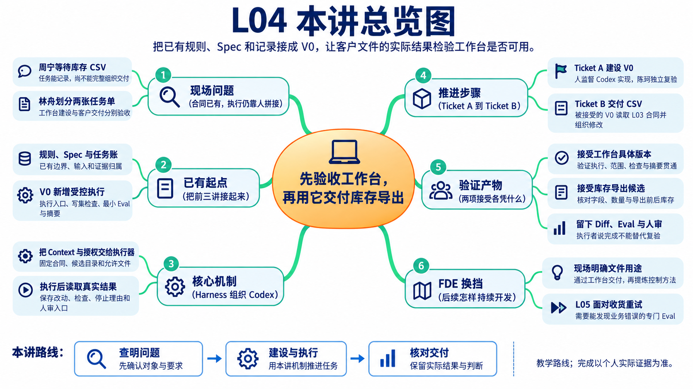

## 本讲总览

本讲把 L01 的记录、L02 的规则和 L03 的 Spec 接成受控执行链。先完成执行入口、写集检查、最小 Eval、摘要与人工确认点，再用 V0 交付库存导出。你要同时解释工作台版本为什么可用，以及文件内容和导出前后库存为什么符合合同。

## 林舟的项目手记

库存导出 Spec 已经确认，周宁问林舟什么时候能拿到文件。林舟打开工作台，却发现它目前能记任务、读合同，还不能完整组织执行和复验。若现在照旧在聊天里做完，再补一句“通过工作台交付”，就绕过了最需要建设的那一段。

他把事情拆成两项：先与 Codex 补齐工作台 V0，请陈珂独立复验；再让被接受的 V0 读取库存导出合同，组织 Codex 修改 FlowERP。周宁最终拿到的 CSV，将检验这套工作台是否真的能帮助交付。

人物与开场对话为虚构教学情境；实测材料按原注释辨认来源。人物关系与连续路线见[讲义阅读导航](../讲义阅读导航.md)。

## 阅读路线

阅读时带着林舟的两张任务单：Ticket A 建设并验收工作台，Ticket B 使用它交付库存导出。每到一个执行或检查步骤，先判断它属于哪张单，避免拿客户功能的绿灯替工作台验收。

1. 从前几讲的 AGENTS 与 Spec 接着建设 V0
2. 为什么必须分成 Ticket A 与 Ticket B
3. 个人工作台 V0 的架构与核心思想
4. 按已有规则与 Spec，一步步完成并验收 V0
5. 怎样把一份 Spec 变成有边界的委托
6. 怎样判断库存导出真的做对了
7. 常见失败与可复用方法
8. 课程总结、思考与下一讲


## 课堂案例与阅读位置

本材料对应 30 页课堂 PPT。示例 1 和示例 5 分别跨两页，后一页继续同一个案例。第 19 页是真实执行器实测，独立于九组教学示例。

|案例|PPT 页码|学习任务|
|---|---|---|
|示例 1|6～7|写清 V0 任务说明，验证缺少完成定义时的拒绝行为|
|示例 2|9|比较实际改动与授权范围，判断越界返工|
|示例 3|16|控制源码改变后，重新复验并接受当前版本|
|示例 4|18|填写库存导出任务单，绑定 Spec、目录和允许文件|
|真实执行案例|19|读取修正可用库存计算的真实调用、Diff 和独立检查记录|
|示例 5|21～22|准备倒序库存明细，导出后逐列、逐行比较|
|示例 6|23|把错误结果转成有输入、预期和证据的返工说明|
|示例 7|24|检查空库存、带逗号、引号或换行的名称|
|示例 8|25|比较导出前后的库存账，验证只读要求|
|示例 9|26|制造中途写入失败，检查旧文件、半成品和库存|

第 27 页把这些失败归入 A 或 B 的返工路径。讲义说明判断原理，手册说明操作与留证方法。流程图表示教学步骤；标为教学预期的数据不能替代本人实际运行结果。

## 1. 从前几讲的 AGENTS 与 Spec 接着建设 V0

前几讲已经让工作台能够记录工作、提供规则、读取合同，但“能读到要求”与“能按要求组织交付”之间还有一段程序要由你和 Codex 完成。L04 就来补上这一段。这里的“完成 V0”指达到本阶段的最小可用状态，L01 的 V0.1 是早期自举里程碑；本讲不要求一次实现后续全部能力。

### 1.1 从自己的前序成果出发

先打开自己前几讲的材料和源码，逐项回答：它已经解决了什么，本讲还要接上什么？

| 前序成果 | 已有作用 | L04 怎样继续使用 |
|---|---|---|
| L01 的 `WORKBENCH_SPEC.md` 与工作台实现 | 说明工作台为谁服务，建立项目、任务与命令证据账 | 沿用已确认的目的和已有记录能力，补充 V0 的执行与验收要求 |
| L02 的 `AGENTS.md` | 约定目录、禁止事项、验证命令和完成条件 | 据此决定本次写集、验证入口与停止条件，并检查真实改动 |
| L03 的 Spec 模板与最小解析器 | 稳定读取目标、非目标、约束和验收等内容 | 接到执行前的输入检查，结构无效时不启动编码 |
| L03 确认版库存导出 Spec | 规定首个客户交付要达到什么结果 | V0 被接受后，作为 Ticket B 的业务输入 |

若其中一项缺失，先明确缺口并补齐对应前序要求。参考仓库提供的实现可以帮助调查，但应区分哪些代码是现成支架、哪些是本人在本讲新增或接通的能力。

### 1.2 分清工作台 Spec 与业务 Spec

**工作台 Spec 指导我们建工具，库存导出 Spec 指导工具组织客户交付。** 本讲在已有 `WORKBENCH_SPEC.md` 的基础上形成 V0 能力增量合同，实践中保存为 `WB-L04-BOOTSTRAP.md`，注明前序版本和本轮新增要求。它不能被库存导出的字段要求替代，也不应覆盖原有建设记录。

`AGENTS.md` 则为两类任务提供长期约束。例如，规则要求失败可追溯，V0 能力合同就要进一步说明：执行失败后保存哪些命令输出、退出码与候选信息，任务应停在哪里。把规则转成可观察行为，才知道需要实现哪段程序。

库存导出的确认版 Spec 应当说明：使用者为什么需要文件；一行代表什么；八个字段各自是什么；`available = on_hand - reserved`；空库存、特殊字符和写出失败怎样处理；成功和失败都不得改变库存与流水。

这些要求提供了判断实现对错的依据，却还没有产生产品改动。解析器能读出六个部分，只证明合同结构可以被程序消费，也不证明 CSV 已经生成。

### 1.3 L04 要交付两个连续成果

本课程先交付工作台，再交付客户产品：

| 成果 | 建设对象 | 可观察结果 |
|---|---|---|
| 工作台 V0 | 执行入口、写集检查、最小 Eval、结果摘要和人工确认点 | 能接收合同、控制 Codex、保留差异与检查结果，并停在待审核状态 |
| FlowERP 库存导出 | 只读 CSV 导出能力 | 真实文件满足字段、口径、边界和只读要求 |

两项成果前后相接，却不能合并验收。工具可用不代表这次业务结果正确；业务测试通过也不能倒推出工作台的范围控制可靠。

理解了这两个成果，下一步就能解释为什么课堂需要两张任务单，而不是把“建设工具”和“使用工具”塞进同一次自我证明。

### 1.4 L04 怎样实践 FDE：从现场问题到交付，再到能力

FDE（Forward-Deployed Engineering）在本课程中指向一种持续交付方法：贴近使用现场判断问题，组织可验证的交付，再把重复出现的工程问题沉淀为能力。这一方法包含相互衔接的现场、交付和能力三个循环。学生作为建设者负责范围判断，Codex 协助调查与实现，工作台组织执行和证据；业务确认者核对用途，独立复验者检查实现并作出接受或返工决定。学生可以担任同伴任务的复验者，但不能替自己建设的版本独立签收。

**现场循环：把使用者的困难变成有理由的范围决定。** 本讲沿用 L03 的课堂设定：运营人员需要核对可售数量，并定位库存所在仓位。如果只导出在库量，预占部分可能被误认为仍可出售；如果把同商品的不同仓位合成一行，又无法定位明细。因此，学生需要确认采用可用量，保留仓位与批次明细，并说明为什么本次只做只读导出。Codex 可以协助提出问题、调查数据和比较方案，最终的业务取舍由人确认，写回 L03 的 Spec。个人实践要注明真实需求来源；课堂角色设定不能写成已经发生的客户访谈。

**交付循环：把范围决定变成实际结果，再回到用途检查。** 工作台按确认版 Spec 组织 Codex 修改，独立复验者在同一候选检查 CSV、只读性与失败行为。例如，在库 8、预占 3 时，文件应给出可用量 5；业务确认者还需检查，文件中的商品、仓位和批次是否足以完成约定的库存核对。前者验证实现符合数量规则，后者验证交付符合用途。若输出不满足用途，就记录具体差异，先判断是实现错误还是需求遗漏，再决定在原范围内修复或重新确认合同。

**能力循环：把重复工程问题变成下一次可采用的工作台能力。** 委托容易越界，就补写集检查；结果无法追溯，就绑定合同、代码版本和验证记录；程序通过被误当作完成，就补人工确认点。学生直接监督 Codex 在 Ticket A 中实现并复验这些能力，再由被接受的 V0 组织 Ticket B，用真实库存导出检验它们是否生效。L04 完成的是本阶段能力建设与首次业务验证；后续事项明确采用这些能力并留下复验结果，才能进一步证明它们可以复用。这里的能力提升指工程流程与程序的改进，不指模型权重自动更新。

因此，本讲的三层关系是：**库存核对需求决定交付范围；交付风险决定 V0 要补什么；库存导出的实际结果检验 V0 是否有效。** 学生应保留自己的范围决定、实现与修订证据、用途确认及复验反馈，并能解释这些材料如何相互对应。只有命令执行成功或测试全绿，还不足以回答上述问题。

三个循环描述的是持续改进关系，不要求每次都按“先交付业务、后建设能力”的顺序操作。L04 是这条路线的换挡点：依据 L03 已确认的库存导出需求及前序实践暴露的风险，先由你直接监督 Codex 补齐 V0，并由独立复验者接受具体版本；随后才通过 V0 组织库存导出交付。后续各讲继续从 FlowERP 的需求或失败出发，必要时先升级工作台，再用产品结果验证升级是否有效。

## 2. 为什么必须分成 Ticket A 与 Ticket B

Ticket 是一次可追踪的任务。L04 使用 A、B 两张 Ticket，把工具建设和客户交付的责任分开。

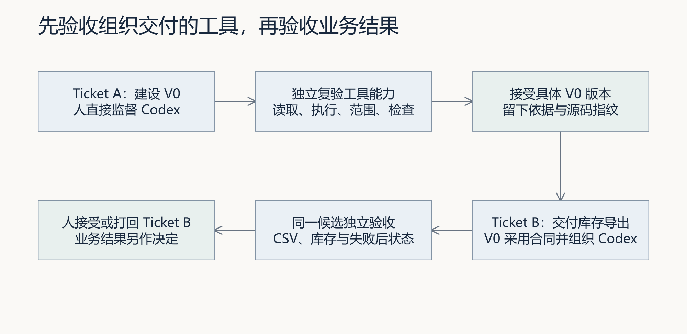

### 2.1 Ticket A：建设工作台 V0

Ticket A 由学生直接监督 Codex，补齐工作台 V0 的最小能力。它的验收对象是工作台本身：输入无效时会不会拒绝；没有授权时会不会启动编码；修改越界、命令失败或超时时会不会如实停下；报告能否列出实际修改、验证命令和剩余风险。

这里需要区分 A 阶段的建设过程与系统中登记的 A 复验任务。建设时，学生沿用前几讲的任务与证据账，保存能力合同、首次检查、Codex 交互、实现差异和自查结果。能力接通后，再按第 4.8 节创建仅复验模式的 A 任务，将这些建设记录的位置和待验源码版本写入它所引用的能力合同。这样，复验者能从 A 回查建设过程；创建复验任务本身不代表工作台已经完成建设。

这里可以使用测试替身制造失败、超时或越界，用来检查控制逻辑。测试替身证明的是某条工作台分支，不是 Codex 已经真实完成库存导出。

### 2.2 为什么 A 需要独立验收

如果同一套工作台既执行任务，又宣布自己可靠，就可能出现“永远通过”的假闭环。另一位复验者需要查看能力合同、首次失败、实现差异和针对性检查，亲自在同一源码版本上复验，然后接受或打回该版本。

独立验收不等于一定要组织复杂评审会。它要求的是责任分离：执行者不能换一个名字替自己签收；没有同伴时，可以完成建设和自查，但必须把“独立接受”保留为未完成项，不能继续声称 Ticket B 已由合格工具组织。

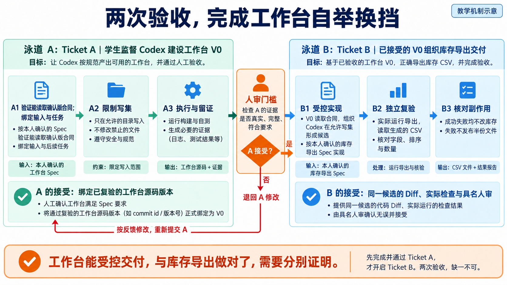

*读图：先验收左侧的工作台能力，才沿箭头进入右侧产品交付。两次验收的对象不同，A 的通过不能替 B 作证。*

为什么不能让同一个“完成”按钮收掉 A 和 B？假设库存 CSV 恰好正确，但执行器允许修改任意目录，产品检查可能全绿，工作台边界仍不合格。反过来，执行器准确限制写集、保存报告，CSV 却把在库量当成可用量，说明工作台组织了一个仍需返工的产品候选。把两个接受决定分开，才能知道下一步改控制能力还是改业务实现。

还有时间上的要求：A 被接受的是具体工作台版本。若准备 B 时又改了执行器，先判断原检查覆盖是否仍有效，对受影响能力重新复验。不能让“V0 已接受”的名称替后来变化的程序继续作证。

### 2.3 Ticket B：由已接受的 V0 交付库存导出

Ticket B 同时引用两份输入：

- `--bootstrap-task-id` 指向已经独立接受的 Ticket A，回答“本次采用哪一版工作台能力”。
- `--requirement-spec` 指向 L03 的确认版 Spec，回答“本次交付依据哪份业务合同”。

随后，V0 在独立候选目录中调用 Codex 修改 FlowERP，采集实际差异，运行检查并生成摘要。另一位复验者读取同一候选中的 CSV 和业务状态，再决定接受或打回 B。

这就是 L04 的自举换挡：学生先直接监督 Codex 建工具；工具通过独立验收后，第一次接过组织交付的职责。

## 3. 个人工作台 V0 的架构与核心思想

林舟把一次交付摊在桌上：谁给 Codex 哪份合同，在哪个目录改动，谁运行检查，结果送给谁。工作台要接起这些动作，FlowERP 则保存客户的业务事实。架构从这次委托需要的对应关系展开。

### 3.1 V0 的最小架构

```text
业务人员／学生
    │  确认需求、授权范围、作出验收决定
    ▼
个人工作台 V0
    ├─ Spec 入口：读取确认版合同
    ├─ Task：绑定任务、候选目录与源码版本
    ├─ Execution：在许可范围内调用 Codex
    ├─ Eval：运行有辨识力的检查
    ├─ Evidence：保存 Diff、命令、退出码与结果
    └─ Review：等待具名接受或打回
    │
    ├────────► Codex：调查、修改、运行命令、报告
    │
    └────────► FlowERP 候选：形成库存导出并接受业务复验
```

这一架构中，Codex 是执行伙伴，工作台是组织者，FlowERP 是客户项目和验证场。人的职责贯穿始终：决定合同、给出授权、处理异常、检查证据并作最终判断。

### 3.2 核心思想一：先绑定合同，再启动执行

工作台不能只接收一句“帮我实现导出”。它要保存本次采用的 Spec 内容或版本，让目标、非目标、约束和验收用例进入同一任务。若 Spec 尚未确认或结构无效，应在改代码之前停止。

这里的“绑定”就是让一条任务记录能明确指向它实际使用的材料。例如，昨天的任务按八列表头执行，今天有人把同一路径的 Spec 改成九列；如果只留下文件名，就无法解释昨天为什么少了一列。保存当时的内容或可回查的版本，才能按当时的约定复验。

### 3.3 核心思想二：能力信封要小而明确

一次委托的能力信封由工作目录、允许写入的文件范围、沙箱、执行超时和停止条件共同组成。它回答 Codex 这次能到哪里、能做多久、发生什么必须停。

其中，**写集**是本次允许新增、修改或删除的文件范围；**候选目录**是保存本次待检查代码的独立目录；**Diff** 是相对起点发生的代码差异。假设只批准修改导出实现及其测试，Codex 又改了订单状态机，即使导出结果正确，也已经超出本次委托。候选目录帮助保留这次变化，写集提供比较标准，Diff 则提供实际改动事实。

项目规则和 Prompt 用来说明应当怎样做；运行时沙箱限制可访问的资源；执行后的 Diff 检查识别最终留下了哪些变化。三者互相补充，不能互相替代。


例如 `workspace-write` 允许写工作区，并不等于只允许修改本次列出的导出文件。因此工作台仍需把真实变化与本次写集逐项比较，发现越界时保留证据并退回。

### 3.4 执行结果、检查结论与人工接受

一次变更应先判断执行是否正常结束，再检查实际改动，最后由具名审核者决定是否接受。同一任务中的三种记录回答不同问题，必须指向同一个候选版本。

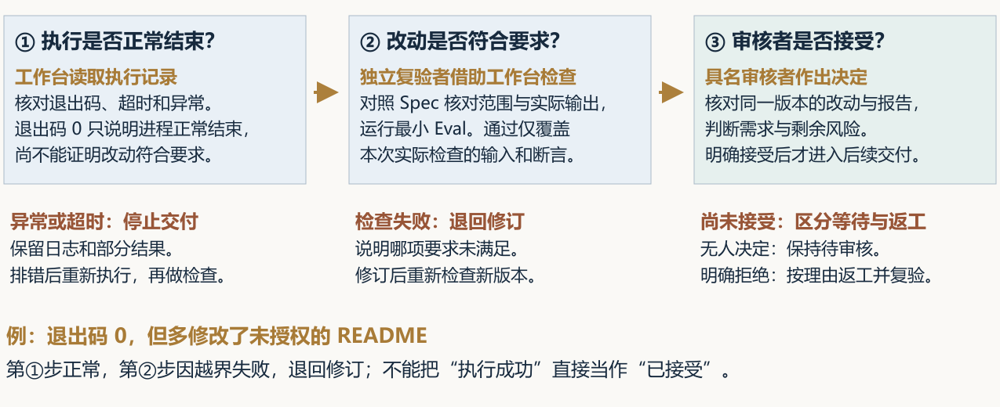

第一步，工作台读取 Codex 的退出码、超时与异常记录。退出码为 0 只说明进程正常结束，不保证需求实现正确。超时或异常时保留输出和部分改动，停止本次交付；排错后重新执行并检查。

第二步，独立复验者对照 Spec 检查实际 Diff、批准范围与业务输出，并运行最小 Eval。退出码为 0，但 CSV 列错误，仍是业务失败；CSV 正确但额外修改未授权的 README，也必须返工。范围内正常路径则应继续业务检查，不能把所有修改一律拦住。绿色结果只覆盖实际运行的断言，不能推断未覆盖情境也正确。

第三步，具名审核者回查同一版本的改动、原始报告和剩余风险，明确接受后才进入后续交付。无人决定时保持待审核；明确拒绝时按理由返工。修订产生新版本后必须重新检查，不能沿用旧候选的报告。仅复验模式可以从已有候选进入第二步，不能据此声称此前调用过 Codex。

## 4. 按已有规则与 Spec，一步步完成并验收 V0

这一节是本讲的建设主体。Ticket A 要把前几讲分散的能力接成可运行的交付路径。学生负责解释规则、确认范围、选择验收情境并审查结果；Codex 协助调查调用关系、编写检查、补齐缺失的能力和排查失败。先写清本轮能力增量，再分段实现，最后独立复验整个 V0。

### 4.1 把 AGENTS 与 Spec 翻译成程序责任

不能把两份文档交给 Codex，再用“已阅读”作为完成依据。每条关键要求都要落到程序的某个位置，并有对应的检查。

| 已有要求 | V0 要完成的程序责任 | 怎样看出它确实生效 |
|---|---|---|
| Spec 缺必要字段须明确报错 | 复用 L03 解析器，在启动执行前检查输入 | 缺字段请求返回具体错误，执行器没有被调用 |
| AGENTS 要求最小变更、遵守目录边界 | 记录授权写集，比较实际新增、修改、删除和重命名 | 无关文件变化被识别，不能进入接受状态 |
| 任务、检查与反馈必须可追溯 | 复用任务账，把合同、候选、执行与检查关联到同一任务 | 从任务记录能找到这次使用的合同及原始结果 |
| 失败不能伪装成成功 | 采集退出码、超时与错误输出，区分失败和未执行 | 失败执行保留原因，未运行检查不会显示通过 |
| 摘要列出修改、验证与风险 | 根据实际差异和命令记录生成摘要 | 摘要中每项结论都有原始记录可查 |
| 人作最终接受决定 | 检查通过后保留待审核状态，记录具名决定 | 程序通过不会自动变成人工接受 |

例如，“不改订单模块”首先是人的范围决定；工作台保存允许文件，向执行器传达边界，并在执行后核对变化。自然语言规则本身不会自动变成文件访问控制，Diff 检查也不能撤销已经发生的写入。因此仍需要独立候选目录和实际运行环境的权限限制。

### 4.2 按四个小步把已有能力接起来

**第一步，接通“Spec → 任务”。** 找到 L03 的解析入口和 L01 的任务记录入口，确认任务能引用本次实际采用的合同，并保存候选目录与源码起点。先用缺字段输入检查拒绝路径，再用有效输入检查记录路径。此时先验证输入和追踪，不急着修改 FlowERP。

**第二步，接通“任务 → 受控执行”。** 让执行入口使用已确认的候选目录、写集、超时和委托内容，调用 Codex 并采集输出。仅复验模式不应启动编码；请求真实执行却缺少必要范围时应拒绝。先用可控的测试替身验证失败与超时分支，再核验真实调用是否走同一入口。

**第三步，接通“执行 → 范围检查与最小 Eval”。** 执行结束后收集完整差异，与写集核对，再按约定运行检查并记录退出码。Eval 指可重复运行的验收检查；本讲只接通最小检查链，后续再增强其辨识力和统一质量门。这里尤其要确认：越界或检查失败时不会被执行器的一句“完成了”覆盖。

**第四步，接通“检查 → 摘要与人工确认”。** 根据真实记录生成摘要，列明修改文件、验证命令及剩余风险，保留待审核状态。让复验者从一条任务记录追到合同、候选、Diff 和检查，再对这个具体版本作出决定。已有任务账、证据账应继续复用，避免另起一套无法互相追踪的记录。

这些是实现顺序，不是要求新建四套系统。先在自己的代码中找对应入口；已有能力保留，只补齐缺失的部分。具体操作与命令见[实践操作手册](实践操作手册.md)，个人判断、实际 Diff 和检查结果保存在建设记录中，并关联到后续的 A 复验任务。

**看一个连接处的具体例子。** 假设 L01 的任务账已经保存任务编号和命令结果，L03 的解析器也已能返回有效合同，但当前执行入口一看到命令退出码为 0 就写入“完成”。本轮缺口便不是重写任务账，而是补上“实际变化是否在写集内、检查是否通过、是否有人接受”这几个判断。

下面只表达判断顺序，是教学伪代码，不能直接替代仓库实现：

```text
读取并校验合同；无效则记录错误并停止
记录候选起点与允许写集
执行委托，保存输出，并采集实际变化
若执行失败、超时或实际越界：保留失败，停止交付
运行约定检查；失败则保留失败，停止交付
生成摘要，进入待人工审核
```

你需要让 Codex 先指出自己仓库中负责这些步骤的函数，再决定改哪里。检查时至少用两组相同结构的输入：范围内改动、检查通过，应到待审核；额外改动无关文件，即使命令成功，也应被阻止。这样才能判断新增连接解决了什么，而不只是看到“又多了一个函数”。

### 4.3 用一个失败例子检查是否接通

假设一次受控练习只允许修改指定的练习文件，执行替身却额外修改了范围外文件，并返回退出码 0。这时应当观察到：工作台记录真实变化、标明越界文件、保留候选与输出，并阻止该结果进入接受状态。

“执行替身”是测试时暂时代替真实 Codex 的一小段程序。我们可以让它稳定地返回失败、触发超时或产生越界文件，从而重复检查同一条控制分支。它适合检验工作台怎样处理异常；真实 Codex 能否按业务合同完成导出，仍要在 B 中另行验证。

如果摘要仍写“成功，可接受”，问题就在执行结束到范围判定的连接处。学生应先记录这个反例，再让 Codex 修复状态判断，使用同一输入复验；随后补跑范围内变化的正常路径，防止修成“所有请求都拒绝”。这组实验验证的是 V0 的范围控制，真实库存导出留到 Ticket B 验证。

### 4.4 把能力写成可观察情境

至少覆盖以下情境：

| 情境 | 工作台应有的行为 |
|---|---|
| 仅复验模式 | 不启动 Codex，不修改候选代码 |
| 请求真实执行但没有必要写集 | 拒绝不完整委托，不退化成“假装执行” |
| Codex 命令失败或超时 | 保留原因、输出和候选状态，任务不得变成可接受 |
| 实际改动越过写集 | 记录越界文件，阻止任务进入接受状态 |
| 检查全部通过 | 生成实际摘要，停在待人工审核 |

这些情境比“执行器可以运行”更有辨识力。后者只覆盖顺利路径，无法证明工作台会在风险出现时停下。

### 4.5 先确认是真缺口，再建设

参考仓库可能已经包含部分终态能力。学生应先读取自己的代码和测试，确认当前缺失的行为。若能力已经存在，应如实记录其来源及复验结果；复验已有能力可以确认起点，但不能替代本人在本讲补齐或接通能力的建设证据。若未找到本讲增量，先核对是否进入课程指定的隔离起始工作区，再根据实际缺口开展建设。不要在终态仓库随意删除正确实现来制造红灯，也不能拿环境错误冒充目标行为失败。

建设前后的检查应保持同一要求和输入。保存首次输出、退出码、最小 Diff 和复验结果，才能说明哪项变化解决了哪项问题。

### 4.6 接受要绑定源码版本

Ticket A 的接受记录需要绑定控制源码的内容指纹。接受以后，如果执行入口、范围检查或结果采集代码发生变化，旧接受应当失效，需要重新复验。

内容指纹是由文件内容计算出的标识，用来比较两个版本是否一致。例如，同伴复验时范围检查会拒绝越界，之后有人改了这个判断，原审核就不能继续为新代码背书。重新复验的原因是审核对象变了，而不是任务编号变了。

内容指纹只回答“当前控制代码是否仍是被接受的版本”。它不能证明复验者身份，不能冻结依赖，也不能保证运行中的旧进程已经加载新代码。因此源码变化后还要重新运行检查，并按实际情况重启相关进程。

Ticket A 被实际复验者接受后，工作台 V0 才取得组织 Ticket B 的资格。此时还没有任何库存导出业务结果。

### 4.7 怎样判断自己的 V0 完成了

首页事项保存遇到的问题和本人决定，任务记录保存采用的 Spec、执行与检查证据。填写事项时可以写：“执行器报告成功，却额外修改 README；本次只补范围检查及测试。”这个教学填写示例明确了失败与边界，比“帮我完善工作台”更容易验证。保存事项后形成能力 Spec，再记录建设与复验任务；若页面没有自动关联，填写真实任务编号和证据位置，不虚构关联已完成。


完成本阶段建设，应当能够展示一条连续路径：有效 Spec 进入已有任务账，在授权候选中受控执行，实际差异经过范围检查，最小 Eval 留下结果，摘要停在人工确认点；无效输入、越界和命令失败分别有可复验的处理证据。还要指明本讲新增或接通的代码，以及独立复验者接受的版本。

日常研发仍从工作台首页的“事项与决策”进入。本讲的命令用于建设和复验底层能力；后端检查通过，只证明已检查的调用路径。首页上哪些操作已经贯通、哪些仍需要命令，应按实际情况记录。V0 也不代表后续的有界返工、完整状态图、记忆召回与工作流蒸馏已经完成；这些能力需要在后续交付中继续建设。

### 4.8 阅读真实复验记录：V0 怎样停在待审核

下面记录了 2026-09-07 对当前参考实现的一次真实复验。按“输入什么 → 执行什么 → 看哪里 → 作什么判断”的顺序阅读。六张图是实际命令输出的浏览器排版截图，不是工作台原生界面；完整命令、输出和退出码见[执行记录索引](assets/execution/README.md)。这次已有控制能力通过了检查，因此没有冒充学生开发前后的红→绿过程，也没有人工签收。

**第 1 步：让 V0 读到工作台能力合同。** 先沿用 L01 工作台目的和 L02 规则，写出本轮六段能力 Spec；本次参考输入见[工作台 V0 能力合同](assets/execution/records/WB-L04-BOOTSTRAP.md)。学生应将它改为自己的前序来源、真实缺口和验收要求，保存为 `lesson-04-submission/WB-L04-BOOTSTRAP.md`，不要直接把示例当成本人的确认稿。

在已激活项目 `.venv` 的仓库终端执行：

```powershell
python -X utf8 -m workbench.cli spec lesson-04-submission/WB-L04-BOOTSTRAP.md
```

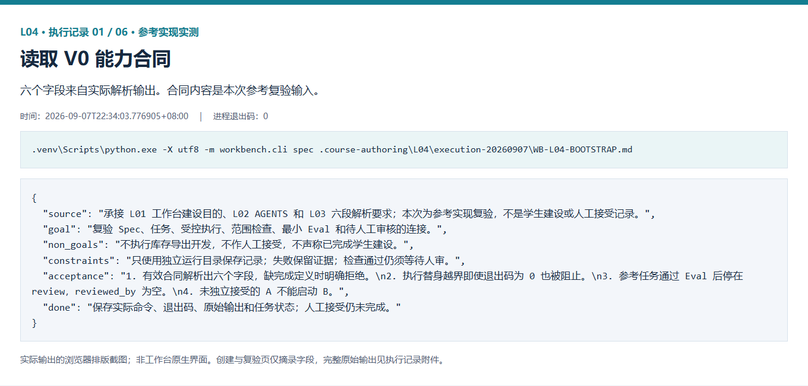

看图中的 `source`、`goal`、`non_goals`、`constraints`、`acceptance`、`done` 六个字段。退出码 0 说明解析成功；接着人工核对“来源是否对应自己的前序成果、验收是否针对工作台”。解析成功不会自动确认合同内容，也不会开始编码。

**第 2 步：先看错误输入会发生什么。** 在练习副本中移除“完成定义”及其正文，保留有效原稿，再把副本交给同一解析命令。不要修改正确的解析器来制造失败。

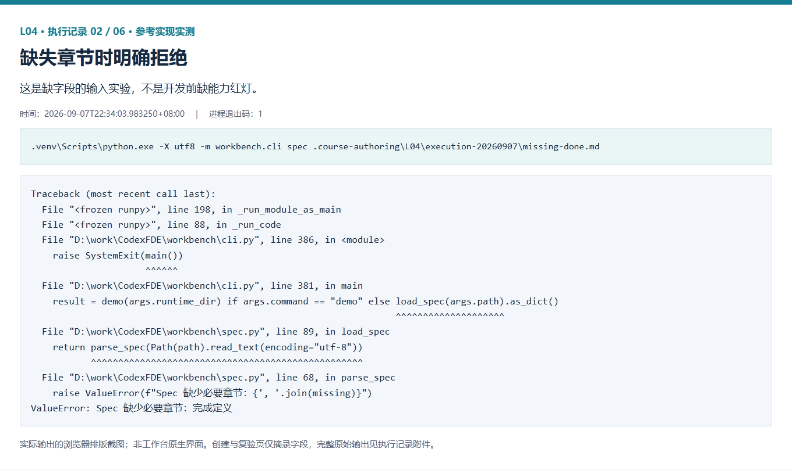

本次进程退出码为 1，原始错误指出缺少必要章节。学生应保存无效副本、错误和有效原稿的成功结果。这里验证的是输入校验；如果看到的是找不到解释器或文件，先处理环境与路径，不能把它算作这个反例。

**第 3 步：接通执行，并检查它是否守住边界。** 回到 4.2 的四个建设小步，先让 Codex 指出实际入口、缺口和允许修改的文件，再按已确认的增量实现。每完成一段，运行对应的正常与失败检查。当前参考实现的重点检查可以这样运行：

```powershell
python -X utf8 -m unittest tests.test_workbench.WorkbenchTests.test_codex_execution_runner_blocks_out_of_scope_writes -v
python -X utf8 -m unittest tests.test_execution_streams tests.test_bootstrap_handoff -v
```

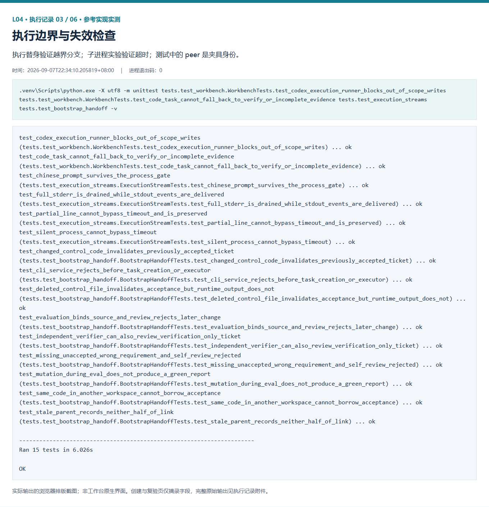

图中共运行 15 项针对性检查，还包含一项“代码任务不能退化为仅复验”的检查，完整命令见原始记录。越界用例在临时目录中允许修改 `flowerp`，执行替身却改写 `README.md` 并返回 0；断言检查工作台仍判失败、列出越界文件。测试结果为 `ok` 表示它正确识别了风险，不表示越界请求成功。

学生自己的实现结束后，在自己的候选目录检查 `git status --short` 和 `git diff`，对未跟踪新增文件还要打开内容核对。把每项差异对应回一条能力要求，保留实现前后同案检查。参考实现此次没有新增控制代码，图 6 只能作为复验示范；你的建设 Diff 和 Codex 交互过程需要自己保存。

**第 4 步：登记 A 复验任务，关联建设记录。** 能力实现与自查完成后，先在能力合同中列明建设记录的位置及待验源码版本，再使用[实践手册第 4 节](实践操作手册.md#4-创建并独立验收-ticket-a)的 `task-create` 命令，为 A 提供自己的合同路径、独立运行目录和实际执行者标识。保存返回的任务编号，后续复验与审核都引用它。

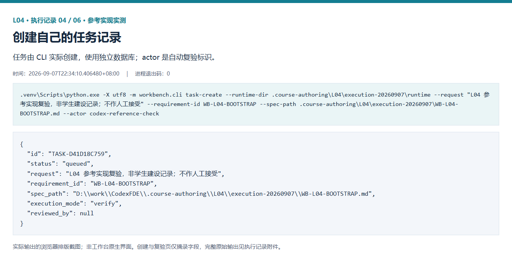

本次参考任务为 `TASK-D41D18C759`。图中的 `execution_mode: verify` 表示只做复验；它不会替学生实施 V0，也没有启动 Codex 编码。学生操作时必须使用自己的返回编号，不能复制图中的编号。

**第 5 步：运行复验，沿任务事件观察过程。** 使用 `task-run` 运行自己的 A，再用 `task-show` 查看记录。人工独立复验阶段应由实际同伴操作；本次采集只是自动参考复验。

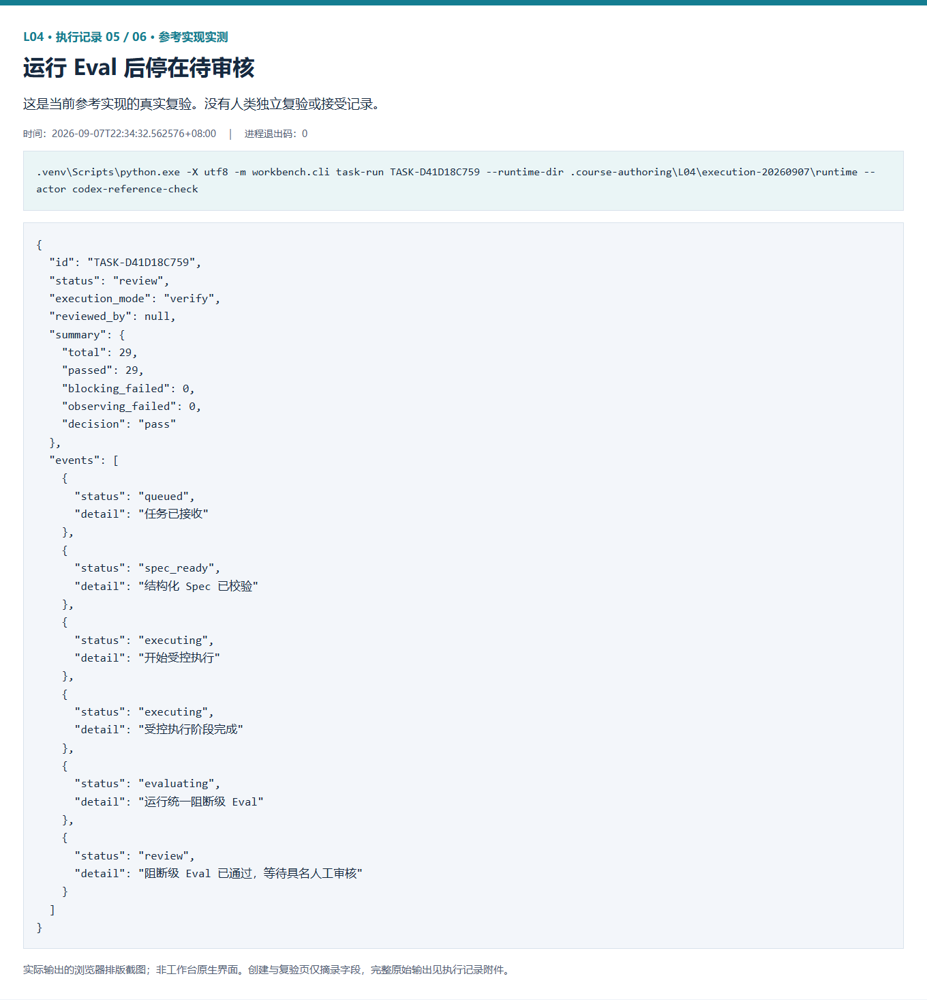

从图中依次观察：`queued` 接收任务，`spec_ready` 校验合同，`executing` 完成仅复验阶段，`evaluating` 运行阻断检查，最后进入 `review`。本次 29 项阻断检查通过，`reviewed_by` 仍为空。可以据此说“参考实现检查通过、等待人工审核”，不能说“A 已独立接受”。统一阻断 Eval 也不能替代图 6 中的 V0 针对性检查。

**第 6 步：验证未经接受时确实交不出 B。** 在独立练习运行目录，用尚未被独立接受的 A 请求 `course-submit --lesson 4 --execute-code`，并传入该 A 编号。这是拒绝路径实验；本次未提供业务 Spec，资格检查首先拒绝了未接受的 A，因而不证明 B 的业务输入校验。

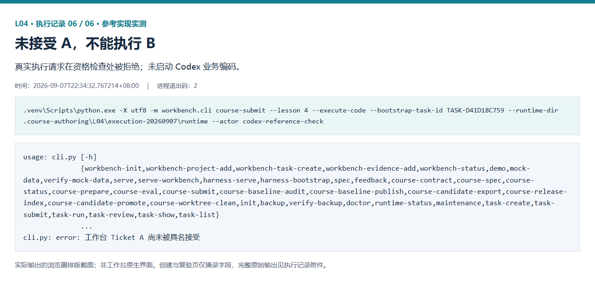

本次返回退出码 2，末行明确写出“工作台 Ticket A 尚未被具名接受”，没有启动库存导出编码。正确的下一步是交给真实复验者检查 A 的合同、源码、Diff 与结果，记录其决定；A 合格后，再携带 L03 确认的业务 Spec 进入下一节。不要为了截到“完成”而填写虚构审核者。

这六步把规则与 Spec 落到了可观察的输入、控制分支、任务记录与状态。完成自己的实践时，至少另存“Codex 提出的修改范围、本人取舍、实际建设 Diff、同案复验”四类材料，才能从参考复验走到本人完成 V0 的证据。

### 4.9 绿灯覆盖了哪些输入

在当前参考实现的 `inventory_export_is_stable` 用例中，两种商品的在库量分别为 3 和 2，预占量均为 0。用例检查八列表头、商品排序、行末数量和再次读取的可用量。这些断言支持这组数据的结论，却不足以证明非零预占计算正确。

假设错误程序直接把在库量当成可用量，预占为 0 时也能通过。加入“在库 8、预占 3，预期 5”的反例，才可能发现漏减预占。随后仍要补仓位、批次、特殊字符与失败后状态，不能把“29 项通过”当作本讲全部要求已验证，更不能代替本人建设和独立接受。

## 5. 怎样把一份 Spec 变成有边界的委托

陈珂接受具体 V0 版本后，林舟才开始 Ticket B。他把 L03 的库存合同与本轮目录、允许文件、检查和停止条件一起交给工作台；合同写清业务终点，执行委托还要补齐这一次行动的条件。

### 5.1 锁定同一份输入

把 L03 确认版 Spec 作为 Ticket B 的需求输入。不要用全课程根目录中的通用 Spec 代替，也不要只记录一个可能被覆盖的文件名。任务需要让接手者能够核对：这次执行实际读取了哪份内容。

### 5.2 指定候选工作目录和解释器

Codex 应在本次独立候选目录中修改代码。执行和复验都要记录绝对目录、源码起点和实际解释器。

常见错配是：Codex 在候选目录改代码，复验者却回到原仓库运行测试。即使原仓库的检查全部通过，也没有验证候选中的实际改动。隔离目录的价值在于让起点、变化和验证对象更清楚；它本身不自动隔离网络或凭据。

### 5.3 从验收要求推导最小写集

若本次目标是只读库存 CSV，合理范围通常包括导出实现及直接相关测试。订单状态机、采购审批或网页样式没有被业务合同要求时，不应被顺手修改。

文件数量不能单独衡量风险。一行代码也可能删除关键保护。审查时要问：每个变化对应哪条需求或必要依赖？新增依赖带来什么代价？删除和新增文件是否都被看见？

先追踪“学生运行的命令 → 实际调用的导出函数 → 读取的数据 → 文件写出位置”，再确定写集。同一个仓库可能同时存在教学入口、业务服务入口和页面入口；函数名含有 `export` 并不意味着它就是本次实际执行路径。若现有函数只会输出默认仓位，它就不能仅凭表头正确满足多仓位明细要求。调查结果应回到你的确认版 Spec：需要补哪一段、为什么必须改、怎样验证。

可以从“CSV 的可用量应为在库减预占”倒推写集：先定位读取数量的入口，再定位生成字段的位置，最后决定是否需要改测试。若公式已由现有查询正确提供，导出层就应复用，避免顺手重写库存服务。最小写集不是“文件越少越好”，而是每个允许文件都能对应一个必要改变。实现途中发现新依赖时，先交回依据和新增范围，由人决定；执行者不能改完以后再扩清单。

### 5.4 使用非交互入口

工作台通过非交互命令调用 Codex，把完整委托从标准输入交给执行器，并收集结构化事件：

```powershell
codex exec --json --sandbox workspace-write --cd <候选工作目录> -
```

尖括号中的内容必须替换为真实目录。`--cd` 确定候选位置，`--sandbox workspace-write` 设置运行时写入边界，最后的 `-` 表示从标准输入接收委托。结构化输出便于保存事件，却不保证业务内容正确。

这行展示的是工作台调用执行器的形式：完整委托由程序送入标准输入，单独粘贴它还没有提供任务内容。`--json` 输出逐行 JSON 事件，工作台据此保存过程。参数说明参考 [Codex 命令文档](https://learn.chatgpt.com/docs/developer-commands?surface=cli)与[非交互执行文档](https://learn.chatgpt.com/docs/non-interactive-mode)，核对日期为 2026-09-08；实际使用前仍须核对安装版本的帮助信息。

课堂使用 CLI 作为最小执行入口。工作台负责准备输入、启动命令、接收输出、检查范围和生成摘要，不需要在本课程另做文件读写 MCP 或复杂协议层。

### 5.5 明确停止条件和摘要

出现输入无效、A 已失效、写集冲突、执行超时、关键命令失败或实际越界时，工作台应停止交付并保留当前候选。摘要至少列出：实际修改文件、实际运行的验证命令及结果、未验证项和剩余风险。

摘要是索引，不是证明本身。审核者仍需回到原始 Diff、命令输出和业务结果。

### 5.6 把前后两阶段连起来看

下面是一条**教学推演**，用于说明每一步的判断与交接，不是已经发生的客户交付或人工签收记录。A、B 的真实命令见实践手册第 4～5 节。

| 走到哪一步 | 人与 Codex 分别做什么 | 看什么结果，再决定下一步 |
|---|---|---|
| 建设 A | 学生确认 V0 缺口与范围，Codex 协助补齐控制连接 | 保存首次检查、实际改动和同案复验；能解释哪个缺口被修好 |
| 独立复验 A | 同伴在指定版本运行针对性检查，核对合同与 Diff | 有关键失败就返工；符合要求才由同伴记录接受 |
| 准备 B | 学生引用有效 A 和 L03 确认稿，工作台准备候选、写集与检查 | 编号、合同、目录和版本能对应；起点缺能力与环境错误分开记录 |
| 执行 B | 工作台调用 Codex，学生观察执行与异常 | 实际变化位于写集内，命令结果和失败现场留在同一任务 |
| 复验 B | 同伴读取候选中的 CSV，检查正常、边界和失败后状态 | 第 6 节各项要求有对应结果，未覆盖项明确列出 |
| 接受或返工 | 业务确认者核对用途，实际审核者说明接受或打回的理由 | 通过检查仍先待审核；关键要求失败就带着反例返工 |

假设第一次 CSV 把在库量 8 直接填进可用量列，同伴按合同计算应为 5。此时应保留错误 CSV 和输入数据，把问题交回 B，在原范围内修复公式，再用同一数据及另一组数据复验。只有发现工作台漏报越界、覆盖失败等控制问题时，才返回 A 修复工具并重新接受。这样，业务返工与工具返工各有明确对象。

### 5.7 真实案例 工作台执行器修正可用库存

2026-09-08，在隔离练习副本中直接调用仓库已有的 `CodexExecutionRunner`，令真实 Codex 进程修正 `inventory.py` 的 `available` 函数。任务仅允许修改这一个文件；工作台通过 `codex exec` 启动进程，从标准输入送入任务，指定候选目录并采集 JSON 事件。

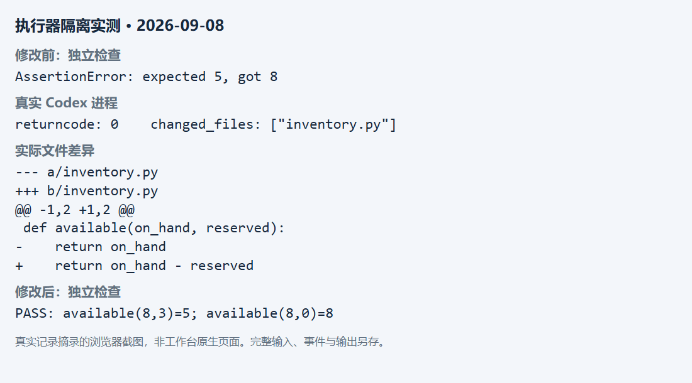

修改前，外部运行的检查报 `expected 5, got 8`。Codex 将 `return on_hand` 改为 `return on_hand - reserved`，实际文件变化仅有 `inventory.py`，进程退出码为 0。随后再次独立运行给定检查，`available(8,3)=5` 与 `available(8,0)=8` 均通过。这里的文件差异来自工作台对执行前后文件的比较，检查结果来自真实命令，不能只凭执行者自述。

截图是原始记录摘录的浏览器排版，非工作台原生页面。完整输入、调用参数、Diff 与前后检查保存在 `assets/execution/records/07-real-codex-executor.json`。本案例仅验证执行器调用和受控修改机制，没有实现完整 CSV，也未经过完整 Ticket B 流程或具名接受，不能替代课程交付。

## 6. 怎样判断库存导出真的做对了

CSV 生成了，周宁先按约定用途读数，陈珂再到同一候选检查字段、库存前后状态与改动范围。两人要回答的问题不同，林舟把对应结果一并留在 Ticket B 中。

### 6.1 按列读取真实 CSV

先把合同转成可以手工算清的小样本。下面沿用 [L03 修订版示例](../L03/examples/inventory-export-v2.md)：一行保留一条库存明细，按 `sku、site、location、lot_id` 依次升序排列。它是课堂约定；实践时以本人确认稿为准，发现差异应先核对合同。

| 列名 | 表示什么 | 复验时关心什么 |
|---|---|---|
| `sku` | 商品编码 | 同商品可有多行，不能只凭编码合并 |
| `name` | 商品名称 | 中文和特殊字符读取后保持原值 |
| `site` | 仓库或站点标识 | 库存属于哪里 |
| `location` | 库内仓位标识 | 同商品不同仓位分别保留 |
| `lot_id` | 批次标识 | 不同批次分别保留；空值按合同处理 |
| `on_hand` | 在库量 | 与输入明细一致 |
| `reserved` | 已预占量 | 与输入明细一致 |
| `available` | 可用量 | 等于本行在库量减预占量 |

**教学输入：**在独立练习数据中准备以下两条明细，故意先提供西仓，再提供东仓。这里的名称与数值均为示例，不是当前数据库记录。

| 商品编码 | 商品名称 | 仓库 | 仓位 | 批次 | 在库 | 预占 |
|---|---|---|---|---|---:|---:|
| P001 | 螺丝 | WEST | B01 | LOT02 | 12 | 4 |
| P001 | 螺丝 | EAST | A01 | LOT01 | 8 | 3 |

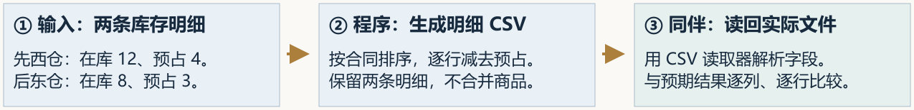

故意倒序，是为了反驳“程序原样照抄输入”的实现。同一种螺丝位于两个仓库，业务人员需要逐仓、逐仓位和批次核对；只导出合计可用量 13 虽然加总正确，却丢失位置明细。程序应对输出排序，不应重新排列或修改库存账。

按上述合同，预期 CSV 为：

```csv
sku,name,site,location,lot_id,on_hand,reserved,available
P001,螺丝,EAST,A01,LOT01,8,3,5
P001,螺丝,WEST,B01,LOT02,12,4,8
```

用 CSV 读取器读取实际导出的文件，核对两条明细，再把数量转换为整数比较。东仓可用量应为 5，西仓应为 8；两条明细应保留，不能合成可用量为 13 的一行；输出应把 EAST 排在 WEST 前面，不能依赖输入碰巧有序。这里采用商品、仓库、仓位、批次四字段排序组合，它不自动构成记录的唯一标识。若多条记录的排序字段完全相同，仍需核对记录数量与各字段内容，不能只保留其中一条；这些记录之间的额外次序按合同处理。

只在文本中搜索字符 `5` 不足以证明公式正确，因为商品名、仓位或其他字段也可能包含 5。只测一组数据也可能放过写死结果。

### 6.2 检查结构、边界和失败行为


三种输入应分别测试，空库存不与特殊名称混成一个情境。空库存仍需准确表头；名称中的逗号属于字段内容，不能挤乱后续列。例如 `P001,"螺丝,镀锌",EAST,A01,LOT01,8,3,5` 读回后应有八个字段，名称仍为“螺丝,镀锌”。名称中的引号或换行也必须按原文保留，不能按文本行数代替记录数。


上一组输入能检查数量和部分排序，但还不能覆盖整份合同。继续用小样本逐项反驳可能的错误实现：

| 情境 | 怎样准备与操作 | 应观察到什么 | 能发现哪类错误 |
|---|---|---|---|
| 固定列结构 | 读取实际文件的表头列表 | 恰好是上面的八列，名称与顺序一致 | 少列、多列或顺序变化 |
| 同仓不同仓位、同仓位不同批次 | 在练习数据中分别添加明细，打乱输入次序再导出 | 明细分别保留，按四个字段逐级排序 | 只按商品汇总、只按仓库排序 |
| 空库存 | 使用没有库存明细的练习数据导出 | 表头存在，数据行数为 0 | 无表头、虚构默认行 |
| 特殊字符 | 名称分别含中文、逗号、双引号和换行，导出后用 CSV 读取器读回 | 每个名称与原字符串完全相同，每条明细仍有八列 | 用逗号直接拼接导致错列、用文本行数误判记录数 |
| 写出失败 | 在临时测试目录用可控失败方式中断写出；如有有效旧文件，先保存其内容 | 明确报错，无可误用的半成品；旧目标内容不变 | 失败返回成功、旧文件被提前清空 |

特殊字符检查必须比较读取后的字段。例如名称为 `螺丝,镀锌` 时，文件中的逗号既可能是分隔符，也可能属于名称；正确的 CSV 编码会保护字段边界。自己用逗号拆字符串，会把正确输出也读错。


原本有旧报表时，先保存旧文件字节内容，失败后逐字节比较；原本没有文件时，检查是否留下可被误用的目标半成品。这是两个独立实验，不是一个合并情境。保留诊断证据与避免正式目标半成品并不矛盾。

写出失败练习可以使用会抛出写入异常的测试替身，并补充实际文件写出检查。单纯让目录不存在，只能覆盖路径错误，不能证明写到一半时旧文件仍然完好。所有破坏性情境都在临时练习目录完成，保留错误输出和失败后的文件状态。

对应的可执行步骤见[实践操作手册第 5 节](实践操作手册.md#5-用已接受的-v0-启动-ticket-b)。参考终态提供本地文件入口 `flowerp.inventory_export.export_inventory_file`，复用多仓明细导出并在写入完成后替换目标文件；学生在 B 的起始候选中实现和验证自己的版本。检查脚本通过实际主数据、入库和预占接口准备数据，分别保存内容检查和文件失败检查证据，不能把检查工具生成的文件当作产品交付。

### 6.3 检查只读性与范围


示例 8 比较的是库存账中的在库量，不是 CSV 单元格。东仓从 8 变成 7、西仓从 12 变成 13，前后合计仍为 20，但已违反导出不改库存的要求。正确状态应仍为东仓 8、西仓 12。为判断变化是否由导出引起，要排除其他并发写入。


记录导出前后的库存记录和库存流水，确认成功与失败都没有改变业务状态。再检查实际 Diff，确认所有新增、删除、修改和重命名都位于批准范围，并能回指某条需求或直接依赖。

在没有其他写入的独立练习环境中，先保存待导出明细的数量和对应流水内容，完成导出后再读取比较；写出失败也重复这一过程。只比较库存总数不够：东仓少 1、西仓多 1，总数仍然相等，但只读约定已经被破坏。只比较流水条数也不够，还需核对原记录内容。业务状态比较与文件写出检查共同说明：生成文件没有顺带改变库存账。

### 6.4 将证据绑回同一任务

在候选目录运行产品复验，在控制工作区读取 Ticket B 的记录。两边要能够对应同一个任务编号、候选目录、源码起点、Spec 和 A 版本。若复验换了目录、环境或源码，就不能直接沿用原结论。

复验完成后，由实际审核者选择接受或打回，并写清理由和剩余风险。接受 B 表示这个候选满足本次交付要求，不自动表示已经合并、发布或上线。

一份可复查的说明应把“判断”和“依据”放在一起。例如下面是**填写指导，不是执行结果**：

| 要说明的事 | 怎样写得可复查 |
|---|---|
| 采用什么要求 | 填实际 B 编号、保存的 Spec 版本、有效 A 编号及控制版本 |
| 修改了什么 | 列实际文件与对应要求；附候选位置、起点和完整 Diff |
| 验证了什么 | 填实际命令、退出码、CSV 与状态记录位置，逐项对应本节情境 |
| 还有什么问题 | 明确未执行或失败的项目；关键要求未验证时保留待处理 |
| 谁作出决定 | 由实际复验者填写亲自检查的对象、理由和接受或返工决定 |

学生应能据此回答两个问题：FlowERP 增加的只读导出是否符合用途；工作台是否在这次真实执行中落实了合同、范围、检查和人审。两项判断都成立，才构成本讲的完整交付。

## 7. 常见失败与可复用方法

L04 的失败不应被擦掉。失败能够暴露工作台应该在哪些地方停下，也为后续课程提供可复用的改进依据。

### 7.1 四类高频失败

| 失败 | 正确处理 |
|---|---|
| A 没有独立接受或源码已经变化 | 停止 B，重新复验并接受当前 A 版本 |
| Codex 超时、异常或只完成部分改动 | 保留输出和候选，调查原因后在原范围内继续或返工 |
| CSV 结果错误、业务状态被改动 | 退回实现，保留反例和失败后的状态 |
| 实际修改越过写集 | 退回范围审查，不能用测试通过抵消越界 |

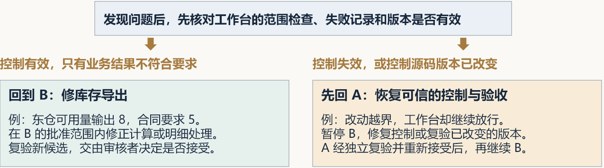

A 是工作台 V0 的建设与验收，B 是库存导出。工作台正确记录并拦下业务错误时，在当前批准范围内修 B，复验新候选再交给人审核。工作台漏报越界或把失败记成成功时，先暂停 B、修复 A，经独立复验和重新接受后再继续 B。控制源码改变不一定说明存在缺陷，但旧接受不能直接沿用，仍需复验当前版本。

两类问题同时存在时先处理 A，否则继续业务修复仍可能越界或丢失失败记录。原因尚不明确时先回查 Diff、错误 CSV 与检查报告，不能仅凭测试变红就认定返工对象。返工说明可以写：“东仓在库 8、预占 3，CSV 实际输出 8，预期 5；附输入和错误文件，请在 B 的范围内修复并复验。”

### 7.2 可复用的受控交付方法

这次实践可以提炼为七步：

1. 读取确认版合同，明确目标和非目标。
2. 确认采用的工作台版本已经独立验收。
3. 绑定候选目录、源码起点、解释器和最小写集。
4. 由工作台调用 Codex，并保存真实事件和结果。
5. 检查完整 Diff、范围与停止条件。
6. 在同一候选独立运行产品验收。
7. 由实际审核者接受或打回，记录未验证项和剩余风险。

配套 skill 用于在后续交付中重复执行这套检查。skill 文件存在只说明方法被写下来；后续任务明确采用并留下复验结果，才能形成复用证据。复用成功时记录适用条件与结果；发现问题时保留失败依据，并据此修订或停用。

### 7.3 迁移到采购申请导出

若下一次诉求变成“导出未完成的采购申请”，可以复用两张 Ticket、候选隔离、范围检查、证据链和人工审核。业务合同必须重新确认：哪些状态算未完成、谁有权限导出、需要哪些字段、是否包含金额、怎样处理敏感信息。

工作台复用的是组织交付的方法，不是把库存的字段和公式复制到另一个业务领域。

## 8. 课程总结、思考与下一讲

L04 的核心成果是：你依据前几讲的 AGENTS 与 Spec，把已有任务账、解析入口和本讲新增的受控执行、最小 Eval、摘要与人工确认点接成了工作台 V0。独立复验者接受具体版本后，再由它组织 Codex 交付库存导出。这样，FlowERP 的真实结果反过来验证工作台是否能够承担交付组织职责。

从 FDE 的角度复盘，请用自己的材料连贯说明：使用者遇到了什么库存核对问题；你为什么选择这些字段、数量口径和只读范围；业务确认者和独立复验者怎样核对实际 CSV 的用途与正确性；本次暴露的工程问题怎样推动 V0 改进。把这条因果链讲清楚，才能说明你掌握了从现场判断到工程交付、再到能力积累的方法。

请带着四个问题完成实践：

1. 如果 Codex 返回 0，但 CSV 列顺序错误，工作台应处于什么状态？依据在哪里？
2. 如果所有业务测试通过，但 Diff 修改了订单状态机，为什么仍不能接受？
3. 如果 Ticket A 接受后控制源码又变化，Ticket B 为什么必须停下？
4. 请从自己的 AGENTS 中选一条规则，指出它如何进入 V0 能力 Spec、哪段程序负责落实、哪个正反用例验证它；换一个业务需求后，这段能力还能复用吗？

回答后，再完成第 7.3 节的采购申请导出迁移题，说明需要重新确认的业务要求，以及支持复用 V0 的本次证据；尚未在新任务中执行的部分，记录为待复验。

### 后续各讲如何继续练习 FDE

| 阶段 | 现场与交付任务 | 要形成的可复用能力 |
|---|---|---|
| L05～L08：建立可信验证 | 从重复入库、库存口径、订单创建与原子预占判断业务风险 | Eval、Harness、本地 Hook 与独立 CI 复验 |
| L09～L12：组织返工与协作 | 修复取消与状态迁移，交付采购申请和具名审批后入库 | 修复任务、有界 Loop、独立分工、Graph 与人工审核 |
| L13～L15：支持使用与反馈 | 让补货任务可接续、页面可操作，并依据真实反馈交付小改进 | 持久化 API、可信状态、摘要与反馈分诊 |
| L16：验证迁移 | 在新环境中处理此前未实现、范围受控的小需求 | 冷启动、完整交付证据与有边界的经验复用 |

阅读后续讲义时，先问谁遇到了什么问题、为什么选择本次范围，再看技术机制，最后回到产品状态与人的决定。L05 将从重复入库开始追问：检查本身可靠吗？如果实现和测试共享同一个错误假设，绿色结果仍可能误导。下一讲将用失败样本验证检查是否真的能发现问题。

## 离开这一讲之前

林舟把 CSV 交给周宁时，还附上字段含义和对应检查。陈珂则回查导出前后库存，确认读取没有改账。首个交付结束后，仓库提出一个新问题：收货时没看到响应，又按了一次提交，会不会多记库存？下一讲从这次重试开始。

## 附录：本讲课程合同

对应 CLO-2。以下四项沿用正式大纲；FDE 引导细化判断与学习证据，不增加机器通过门槛。

- **核心内容**：非交互执行、工作目录、权限边界、结果采集与人工确认点。
- **演示结果**：读取第 3 讲 Spec，委托 Codex 完成一个小型代码变更并运行测试。
- **课内增量**：先由学生直接监督 Codex 补齐并独立验收 Workbench V0 的执行入口、写集检查、最小 Eval 和结果摘要，再由 V0 在授权工作区调用 Codex 交付库存导出；不额外包装为文件读写 MCP。
- **通过标准**：变更能够运行；基础测试通过；摘要包含修改文件、验证命令和剩余风险；密钥和环境文件未提交。
