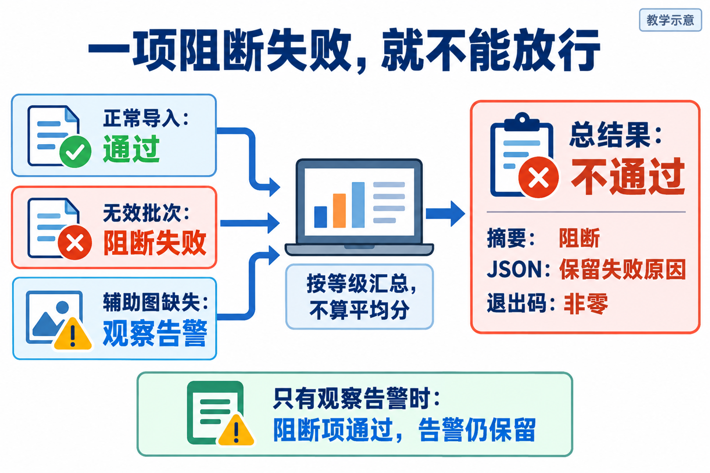

# L06｜用 Harness 汇总证据和等级

> 本讲只追问一件事：检查已经发现问题，为什么总结果还会显示“通过”？
>
> 先读本文理解判断顺序，实际操作见[实践操作手册](实践操作手册.md)。完整源码、实测和进阶理论见[参考详解](参考详解.md)。

## 1｜三行商品，为什么不能只导进去两行

运营交来一批三行商品资料。前两行有编码、名称和价格；第三行名称为空。业务人员已经确认：**这一批要么全部导入，要么一条也不写入商品主表。** 商品主表就是保存正式商品档案的地方。

错误程序导入前两行，跳过第三行。检查已经发现不符合要求，最后的总结果却仍是绿色。这里其实有两个错误：

第一，产品把“不允许部分成功”的一批商品导成了部分成功。第二，质量程序没有把已经发现的失败如实传给外部调用方。

本讲要先修第二个错误，让红灯可信；再修第一个错误，让产品按约定工作。如果同时乱改，最后变绿也说不清为什么。

**课程映射提醒：** 本文与配套实践采用商品整批导入案例；当前大纲的 ERP 产品映射仍是“统一可用库存口径”。这是既有差异，不是同一成果的两种叫法。完成导入实验不能被登记为库存口径已经验收，原有 lesson 6 提交入口也不能冒充这个新案例的验收。

## 2｜一个检查判一件事，Harness 负责组织和汇总

L05 的 **Eval** 是具体检查，例如“无效批次被拒绝后，商品主表有没有改变”。本讲的 **Eval Harness** 是组织这些检查的程序：选哪些检查、逐项运行、保存结果、给出总判断。

先把它理解成“检查的运行器和汇总器”。完整 AI Harness 还涉及工具、上下文与执行控制，本讲只建设其中的质量检查部分，不要求你重新实现 Codex。

**从图左侧逐项读到右侧。** 正常导入通过；无效批次却写入两行，这是阻断失败；辅助图缺失是观察告警。只要第二项失败，总结果就必须阻断，不能用另外两项的结果投票抵消。图中是三项缩小示例，不是个人实验完整的登记表。

两个等级的含义是：

- **阻断项（blocking）**：失败就不能放行。例如错误批次污染正式商品数据。
- **观察项（observing）**：问题要保留，但按事先确认的约定不单独阻断。例如不影响操作文字完整性的选读辅助图缺失。

等级由要求和风险决定，不能因为某项失败了，就临时把它降为观察项。若缺图已经导致操作者无法完成操作，就应重新讨论风险，而不是套用本例。

你负责确认整批规则、失败等级和修改范围；Codex 协助实现运行器及产品修复；工作台留下报告；复验者和审核者决定是否接受。人物与数字用于教学，实际通过要看你自己的候选证据。

## 3｜先让检查完整运行，再谈总结果

### 第一步：明确这次到底运行哪些项

最小实现可以有一张登记表，每项写清名称、等级和对应检查函数。**测试文件存在，不代表已经被运行。**

选择为空、名称不存在、登记重复，都不能被解释为“没有失败，所以通过”。应给出配置或选择错误，要求先修复检查入口。新需求也不能挤掉旧保护：个人实验要接入自己的 L05 收货检查和范围检查，而不是临时另写更弱的替代品。

个人练习登记六项业务检查；用于检验 Harness 自身行为的九项合同测试是另一组东西。六项和九项不能相加后叫作一个业务通过率。

### 第二步：每项留下观察和原因

对正常批次，查编码、名称和价格是否全部正确写入。对无效批次，先保存商品主表的完整状态，再检查请求被拒绝且主表没有变化。只数“新增零行”可能漏掉旧商品被误改。

预检查可以保存导入任务与暂存行，但不能改正式商品主表。所以这里要求的是“商品主表不变”，不是“数据库任何表都不变”。

运行器还要保留异常原因。断言失败可能是业务行为不符；数据库不可读可能是没有完成验证。两者都可能阻断，但修复方向不同，不能统一写成“商品规则失败”。

### 第三步：按等级算结论，不算平均分

有效运行中，只要有一项阻断失败，总结果就是不通过。只有观察告警、阻断项全部通过时，可以继续，同时明确保留告警。

“阻断项通过”只说明本次实际选择的阻断要求满足，不表示所有风险都被检查。当前参考运行器逐项串行执行；记录耗时也不等于已经具备逐项超时终止或进程隔离。

## 4｜同一个结论，必须从三个出口一致地传出去

人、程序和外层流程，读结果的方式不一样：

| 谁需要结果 | 看什么 | 有阻断失败时应看到什么 |
|---|---|---|
| 操作者 | 终端摘要 | 哪项失败，因为什么，需要返工 |
| 后续程序 | JSON 结构化报告 | 分项失败、等级、原因、运行时间和总判决 |
| 调用它的流程 | 退出码 | 非零，不能按正常通过继续 |

**退出码**是程序结束时返回的数字。本课程质量入口用 0 表示所选阻断检查通过，非零表示不能按通过处理。JSON 只是便于程序读取的一种固定字段格式，不会自动让内容可信。

分项写“无效批次留下两行”，摘要却写“零阻断”，退出码还是 0，就是**假绿灯**。日志里有一行红字也救不了它，因为外层流程可能只读退出码。

因此，检查 Harness 自身时也要故意给它一个失败项：分项能否保存？总判决是否阻断？外部是否收到非零？报告有没有时间和原因？不能只用全通过的样本证明汇总器可靠。

## 5｜分两次修，才能解释结果为什么变了

个人练习中的六项结果应经历下面三个阶段。PASS 是通过，BLOCK 是阻断失败，WARN 是观察告警。

| 阶段 | 分项事实 | 汇总结果 | 你应作出的判断 |
|---|---|---|---|
| A：两个缺口都在 | 4 PASS、1 BLOCK、1 WARN | 错误地通过、退出 0 | 汇总不可信，产品也没修好 |
| B：只修汇总器 | 4 PASS、1 BLOCK、1 WARN | 阻断、退出 1 | 检查会如实报错了，继续修产品 |
| C：再修整批导入 | 5 PASS、0 BLOCK、1 WARN | 通过、退出 0，告警仍保留 | 原阻断要求通过，进入复验 |

A 到 B，商品导入行为不变，修复的是判决与失败传递。B 到 C，检查标准不变，修复的是产品行为。B 虽然仍红，却是必要进展。

产品修复要让整批内容先接受校验，再按整批规则提交；不能逐行成功一部分就声称完成。具体服务调用和文件位置按实践手册，在隔离候选中操作，不要把客户业务目录加回工作台控制仓库。

如果为了变绿删除了坏批次用例、把阻断改成观察，或者跳过 L05 回归，C 就不是同一标准下的通过。

## 6｜绿报告还要回答：它检查的是哪一版

今天的代码不能拿昨天的绿报告证明。报告需要和实际候选、运行命令、工作目录、检查集合及生成时间对应起来。

若命令中途失败，没有产生新报告，旧文件还在，不代表这次成功。先确认新报告确实来自本次运行；文件指纹可用于比较内容身份，但不等于签名认证，也不替代独立复验。

再把三行改为七行。有效批次应完整新增七件商品；最后一行无名称的批次应被拒绝，商品主表仍保持原状态。这是迁移检查，用来排除只针对三行写死的修复。并发提交、中途数据库故障等风险仍需另设用例，不在一次绿灯中自动获得保证。

交接时分开说明两个成果：FlowERP 的整批导入修好了什么；工作台的选择、记录、等级与出口修好了什么。保留首次失败、两步差异、最终候选报告、观察告警和人工结论。报告一致性检查通过，不等于商品业务通过；商品业务通过，也不等于已经完成具名验收。

## 7｜读懂之后，按这个顺序动手

打开[实践操作手册](实践操作手册.md)：

1. 实践 1～3：准备并辨认假绿灯。预期看到分项失败与总结果之间的矛盾。
2. 实践 4：先修 Harness。预期看到同一个产品缺陷得到可信的红报告。
3. 实践 5：再修整批导入。预期看到原阻断检查通过，观察告警仍保留。
4. 实践 6～7：换七行数据并独立复核。带上候选身份和报告来源，不只展示绿色截图。
5. 中断或异常时看实践 8，先确认恢复的是哪份候选和哪组检查。

自测：九项通过、一项阻断失败，能放行吗？不能。只剩观察告警，能否写“没有任何问题”？不能。报告复核成功但业务结论为 block，是否应该继续返工？应该。

更完整的执行循环、上下文、FDE 和经验复用讨论在[参考详解](参考详解.md)。先把本讲的判断做好：**检查确实运行过，失败没有丢失，总结果与外部出口一致。** L07 才能放心在关键节点自动调用它。

## 本讲合同（与课程大纲一致）

- **核心内容**：用例发现、统一退出码、阻断级与观察级指标、机器可读报告。
- **演示结果**：Harness 输出分项结果、阻断结论和 JSON 报告。
- **课内增量**：实现最小 Harness，将第 5 讲用例纳入统一执行。
- **通过标准**：阻断用例失败时返回非零退出码；观察项失败只记录告警；报告保留运行时间和失败原因。

配图为内置 ImageGen 生成的教学示意，不是运行截图。[查看配图设计与提示词](assets/reading-figures-v2/设计与提示词.md)。
