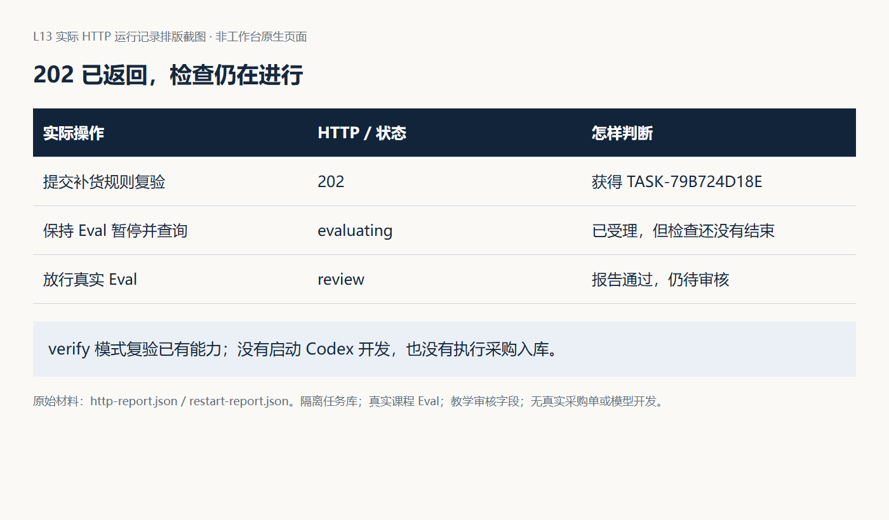
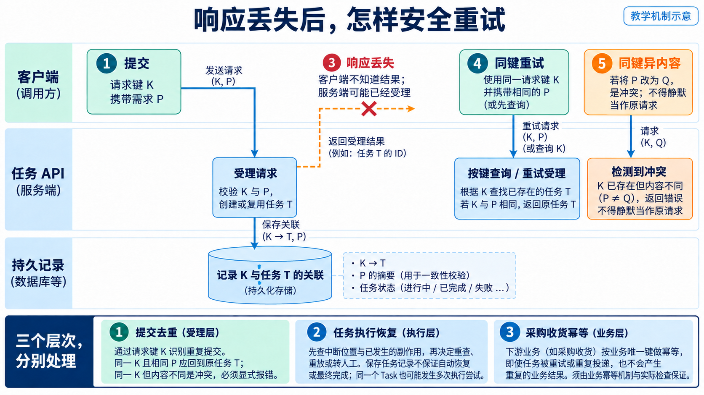
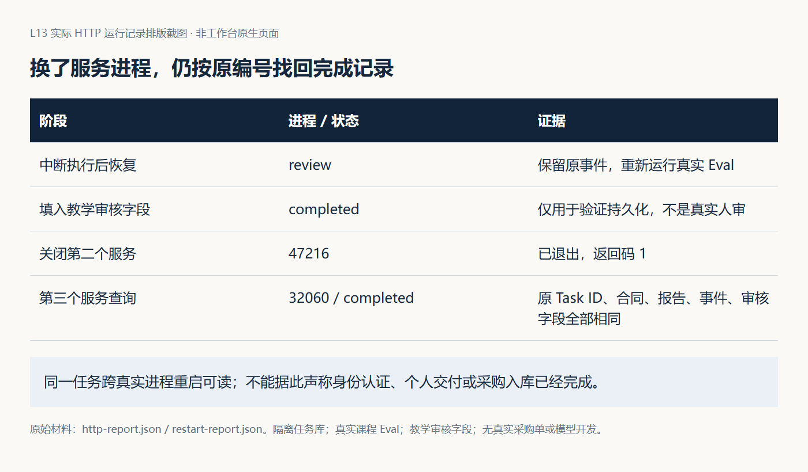
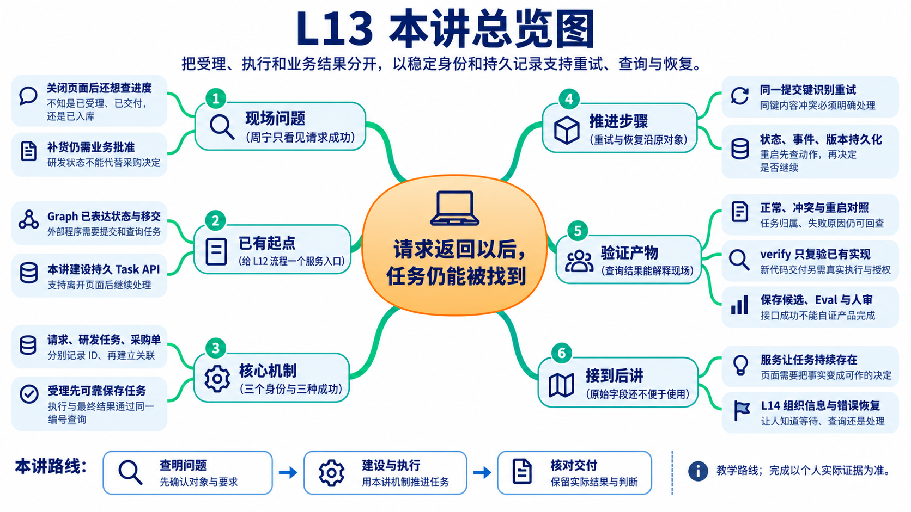
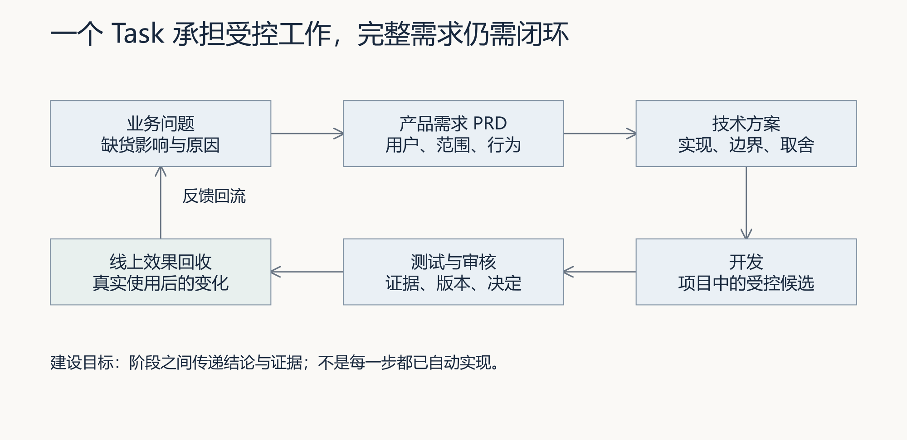
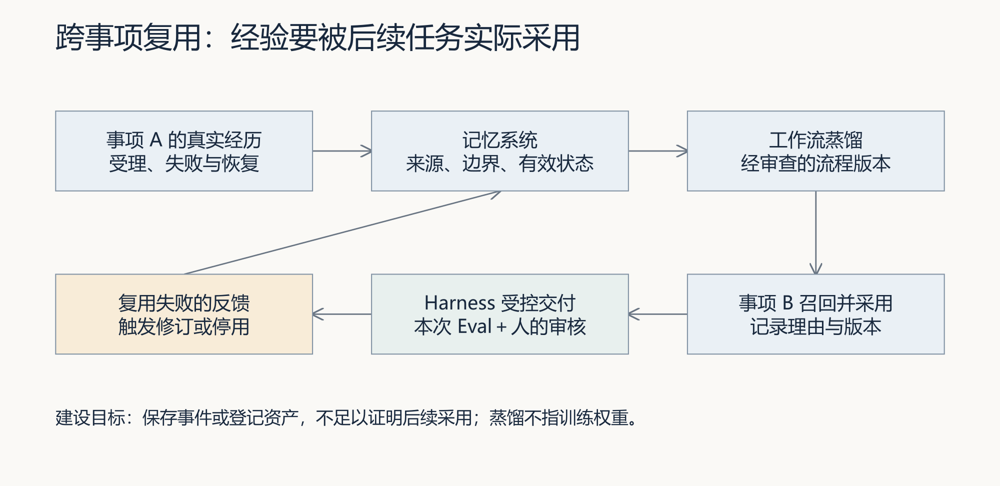

# L13｜参考详解

> 按需查阅：先读[辅导资料](辅导资料.md)，再查下面的原有实验、源码解释、实现边界和课件对照。
>
> 本文件完整保留原详细材料。下文的“第几节”“讲义§”及课件对照均指本文件保留的原章节，不是新版辅导资料的章节号。原核验日期和参考记录不表示本轮重新运行，更不代表学员已经通过。操作步骤以[实践操作手册](实践操作手册.md)为准。

> 本资料先解释问题、原理和判断方法；实际操作见[实践操作手册](实践操作手册.md)。

## 先看一次提交：页面关掉了，任务还能找到吗

上一讲已经能安排开发、检查、等待人审和返工。现在，使用者希望从页面提交需求，关掉页面以后还能回来查看进度。程序需要给这次工作一个稳定编号，并把记录保存下来。

本讲的 **API** 就是程序之间约定的提交与查询接口。先不用背接口路径，用下面四步理解它。T-001 是教学编号，不是实际运行结果。

1. 使用者提交一项补货交付需求。
2. 工作台保存任务，返回编号 **T-001**。这表示“已经受理”，不是“已经完成”。
3. 使用者稍后带着 T-001 查询，看到执行中、等待人审或失败原因。
4. 任务结束后，仍用 T-001 查到本次需求、检查报告和人的决定。

### 三个编号不要混用

需求说明“想解决什么”；任务编号追踪“这次研发工作办到哪一步”；采购单号指向“哪笔采购业务”。找到 T-001，不等于采购单已批准，也不等于库存已增加。后文会把三者联系起来，但不会把它们合成同一个完成状态。

最容易出错的是“提交后没收到响应”。服务可能已经保存任务，因此不能立即换一个新身份再提交。第 3 节会解释如何用原提交键找回同一任务；第 5 节再区分“重启后能查记录”和“能安全继续执行”。

### 本讲按这条线读

第 1 节确定任务的完成标准，第 2 节提交与查询，第 3 节处理重试，第 4 节处理状态与人审，第 5 节处理重启，第 6 节完成本人交付。实现细节放在附录，第一次阅读可以先跳过。

你确定任务含义与权限，Codex 协助实现，复验者独立核对。工作台新增可追溯的任务 API；FlowERP 的交付目标是通过它组织补货交付，并核对采购审批、库存与流水。

参考异步实验使用 `verify`，即**只检查已有实现**，没有调用 Codex 开发新功能，也没有执行真实采购入库。个人交付还需要自己的实现和业务证据。原有实现说明与实验记录采用 **2026-09-06 核对口径**，本次文字整理不代表重新运行了实验。

## 1 先确定：这次提交的是什么任务

FlowERP 运营周宁请林舟跟进商品 A 的补货事项：“需要七件，先审批，同一次收货不能重复入账。”工作台返回了“请求成功”。她关掉页面后再来查询，却说不清刚才成功的是接收请求、完成研发，还是货物已经入库。

这个虚构教学情境延续上一讲。林舟负责设计和实现，周宁确认业务需求，陈珂独立复验。人物关系见[讲义阅读导航](../讲义阅读导航.md)。下面的机制解释与参考实验分别说明，不把人物对话当作实际执行记录。

### 1.1 先写完成标准，再设计接口

“跟进补货”可能包含不同工作。若本次目标是开发“审批后才能入库”的功能，任务要交付软件候选、检查报告和交付审核；若目标是使用已有功能处理一张采购单，就要取得这张单据的业务批准，完成收货并核对库存。它们可以关联，但批准对象和完成依据各不相同。

本讲的个人项目要求通过 API 组织 FlowERP 补货交付。因此在提交前，你要写清：本次改变哪项能力，关联哪个业务对象，最后用什么行为或数据验证。后面的 Task ID、报告和审核都应回到这份约定。

### 1.2 三个对象，各回答一个问题

沿图 1 分别看请求、任务和采购单。一次查询读取任务，任务可以引用采购单；这些连接帮助你查证，是否完成仍需检查各自的事实。

| 对象 | 它回答的问题 | 补货案例中怎样判断 |
|---|---|---|
| HTTP 请求 | 这一次提交或查询怎样了？ | POST 返回 202 表示已受理；GET 返回 200 表示查到了记录 |
| 研发任务 Task | 这一项交付进行到哪里？ | 按 `task_id` 查询 Spec、执行阶段、报告、失败原因与审核 |
| 采购单 | 这一次业务操作怎样了？ | 核对单据批准、收货、库存和属于该单的流水 |

例如，GET 返回 200，任务状态仍可能是 `rework`，即需要返工。任务为 `review`，表示仍在等待审核。即使任务到达 `completed`，也应按任务合同判断它完成了什么，不能直接推导出库存增加。

商品 A 原来在库 10、预占 2、可用 8。真实批准并收货七件后，应为 **17、2、15**，同时留下一条属于目标采购单的 **+7 流水**。任务记录中的业务引用只提供查询线索，最终需要沿线索核对这些数据。

明确这三个对象以后，接口就有了清楚的职责：先接收并保存任务，让调用方取得编号，再围绕该编号查询交付事实。

## 2 提交与查询：先保存任务，再返回编号

周宁提交后不必一直开着页面等执行结束。她需要的是一个下次仍能使用的任务编号。林舟据此设计两个最小接口：一个负责受理，一个负责查询。

### 2.1 两个接口怎样配合

| 主线工作台接口（默认 :8001） | 调用方做什么 | 成功响应意味着什么 |
|---|---|---|
| `POST /api/v1/delivery/requests` | 提交需求和提交键 | 返回 202 与任务编号，后台按参考入口的 verify 模式推进 |
| `GET /api/v1/tasks/{id}` | 用原编号查询 | 返回 200 与任务、事件；任务不存在时返回 404 |

这里的“提交键”是调用方给本次提交确定的身份，第 3 节会解释它如何处理重试。首次阅读先记住：受理后拿到的 `task_id` 用于后续查询，刷新页面时仍查询原编号。

读图 2 时分两条线。提交这一条线先保存任务，再返回编号；后台这一条线继续执行和检查，把结果写回同一任务。查询从已保存的记录中取得当前事实。

这就是异步受理：HTTP 响应不等待整个任务执行完毕。后台可能很快，客户端第一次查询时已经看到 `evaluating`，即正在检查，而不是最初的 `queued`。判断异步是否成立，要看受理响应是否必须等待检查结束，而非必须看到某个瞬间状态。

### 2.2 为什么必须先保存

Task 是一个持续存在的工作对象，至少要能追溯原请求、Spec、执行方式、当前状态、事件和证据。若先告诉客户端“已接受”，之后保存失败，客户端就会持有一个系统不认识的编号。

参考 TaskStore 把任务、初始事件和提交键映射放在同一次数据库事务中。事务使这些数据库写入一起成功或一起失败，让返回的编号有记录可查。独立 Spec 文件属于另一种存储，仍有单独的失败边界，具体缺口见附录 B.1。

后台队列安排什么时候执行；持久化记录保证之后还能查询。两者职责不同，所以“任务已保存”还不能证明服务重启后会继续执行，第 5 节再处理恢复。

### 2.3 用参考记录理解受理与完成

图 3 对应已有的真实 HTTP 实验记录：实验先暂停 Eval，POST 已返回 202，随后按原 Task ID 查询到 `evaluating`；放行后任务进入 `review`。依次观察响应、任务编号和状态，就能解释“已经受理，检查仍在进行，之后还需审核”。

这张图支持异步受理与状态查询的判断。实验使用 verify，没有运行 Codex 开发，也没有改变采购库存。实际操作见[实践操作手册第 2 节](实践操作手册.md)。

至此正常路径已经清楚。接下来考虑客户端没有收到那个 202 的情况：服务可能已经保存了任务，再次提交怎样找到它？

## 3 请求超时：用原提交键找回同一任务

通信超时有两种可能：请求尚未到达服务，或者任务已经保存、响应却在返回途中丢失。调用方仅凭超时无法区分它们，因此不能一重试就创建新的工作。

### 3.1 提交键 K 与任务编号 T

调用方在发送前确定提交键 **K**，服务受理后产生任务编号 **T**。如果响应丢失，调用方还不知道 T，但仍持有 K。再次带着 K 提交原内容，服务就能找到之前建立的 T。

这项保证称为提交幂等：同一次提交的重放沿用原任务，不重复建立 Task。

沿图 4 区分“服务端已经保存”和“客户端已经知道”。同键重试填补两者之间的空隙；取得 T 后，再通过 T 查询进度。

### 3.2 三种提交，三种处理

| 本次提交 | 服务如何处理 | 调用方下一步 |
|---|---|---|
| 同键、同约定内容 | 返回原任务 | 按原 Task ID 继续查询 |
| 同键、不同约定内容 | 返回 409 冲突 | 查清原内容，由提出者确认是否改需求 |
| 新键 | 作为新的提交处理 | 事先确认确实是一项新操作 |

例如 K 原来表示采购七件，重试时改成十件，变化的是需求。此时先确认变更，再决定是否创建新事项。遇到 409 就自动换键，会绕过这一步业务判断。

“同内容”以接口约定的字段为准，不是按自然语言意思相近来判断。参考实现的字段、顺序与键作用范围见附录 B.2。

图 6 先重复原内容，随后分别改变请求、提出者和业务引用。已有实验中，三次冲突后任务数仍为一，Spec 文件数却逐次增加。前者说明任务去重，后者暴露文件写入位于任务事务之外的残留问题。这是待修复缺口，不能把实验观察到它表述为已经修好。

### 3.3 Task 不重复，库存还需要单独保证

提交键约束的是 Task 的数量，收货幂等键约束的是库存副作用。只有一个 Task，也可能因中断恢复而再次尝试收货。因此需要分别观察：

| 要避免的重复 | 要核对的证据 |
|---|---|
| 同一次提交建立多个任务 | 提交键、原 Task ID、最终任务数 |
| 中断恢复重复执行已发生的动作 | 执行轨迹、动作结果、恢复决定 |
| 同一次收货多次增加库存 | 采购单、收货幂等键、库存与流水 |

在补货案例中，同一收货的重试以后，数量仍应为 17、2、15，目标 +7 流水仍只有一次。前端禁用按钮、提交去重和业务幂等分别保护不同环节。

现在已经能认出同一任务。下一步要解决的是：这项任务怎样推进，谁有权宣布完成？

## 4 执行与审核：让状态支持下一步判断

外部使用者需要知道任务在排队、执行、检查、等待人审还是返工。L12 的 Graph 定义内部去向，L13 把这些事实保存下来并供接口查询；接口应沿用同一套交付含义。

### 4.1 状态、事件和报告各负责什么

参考任务的主要成功路径是：

`queued → spec_ready → executing → evaluating → review → completed`

依次表示排队、Spec 就绪、执行、检查、等待审核和完成。出现问题时进入相应返工或停止路径。

| 查询内容 | 用途 | 接手者要问什么 |
|---|---|---|
| 当前状态 | 确定此刻的位置 | 正在做什么，下一步允许什么？ |
| 事件序列 | 解释怎样走到这里 | 什么时间、因为什么发生了转移？ |
| 报告和候选引用 | 支持检查结论 | 检查的是哪个版本，依据是否仍有效？ |
| 审核决定 | 记录人的判断 | 谁对哪个对象作了什么决定？ |

状态名 `executing` 只表示流程所处阶段。verify 也会经过这个阶段，是否真的调用 Codex 修改代码，要继续核对执行方式和执行记录。

图 7 展示 TaskStore 的数据库机制：先检查允许边，再在同一事务中更新状态、递增版本并写入事件。这样，当前状态和引起它的转移理由才能对应起来。图中的 version 随状态转移递增，其并发使用边界见附录 B.3。

### 4.2 检查通过后，怎样进入完成

报告通过为审核提供依据，审核者还要确认它属于当前候选、符合本次需求，再作具名决定。参考本地接口 `POST /api/v1/tasks/{id}/review` 接收审核字段；其完成守卫要求 reviewer 非空、decision 为 approve，以及已保存报告摘要为通过、阻断失败数为零。

这些字段检查只说明程序接受了什么，完整审核还要回答身份、权限和对象版本问题。若 X 的报告通过后候选变成 Y，应为 Y 重新取得依据，再审核当前对象。

参考并发实验同时发起两个批准请求，后到请求因任务已经 completed 而返回 400。这证明了该场景下的状态守卫；客户端是否按它读到的版本批准，是另一项要求，见附录 B.3。

### 4.3 最小权限落到具体动作

设计多人使用的接口时，应分别规定谁能提交、读取任务、运行代码和审核。身份应来自认证后的调用者，再结合任务归属、写入范围和批准对象判断权限。

参考异步受理入口限定为 verify，拒绝 `execution_mode=codex`。这个限制防止受理接口直接变成代码执行入口，但它没有提供完整账号体系。请求体中的 reviewer 姓名也不能单独证明实际身份。个人作业中的具名人审，需要真实人的判断与证据。

已授权的范围内操作可以继续推进。新增业务决定、扩大写入范围或批准另一份候选，需要对应的授权依据。页面和仓库都不应保存密钥。

### 4.4 当前错误与历史错误怎样读

失败事件应保留，便于解释首次失败、修订和复验。当前阻断原因则应让使用者知道此刻为什么不能继续。

原资料记录的实现会在部分成功转移后保留旧 error。遇到“状态已到 review，error 仍有文字”的记录，先沿事件时间核对错误是否已经恢复，再检查最新报告与候选。新接口应明确区分当前错误和历史错误，避免让调用方猜测，详见附录 B.4。

任务现在能够合法推进、解释失败并等待审核。服务若在途中退出，这些规则还要用于判断从哪里恢复。

## 5 服务重启：先找回记录，再判断能否继续

陈珂重启服务后，先用原 Task ID 查询。查得到记录只是第一步，还要看中断前正在执行什么、哪些动作已经发生，以及重做它们是否安全。

### 5.1 可读取与可恢复，各怎样验证

| 验证目标 | 实验要观察什么 |
|---|---|
| 完成记录可读取 | 任务完成后关闭服务，启动新进程，按原 ID 查到状态及证据 |
| 中断任务可恢复 | 确认执行中断、旧进程退出，新进程识别原任务并按策略推进 |
| 恢复动作安全 | 核对候选变化和外部动作，证明接续没有重复入账等副作用 |

重新打开数据库能验证读取，不能替代真实服务进程的中断与恢复实验。任务表之外的 Spec、报告和候选证据也要保留，否则虽然查得到 completed，后来的人仍无法复验。

### 5.2 不同执行方式采用不同恢复策略

图 8 按中断前的动作分流：

- **受控 verify 检查中断**：识别原任务、保留恢复事件，重新运行检查，再进入待审。
- **codex 修改中断**：可能已有部分 Diff 或残留写入进程，进入 `dead_letter`，等待人核对后决定如何处理。
- **已经检查失败而停在 rework**：保留明确失败，不因每次启动服务就无限重试。

这里的 `dead_letter` 表示自动处理停止、需要人介入，原记录仍保留。这张图描述后台调度器对任务的恢复分类，不意味着第 2 节的 verify 受理接口已经允许提交 codex 任务。

verify 可重放的前提是本讲受控的检查场景。若检查还会发送消息、扣款或改变外部系统，就要重新分析副作用，不能直接套用。

### 5.3 用进程实验核对结果

参考进程实验在第一次 Eval 开始后暂停，终止自己启动的服务子进程，再用同一运行目录启动新进程。新进程把中断的 verify 从 evaluating 转为 rework，留下恢复事件，再运行课程 Eval，最后停在 review。沿原 Task ID 检查这条轨迹，才知道恢复机制是否发生。

图 9 来自已有的[完成后重启实验](examples/completed_restart_lab.py)：中断恢复后，实验提交明确标注的教学审核字段，关闭第二个服务进程，再启动第三个进程。通过 HTTP 读取原编号，记录的完整响应与重启前相同。

它支持“已完成记录跨进程可读”的结论。教学审核字段不代表实际人员批准，实验也没有执行 Codex 开发或采购入库。个人实践应按自己的完成标准补齐真实交付与人审。具体操作见[实践操作手册第 3 节](实践操作手册.md)。

## 6 完成交接：用同一任务编号说明交付结果

本讲最后的检验是：同伴拿到你的 Task ID，能否找到需求、判断当前阶段、解释失败，并核对实际产品结果。

### 6.1 把参考实验转成自己的交付

先写预期，再运行参考实验，记录哪些观察支持了你的判断、哪些暴露了缺口。然后为自己的两个最小接口确定 Spec，由 Codex 协助实现，保留实际起点、范围内 Diff 和修订后的复验。

| 交接材料 | 接手者据此验证什么 | 实践入口 |
|---|---|---|
| 首次设计与接口合同 | 提交、查询、冲突、状态与权限含义明确 | 手册第 1、4 节 |
| 原 Task ID 与 HTTP 记录 | 受理后可持续查询，失败原因可见 | 手册第 2 节 |
| 原始失败、Diff 与复验 | 学生实际建设或修复了什么 | 手册第 4、6 节 |
| 中断与完成后重启记录 | 原任务可恢复或明确停下，完成记录仍可读 | 手册第 3 节 |
| 采购审批、库存与流水 | 任务完成标准与 FlowERP 结果一致 | 手册第 5 节 |
| 具名意见、同伴反证与修订 | 审核和修正有真实责任人与依据 | 手册第 6 节 |

业务对账仍回到第 1 节的约定。若个人任务目标包含目标采购单收货，应核对批准、17／2／15 和一次 +7 流水；若只运行参考 verify，库存不变符合它的范围，但还没有完成个人补货交付目标。

### 6.2 用三个问题自检

1. **提交超时，任务可能已经建立。你下一步做什么？**

   回答应包含原提交键、约定内容、原任务查询和冲突处理，并解释为什么不能自动换键。

2. **重启后任务为 review，旧 error 仍有文字，最新报告通过。你怎样判断？**

   回答应串起事件顺序、错误是否恢复、报告与候选的对应关系，以及谁还需要作决定。

3. **任务 completed，库存却没增加。这一定是错误吗？**

   先说明任务合同交付的是研发能力、既有实现复验，还是实际收货，再列出相应业务证据。

把首次答案、同伴反证和修订理由写入[个人提交模板](SUBMISSION.md)，连续命令、预期和排错按[实践操作手册](实践操作手册.md)执行。

### 6.3 本讲通过标准与下一讲

本讲的正式通过标准是：**状态只按合法路径变化；失败原因可查询；已完成任务在服务重启后仍可读取。**

这对应 CLO-6 的服务化交付能力。接口提供了可查询事实，L14 将把这些事实组织成页面，让使用者知道此刻该等待、返工、核对业务，还是作出审核决定。

## 读完后回看：先回答，再看总览图

**重启后能查询任务，是否说明它会自动从中断处继续？**

不说明。记录持久化和安全恢复执行是两项能力，需要分别检查；不能盲目重做可能已生效的业务动作。

这张图用于复习，不是阅读起点。先沿本讲案例的先后顺序回看，能解释上面的问题后，再查图中的分支和术语。

### 接下来到实践手册做什么

手册第 2～3 步观察接口与中断，第 4～6 步实现自己的接口、接回 FlowERP，并完成复验。具体命令见[实践操作手册](实践操作手册.md)。实验示例用于理解；提交材料必须对应自己的输入、版本、实际结果和判断。

## 附录 A：完整需求链路与后续复用（选读）

正文先完成一个任务的提交、查询与恢复。本附录把这个任务放回完整研发过程，并讨论下一事项如何使用本次经验。

### A.1 Task 在完整需求链路中的位置

图 10 是课程建设目标示意。业务问题说明影响，PRD 说明使用者、范围和可观察行为，技术方案说明实现与取舍，开发产生候选，测试提供证据，效果回收检查真实使用是否改善。箭头表示前一步结论成为后一步输入，不表示各环节已经自动实现。

一个 Task 可以承担其中一段受控执行。稳定编号帮助这些阶段关联，但仍要逐项核对相应活动是否发生。采购状态与库存一致，也不能单独证明线上缺货率降低；效果判断需要真实使用数据和一致的统计口径。

### A.2 本次经验怎样被下一项任务采用

图 11 是跨事项闭环的建设目标。Harness 负责受控执行和检查；记忆系统保存经验的来源、适用条件和有效状态；工作流蒸馏把真实交付经验提炼成经审核的流程版本。这里的蒸馏是工程流程提炼，不涉及模型权重训练。

本次可以提炼：“收到 202 后按原 Task ID 查询；通信重试沿用原提交键；研发审核与业务对账分别进行。”保存时要附上接口范围、实验来源和反例，避免套用到不支持幂等或不能安全重放的操作。

下一事项采用时，记录选用的流程版本，在新任务中重新验证异步、重试、失败与业务结果，保留 Harness 复验和具名审核。若复用失败，再修订或停用该版本。两项任务各自有日志，只证明分别留下了记录；要证明复用，还需查到后项对前项经验的采用。

## 附录 B：参考实现细节与已知缺口（按需查阅）

以下保留原资料 **2026-09-06** 的实现核对口径，作为查代码和解释已有实验的入口。正文讲机制，本附录列具体实现边界；本次文字重组未重新验证产品行为。

### B.1 受理事务、Spec 文件与后台队列

数据库事务包含任务、初始事件与提交键映射。独立 Spec 文件先于创建任务写入：同键同内容重放会清理多余文件，同键冲突的异常路径仍可能留下没有任务引用的 Spec 文件。因此任务去重和文件清理要分别检查。

Spec 的可变路径也不足以固定审核对象。独立目录减少覆盖，重要输入还应保存快照或内容校验值，并把报告绑定到对应输入与候选。内容校验值是由文件内容计算的摘要，不是模型总结。

参考 DeliveryAutomation 用线程执行、限制同时运行数量，以内存列表排队；任务与事件写入 SQLite。内存线程和队列不会在重启后自行恢复，需要从持久记录识别可接续任务。

单进程锁、数据库状态守卫和正常服务入口的运行目录租约分别保护不同层。分析多个执行者时，还需核对执行所有权、超时与外部副作用，不能仅凭“有锁”推断所有并发都安全。

### B.2 提交键的作用范围和内容指纹

参考接口通过 `Idempotency-Key` 请求头把提交键传给 TaskStore。键在同一任务库中全局唯一，actor 属于内容指纹，不构成独立键命名空间。不同提出者使用同一个键，也可能产生冲突；多人、多项目接入需要明确命名空间、保留期限和查询权限。

指纹包含请求文字、需求编号、业务引用列表、actor、执行方式、写入范围、超时和自动化模式等。实际 Spec 文件内容不在指纹中，列表顺序参与序列化。空格是否忽略、列表是否按集合处理，都属于协议约定。

并发去重应共同检查“查键、创建任务、保存关联”的事务和唯一约束，观察最终任务数与原内容，避免两个请求分别执行一半。

### B.3 审核守卫与版本的限制

状态转移读取当前状态、校验允许边，再更新状态、递增 version 并写事件。单独追加事件不递增 version，所以这个数字没有覆盖全部记录变化。

参考审核请求没有携带 `expected_version`，服务也未按客户端读到的版本比较。两个同时批准的请求只有一次成功，依靠的是数据库串行写入与状态检查，尚不能证明完整的乐观并发控制。

此外，executing → rework 用于执行异常，审核 reject 也使用 rework 作为目标。审核入口仍需单独限制起始状态和触发条件，避免把执行异常与等待人审时的打回混为一谈。

### B.4 旧错误字段的保留

原资料记录的状态转移使用 COALESCE 保留旧 error，后续成功未必清空。读取时应联合状态、事件时间与最新报告判断。设计新接口时，把“当前阻断原因”和“历史错误”分开，同时保留原始失败证据。

### B.5 其他接口与执行器边界

| 参考工作台接口 | 行为与边界 |
|---|---|
| `POST /api/v1/tasks` | 同步创建并复验，成功返回 201，与正文的异步受理入口不同 |
| `POST /api/v1/tasks/{id}/review` | 接收审核字段，成功返回 200，状态等错误按原口径返回 400 |

同名路径在其他服务中可能有不同约定，阅读时先确认 :8001 主线的运行入口和处理函数。

要把 API 接到真正的 Codex 开发，需要受控执行器根据项目目录与合同准备上下文，在授权范围内执行、运行 Eval 并保存候选 Diff 与审核依据。本文参考异步受理入口默认 verify；仅取得绿报告，不能据此认定新代码已经交付。

查证入口：[HTTP 入口](../../../workbench/workbench_server.py)、[任务存储](../../../workbench/task_store.py)、[后台调度](../../../workbench/automation.py)、[课程合同投影](../../../workbench/course_mainline.py)、[真实进程恢复实验](../../../scripts/audit_task_recovery.py)。

## 附录 C：课程合同与课件对照

- **核心内容**：任务模型、异步执行边界、状态机、持久化和最小权限。
- **演示结果**：提交任务后获得 ID，并查询 Spec、执行阶段和最终结果。
- **课内增量**：实现任务提交与状态查询两个最小接口。
- **通过标准**：状态只按合法路径变化；失败原因可查询；已完成任务在服务重启后仍可读取。

[30 页图文案例版 PPT](slides/L13-把执行链路封装成任务API-图文案例版-30页.pptx)的案例与本文阅读位置对应如下：

| 案例 | 课件页 | 本文阅读位置 | 实践手册 |
|---|---|---|---|
| 1 三种成功 | 4–5 | 第 1 节 | 第 1 节 |
| 2 持久受理 | 6–7 | 第 2 节 | 第 2 节 |
| 3 重试与冲突 | 9–13 | 第 3 节、附录 B.1–B.2 | 第 2 节 |
| 4 状态与审核 | 15–18 | 第 4 节、附录 B.3–B.4 | 第 4 节 |
| 5 进程恢复 | 21–23 | 第 5 节 | 第 3 节 |
| 6 业务对账 | 24 | 第 1 节、第 6 节 | 第 5 节 |
| 7 迁移与审查 | 27–28 | 第 6 节、附录 A.2 | 第 6 节 |
