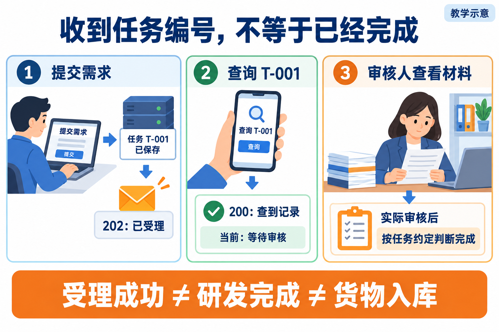
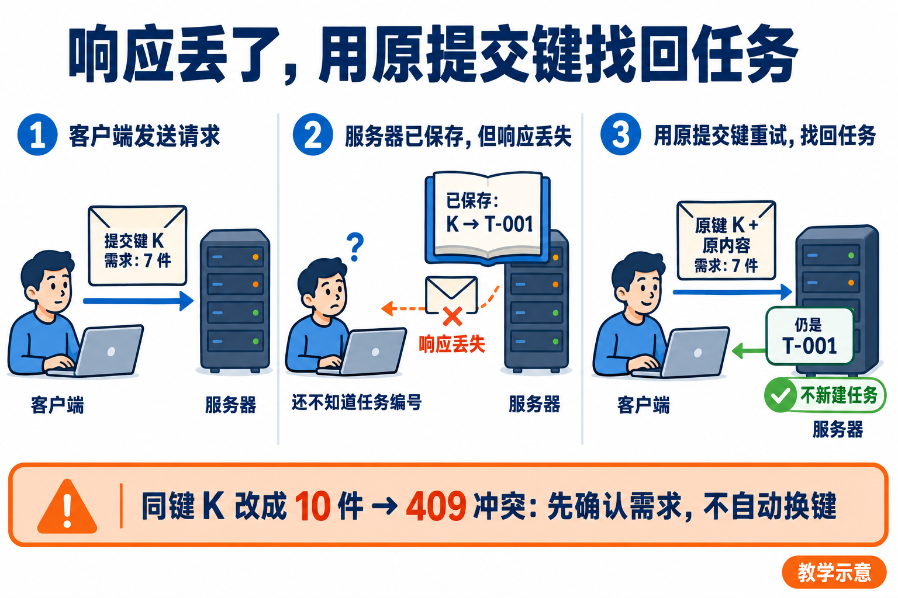

# L13｜把执行链路封装成任务 API

> 这一讲先解决一个使用问题：提交需求后关掉页面，过一会儿回来，还能知道那项工作办到哪一步吗？
>
> 先读本文，再按[实践操作手册](实践操作手册.md)操作。原有 HTTP 记录、实现细节、已知缺口与课件对照保留在[参考详解](参考详解.md)，需要查证时再看。

## 1｜先问“哪件事成功了”，不要只看一个成功提示

延续 L12：你要通过工作台组织 FlowERP 的补货交付，验证采购需审批、收货不重复入账。使用者提交需求，页面提示成功。成功的究竟是什么？

可能只是请求被接收，也可能是软件研发完成，还可能是某张采购单真的收了货。**这三种成功不能混用。**

**先看第一栏。** 服务保存任务 T-001，返回“202：已受理”。这表示接下了工作，不表示已经完成。

**再看第二栏。** 查询 T-001 得到“200：查到记录”，记录里却写着“等待审核”。查询成功与任务完成没有矛盾：查询只是把当前事实告诉你。

**最后看第三栏。** 审核人依据本次任务的材料作决定，再按任务约定判断是否完成。不能从前两栏的成功响应直接跳到货物入库。

T-001 是教学编号，不是实测结果。图里的页面和人物也不是产品截图或真实人审证据。

本讲的 **API** 是程序之间约定的调用接口：调用方按约定提交数据，服务处理后返回约定的结果。HTTP 是这里传递请求与响应的方式。先理解“提交”和“查询”两项动作，不用先背一长串接口路径。

## 2｜一次任务，要有离开页面后仍能找回的身份

**Task（任务）**是持续存在的一项工作记录。任务编号回答“这次工作是哪一项”；任务状态回答“它现在到哪一步”；报告和事件说明“凭什么这样判断”。

需求、研发任务、采购单可以互相关联，但不是同一个对象：

- 需求说明想解决什么，例如“补货必须先审批，同一次收货不能重复入账”。
- 任务 T-001 追踪这次受控研发或验证工作，关联 Spec、候选、报告和审核。
- 采购单 PR-TARGET 指向一笔实际业务，关联商品、数量、采购批准与收货流水。

提交前要写清本次完成标准。如果任务是开发审批入库能力，完成依据是软件候选、检查和交付审核；如果任务合同还包含实际办理目标单据收货，就必须补上采购批准、库存和流水对账。仅复验已有实现又是另一种范围。

本讲由你确认任务含义、接口约定和权限，Codex 协助实现或修复，工作台组织过程，复验者和审核者独立判断。先建设可追溯任务 API，再用它组织 FlowERP 交付，不是给客户随便开一个能执行代码的接口。

## 3｜两个最小接口：先保存，再交回编号

调用方需要一个提交入口、一个查询入口。课程主线工作台默认在 :8001，参考入口如下；这是本地课程协议，不是所有 API 都必须采用的命名。

| 入口 | 用来做什么 | 成功时说明什么 |
|---|---|---|
| POST /api/v1/delivery/requests | 提交一项需求及提交键 | 202：已受理，并返回 task_id |
| GET /api/v1/tasks/{id} | 用原任务编号查询 | 200：找到任务及事件；不存在则为 404 |

POST 在这里用于提交，GET 用于读取；{id} 要替换成实际收到的编号。task_id 就是返回数据中的任务编号字段。命令和请求格式按实践手册执行，不把图中的 T-001 当成真实编号。

### 为什么必须先保存任务

如果服务先回复“已受理”，随后保存失败，用户拿着编号回来，系统却说查无此项。这种受理没有可靠的后续入口。

因此，参考任务存储把任务、初始事件和“提交键对应哪个任务”的关系放进同一次数据库事务：这些记录一起成功或一起失败。任务记录保存成功后，再返回编号。

这项保证有范围。独立的 Spec 文件、报告文件并不因为数据库有事务就自动一起回滚。原参考实验曾发现冲突请求可能留下多余 Spec 文件；任务去重与文件清理要分别检查，详见参考详解，不把已有缺口说成已经修复。

### “异步”不是另外一种成功标准

**异步受理**是先回复已接收，后台继续推进，调用方稍后查询。它让一次 HTTP 连接不必一直等到开发、检查和人审全部结束。

后台可能很快，第一次查询已经显示“正在检查”，不一定能亲眼看到“排队”。要验证异步，应观察检查尚未结束时提交响应是否已经返回，而不是强求某个瞬间状态必须出现。

参考受理入口目前限定为 **verify**，即检查已有实现，不接受从这个入口直接指定 codex 开发模式。它可以验证受理与查询机制，却不能证明 Codex 已开发新功能或采购已经入库。个人交付仍需自己的接口改动和真实业务证据。

## 4｜提交超时后，先别换个编号再来一次

超时有两种可能：请求根本没到服务；或者服务已经保存任务，但响应在返回途中丢了。客户端只看到“没收到”，无法据此判断服务什么都没做。

解决这个空隙，要区分两个身份：

**提交键 K**由调用方在发送前确定；**任务编号 T-001**由服务受理后返回。响应丢失时，调用方可能还不知道 T-001，却仍持有原来的 K。

**沿图从左向右看。** 首次用 K 提交“需求 7 件”；服务已经保存 K 与 T-001 的对应关系，只是返回响应丢失；再次带着 K 和原内容提交，返回的仍是 T-001，而不是另建任务。

这叫**提交幂等**：同一次提交重试，沿用原任务。取得任务编号后，再按原编号查询进度。

如果 K 不变，但把 7 件改成 10 件，就不是单纯重试。参考协议应返回 **409 冲突**，让提出者确认需求变化。不要遇到冲突就自动换键，那会绕过判断，制造另一项工作。

“同内容”按接口约定的字段比较，不是模型觉得两段话意思差不多。键在哪个范围唯一、保留多久、哪些字段参与比较，都应在合同中说清；参考实现的具体字段与边界放在参考详解。

### 任务只建一次，不代表收货只发生一次

提交去重保护的是任务数量。一个任务中断后恢复，仍可能再次调用收货。因此还需要业务自己的收货幂等。

对 PR-TARGET 而言，假设起初在库 10、预占 2，完成一次已批准的 7 件收货后，应为在库 17、预占 2、可用 15，本次 +7 流水只有一条。重试后仍应如此。

按钮禁用、提交键去重、收货幂等分别保护不同位置，不能拿“只查到一个 Task”证明库存没有重复增加。

## 5｜查询结果要能指导下一步，而不只是显示一个词

L12 学过状态、条件与轨迹。L13 把这类事实变成可查询的任务记录。参考任务主要成功路径是：

排队（queued）→ Spec 就绪（spec_ready）→ 执行（executing）→ 检查（evaluating）→ 等待审核（review）→ 完成（completed）。

先按中文含义读懂即可。L12 最小 Graph 与 L13 任务存储是不同参考模块，不是状态名相近就自动接通；是否真正调用了动作，应看代码和实际执行记录。

### 同时查四类信息

当前状态告诉你位置；事件序列说明何时、因为什么走到这里；报告与候选引用支持检查结论；审核记录说明谁对哪份材料作了决定。

比如查到 executing，只能说明流程在执行阶段。verify 也可能经过这个状态，不能据此推断 Codex 改过代码。查到 review，表示还缺审核决定；查到 rework，应能找到当前返工原因，而不只是看到红色标签。

任务存储应检查允许的转移，再把状态更新与对应事件一起保存。不能让调用方任意把 queued 改成 completed，跳过执行、检查与审核。

报告通过后，还要确认报告属于当前候选。若等待期间 X 变成 Y，就重新取得 Y 的依据。reviewer 填了一个名字，只能证明请求带了这段文字，不能单独证明真实身份和权限。

### 最小权限要落在动作上

提交、读取、执行和审核是不同权限。设计时应明确谁可以看哪个任务、谁能触发修改、可写哪个目录、谁能接受哪版候选；不能因为知道一个任务编号就默认拥有所有操作权。

参考 verify 限制可以缩小执行风险，但不是完整账号与授权体系。页面和仓库也不能保存密钥。真实需求仍从工作台首页“事项与决策”组织，API 是同一工作台的程序接口，不另建一套日常研发入口。

### 历史失败不要删，当前错误要讲清

任务曾失败，修复后到了 review，历史错误仍有保留价值。但界面若把旧 error 当成当前阻断原因，读者就会困惑。

原参考资料记录过旧 error 保留的情况。查询时应结合事件时间、最新报告和候选判断是否已经恢复；个人接口应区分“当前阻断原因”与“历史错误”，既不隐藏失败，也不让使用者猜。

## 6｜服务重启：能查到、能接续、接续安全，是三项检查

关掉网页只是客户端离开；服务进程重启则可能丢失内存中的线程和队列。任务已保存到数据库，不代表后台会自动找到它继续执行。

分别验证三件事：

| 要证明什么 | 应实际看到什么 |
|---|---|
| 完成记录仍可读取 | 关闭旧服务、启动新进程后，用原 ID 查到状态和证据 |
| 中断任务有处理策略 | 新进程识别原任务，留下恢复、停止或转人工事件 |
| 接续不会重复副作用 | 核对实际差异与业务数据，确认没有重复修改或入账 |

只重新打开数据库，不能替代真实服务进程的重启实验。只查到 completed，也不能证明报告和候选文件还在；后续复验需要相关材料一起可查。

参考调度器按中断前的动作区别处理：

- 受控 verify 检查中断：保留恢复记录，按策略重新检查，结果通过后仍需审核。
- codex 修改中断：可能已经写了一半，转入 dead_letter，等待人核对，不盲目重放代码修改。
- 已经有明确失败、停在 rework：保留失败，不因每次重启就无限重试。

**dead_letter** 在这里表示自动处理停止、需要人工介入，不是删除任务。上述 codex 恢复分类也不表示前面的 verify 受理接口已允许提交 codex 任务。

重新运行 verify 的前提是检查本身可安全重放。如果检查会发消息、扣款或改外部系统，需要重新分析，不能直接套用。

完成后的任务也要做一次新进程查询。教学审核字段可以验证程序路径，但不能冒充实际人员签字。原参考实测的核验口径保留在参考详解，本轮文字优化没有重新执行那些实验。

## 7｜把这条接口链真正接回 FlowERP

本讲不能只留下两个返回固定文本的接口。工作台要保存并查询真实任务，FlowERP 要有本次合同要求的可观察结果。

先确认自己的改动：从哪个缺能力起点开始，Codex 在什么范围内实现或修复接口，实际差异是什么，原检查如何从失败变为通过。如果参考支架本来就通过，不要伪造起始失败。

再用同一个任务编号说明需求、候选、执行方式、检查报告、失败修订和人工决定。最后沿业务引用核对采购批准、库存与流水。若任务目标包含收货，就核对 17／2／15 与一次 +7；若只运行 verify，库存不变符合它的范围，却不能冒充实际补货已经完成。

打开[实践操作手册](实践操作手册.md)，按以下次序完成：

1. 第 1 步：写下首次预期，先解释 202、review、completed 各说明什么。
2. 第 2 步：观察真实 HTTP 受理、查询、同键重试和内容冲突，保存原 ID。
3. 第 3 步：做真实进程中断与完成后重启检查，不拿重新开页面代替。
4. 第 4 步：实现自己的两个最小接口，写清状态、失败与权限约定。
5. 第 5 步：接回 FlowERP，分开核对研发交付与业务结果。
6. 第 6 步：由同伴凭原 ID 查证，保留反例、修订和真实审核；再迁移到另一种受控任务。

自测：GET 返回 200、任务仍在返工，矛盾吗？不矛盾，只是查到了返工记录。提交超时后自动换键，安全吗？不一定，可能重复建任务。重启后查到 completed，就能说执行可安全恢复吗？不能，那只证明完成记录可读。

这一讲的核心是：**每次受理留下可靠身份，每次查询给出可解释事实，每次恢复依据真实状态。** L14 再把这些事实组织成页面，让人知道该等待、返工还是审核，而不是把所有情况都显示成“成功”。

## 本讲合同（与课程大纲一致）

本讲对应 CLO-6：服务化交付能力。

- **核心内容**：任务模型、异步执行边界、状态机、持久化和最小权限。
- **演示结果**：提交任务后获得 ID，并查询 Spec、执行阶段和最终结果。
- **课内增量**：实现任务提交与状态查询两个最小接口。
- **通过标准**：状态只按合法路径变化；失败原因可查询；已完成任务在服务重启后仍可读取。

本文未重新运行原实验。配套 PPT 已按本文更新为[图文易读版（30页，末尾五页增图版）](slides/L13-把执行链路封装成任务API-图文易读版-30页-v2.pptx)，原版保留；Word 未同步更新。原参考记录、核验日期和已知缺口见[参考详解](参考详解.md)。

配图使用内置 ImageGen，均为教学示意。图与提示词：[受理不等于完成](assets/reading-figures-v2/01-accepted-not-done.prompt.md)、[同键找回任务](assets/reading-figures-v2/02-retry-same-key.prompt.md)。
