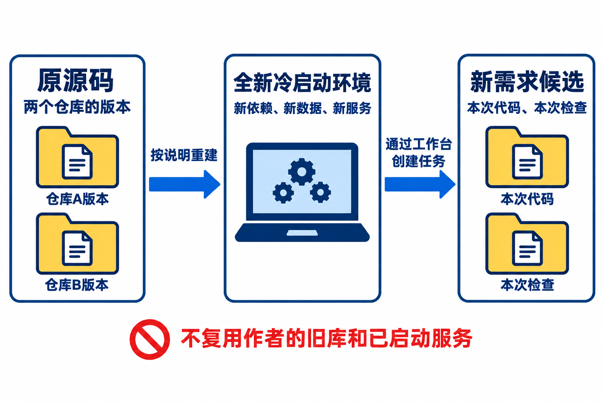
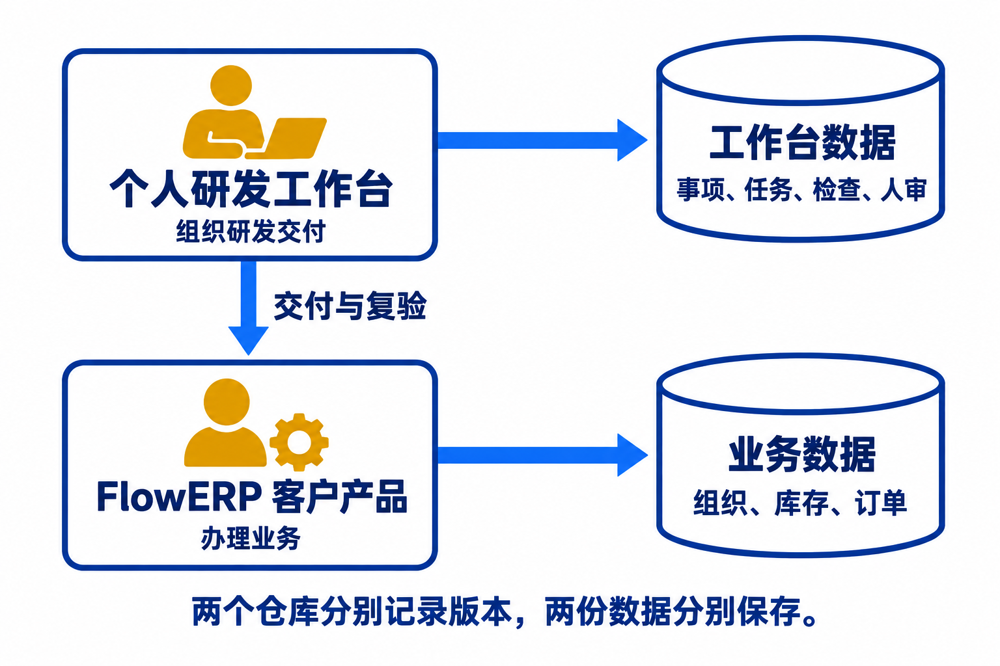
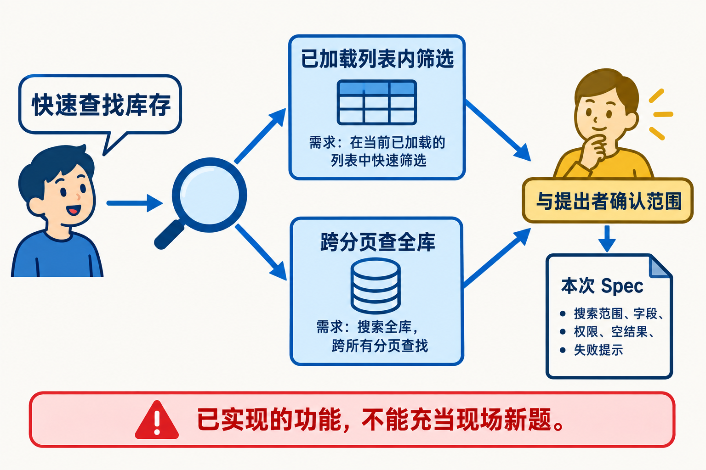
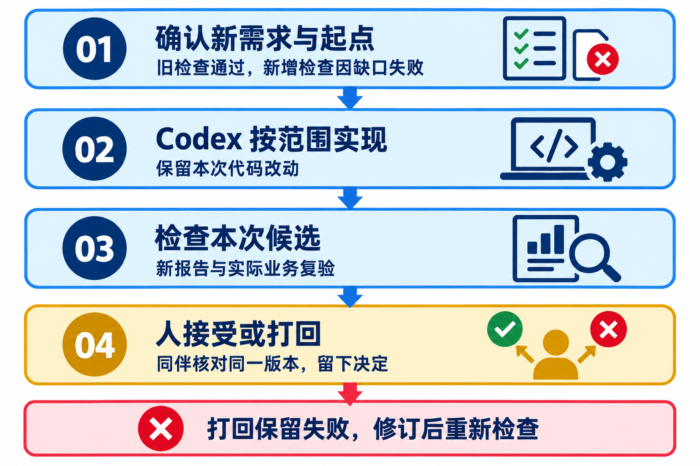
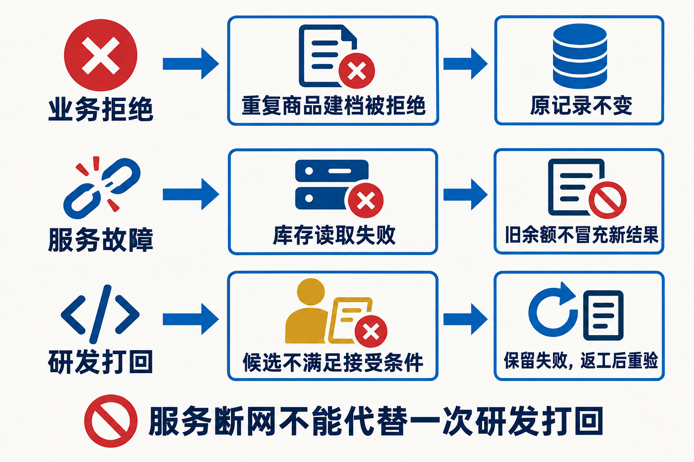
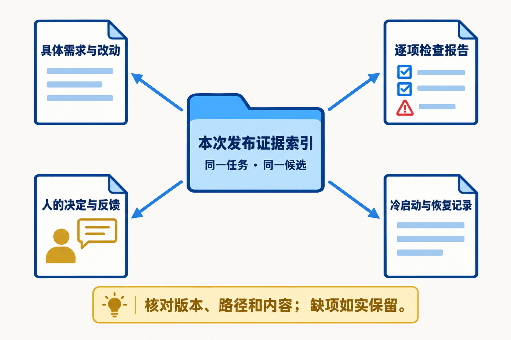
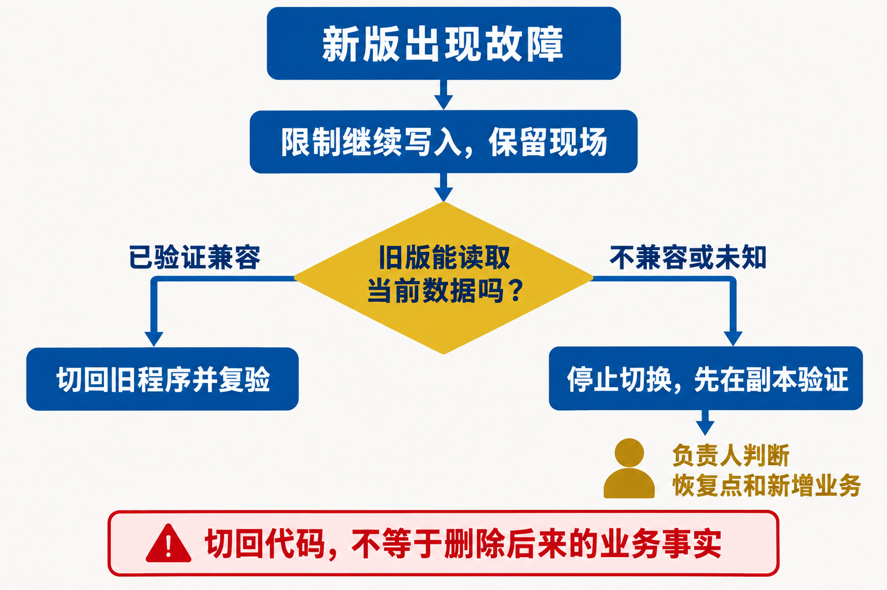
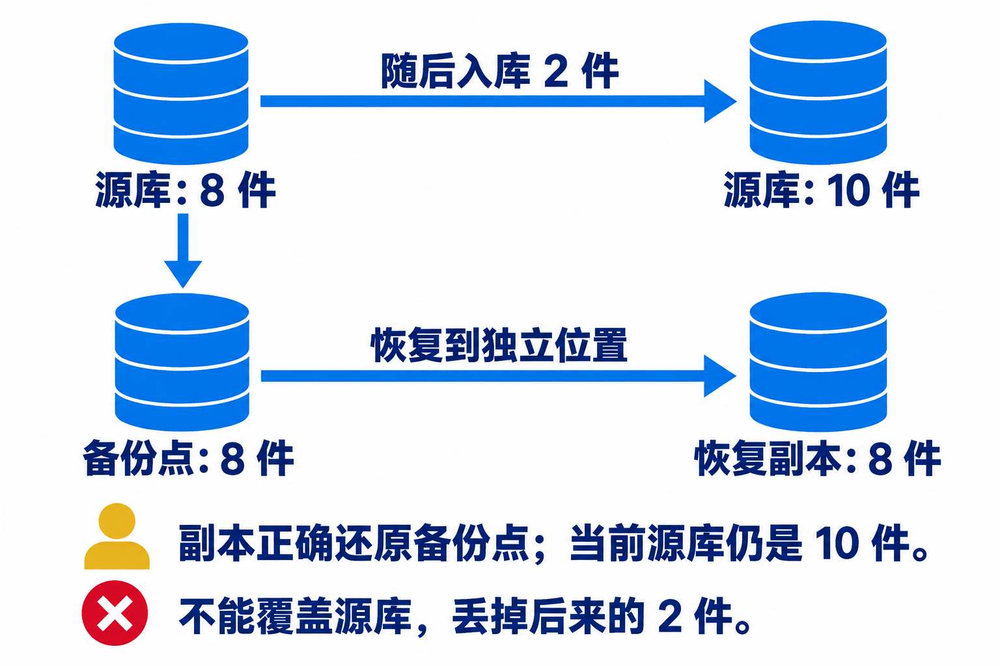

# L16｜在新环境接手，并完成现场新需求

上一讲，我们用交付摘要说明已经完成的工作，把使用反馈整理成有来源、有适用条件的经验。现在，一位同伴拿到这些材料，要在新环境运行个人研发工作台和 FlowERP，并继续完成一项开发。

这次交接要回答一个问题：**离开原作者的电脑和临时指导，这套系统还能运行、修改并交付吗？**

人负责澄清需求和接受结果，Codex 协助调查与实现，工作台组织执行与检查。

> **贯穿案例｜库存查找**
>
> 林舟交接系统，陈珂在新环境接手，周宁提出库存查找需求。文中的人物、情节与配图均为教学示意，不代表已经完成的实践。

## 开始之前：这门课到底把我们带到了哪里

### 从 Vibe Coding 到 Spec Coding：先说清什么算做对

**Vibe Coding 侧重快速探索，Spec Coding 则先明确什么算做对。** 前者用自然语言生成、再按直观反馈调整；后者把目标、范围和验收条件写成规格，再据此实现和检查。

> **案例｜有了搜索框，就算完成了吗？**
>
> 周宁说：“库存记录多了，能不能快速找到我要的商品？”你把这句话交给 Codex，很快得到一个搜索框。输入商品名后，列表变短了，似乎已经完成。
>
> 但商品在第二页还能找到吗？会不会看到其他组织的库存？读取失败会不会被显示成“没有库存”？
>
> 确认需要跨分页查找后，就应把它写入 Spec，并用另一页的商品验收，而不只是观察当前页是否变短。

从 Vibe 到 Spec，关键变化不是提示词更长，而是**判断依据从“看起来不错”变成“是否满足确认过的要求”**。这接近规格驱动开发（Spec-Driven Development）的思路，可参阅 [GitHub Spec Kit 文档](https://github.github.com/spec-kit/)；本课用最小 Spec 和自己的工作台实践。

### 从 Spec Coding 到 Harness 工程：让约定在执行中生效

有了 Spec，交付仍可能出错：Codex 在错误目录修改了代码，漏跑检查，或者修复多轮后仍不通过。每次都靠你盯住终端、补充提醒、手工寻找报告，换一个人就很难继续。

所以还要把约定放进一套可执行的机制：开始前确定目录和授权范围；执行后检查实际改动并运行 Eval；失败时限定修复次数，无法解决就停止并交给人判断；接受时记录审核者和具体版本。

这就是本课所说的 **Harness 工程：设计并运行围绕 AI 执行的控制与验证机制，让交付有边界、可检查、能追溯。** 个人研发工作台是这些机制的承载者。Spec 说明“做什么才对”，Harness 让执行过程真正遵守这些要求。

因此，**Vibe Coding → Spec Coding → Harness 工程**，是本课从快速探索走向可靠交付的学习路线，而不是行业统一划定的三个等级。它们可以配合使用：用探索澄清想法，用规格确定标准，用工作台组织执行与复验。

L01～L04 建成工作台 V0，并首次组织 FlowERP 交付；L05～L08 让检查成为可信门禁；L09～L12 组织修复、协作和审核；L13～L16 将任务、界面、反馈和交接连成可持续使用的系统。

### FDE：在业务现场把问题解决到可用

本课程用 **FDE（Forward-Deployed Engineering）** 表示深入业务现场、理解真实约束并持续交付结果的工程工作方式。谈岗位时，FDE 也常指 Forward-Deployed Engineer，即前线部署工程师。Palantir 的[官方岗位说明](https://jobs.lever.co/palantir/5168e8fd-fec1-4fea-b7a1-81bdaea65850)强调与客户共同工作，并从最初的问题沟通负责到实际软件交付。

> **案例｜从“做一个搜索框”到解决接单问题**
>
> 周宁真正需要的是在接单前确认商品是否有货。了解她的工作方式和系统限制后，才能决定做当前页筛选还是跨分页查询。实现后，由陈珂独立复验，再请周宁实际使用，确认问题得到解决。

本课用三个循环组织这项工作：

- **现场循环**：了解周宁为什么查库存，确认范围；试用后继续听取反馈，修正对问题的理解。
- **交付循环**：通过工作台组织实现、检查、打回与修订，直到具体版本得到具名接受。
- **能力循环**：把“只查当前页”的失败补成跨页检查，记录经验的适用条件，再看它能否帮助下一项需求。

前两个循环解决眼前的问题，第三个循环让下一次交付少走弯路。经验只有在后续任务中被采用和复验，才能证明真正发挥了作用；这不是模型自动学习或自动升级。

**Vibe、Spec、Harness 回答“怎样开发和交付”，FDE 回答“为谁解决什么问题，并负责到什么结果”。** FDE 不是 Harness 后面的第四种编程方式，而是把这些方法带到真实业务现场的工作方式。

L16 就用一次新环境中的开发检验这条路线。下面从接手系统开始，经过新需求开发和交付，最后讨论哪些能力能带到下一项任务。

## 一、接手：先让已有系统运行起来

### 从交付摘要了解当前状态

**接手首先要还原系统的当前状态与运行条件。** L15 的交付摘要说明版本、已有能力、未解决问题和启动入口，引用的原始记录则支持具体结论。

> **案例｜说明里漏掉了客户项目的位置**
>
> 说明只写“启动服务”，没有交代 FlowERP 在哪里。陈珂启动了工作台，却无法访问客户项目。

补齐两个仓库的版本、依赖、配置和数据位置，是把原作者脑中的隐含条件变成别人能够重建的条件。

### 在新环境按说明启动

“冷启动”指在没有现成运行状态的条件下，重新建立依赖、准备配置和数据，再启动系统。只打开一个新终端，仍可能使用作者原来的虚拟环境、数据库和服务，因此发现不了“漏装依赖”或“配置只存在于旧电脑”这类问题。

*读图：左侧保留交接版本，中间验证能否重建，右侧用于开发新需求。*

分开这三处，才能区分“原系统无法启动”和“本次修改破坏了系统”，也保留比较与恢复的起点。

容器化把程序与依赖封装为镜像，减少机器之间的运行差异，但不会自动解决配置和数据问题。例如，新容器如果挂载了旧数据卷，仍会读到原来的库存。判断环境是否真正重建，要把程序版本、配置和数据来源分开看。

*读图：工作台保存研发过程，FlowERP 保存业务数据。*

接手时分别确认两者的仓库、运行目录和数据归属，不能把工作台启动成功等同于客户项目可用。

### 用一次业务操作确认系统可用

**健康检查通过，不等于业务已经可用。** 健康检查只覆盖探针检查的条件，还需要用已有业务操作确认数据读写和目标实例正确。

> **案例｜服务健康，却连接着旧环境**
>
> 两套服务都显示健康，工作台却仍指向作者旧电脑上的 FlowERP。陈珂核对地址和版本后，在新环境建立商品并重新查询，再从工作台查回一项任务，分别验证业务数据和研发记录。

先确认已有操作正常，后面新需求检查失败时，才有依据判断是能力缺失，而不是环境尚未准备好。

## 二、开发：通过工作台完成一个新需求

### 先确认当前版本缺少什么

**先确认能力缺口，再确定实现范围。** 同一句“快速找到商品”，可能对应不同的查询范围与验收标准。

*读图：当前页筛选与跨分页查询，是两种不同的需求。*

> **案例｜把库存查找写成可验收的范围**
>
> 假设当前版本不支持跨分页查找，本次范围定为“在当前组织内，按商品名称查找跨分页库存”，暂不增加模糊推荐和批量修改。
>
> 验收数据放入第二页商品和其他组织的同名商品：前者应能查到，后者不应泄露。

先在原版本运行检查，确认它能识别缺失的能力。连不上服务属于环境问题，不能证明查询功能不合格；如果功能已经存在，则应重新寻找真实缺口。

### 把确认后的需求交给工作台

**授权执行需要同时确定范围、检查方法和停止条件。** 从工作台首页的“事项与决策”组织开发时，除了提供 Spec，还要确定代码副本、允许修改的文件、验收命令和修复上限。否则，同一句“修好查询”可能变成无边界的反复修改。

*读图：确认范围 → 执行修改 → 检查结果 → 人决定接受或打回。*

候选是本次准备检查和交付的一份代码；后续 Diff、报告和人审都应指向它的明确版本。

Codex 返回后，先看 Diff，即实际代码差异，确认改动属于授权范围。然后运行新增检查和已有阻断 Eval，分别确认新要求得到满足、已有能力没有被破坏。

如果检查发现跨页查询仍失败，Loop 可以在限定轮数内组织修复；达到上限仍无法解决，就停止并交给人判断。Graph 则区分“执行完了”“等待复验”和“已经接受”，避免把代码生成结束当成交付完成。旧经验可以帮助选择修法，但不能替代本次查询检查。

### 在开发过程中处理失败和打回

**打回的依据应能复现，重新接受的依据应来自修订后的版本。**

> **案例｜用第二页商品复现查询遗漏**
>
> 第一版仍然只筛选当前页。陈珂用第二页商品查询，得到空结果，便据此打回。Codex 可以按同样的输入定位问题，而不必猜测“功能不好用”指什么。
>
> 林舟组织修订后，陈珂重新运行原有检查和新增用例，再决定是否接受。

第一次失败留在原任务中，后来的通过报告关联修订版本，才能看出哪次改动解决了什么问题。

三类失败需要不同处理。越权请求被拒绝，可能说明权限保护正确；服务读取失败，要检查页面是否明确报错，而非误报“无库存”；研发打回则说明候选不符合已确认的要求，需要修订。把它们都写成“失败后重试”，会掩盖真正需要修复的对象。

## 三、交付：让接手者拿到可继续使用的版本

### 更新交接材料，请同伴实际使用

**通过验收说明满足了已确认的要求，实际使用则可能揭示新的需求。**

> **案例｜名称查找通过了，现场却更需要编码查找**
>
> 周宁试用后说：“能按名称查到了，但接单时客户通常只报商品编码。”

这不一定意味着原实现错误，却说明对现场的理解还不完整。下一步应确认编码查找是否成为新需求，而不是未经确认继续扩大本次修改。

交付摘要和结果导出让接手者知道拿到的是哪个版本、能做什么；保留反馈的原话和使用场景，则让下一次开发知道为什么要改。两者分别连接已完成的交付与尚待确认的问题。

*读图：需求、版本、检查与人审共同支持交付结论。*

> **案例｜“昨天能查，今天又查不到”**
>
> 面对这条反馈，先核对是否为同一版本、同一组织和同一组数据。只有一张成功截图，无法区分版本回退、数据变化和新的程序错误。

### 说明出问题时如何处理

**回退程序与恢复数据是两个不同的决定。** 接手者需要知道上一可用版本和备份位置，更需要知道恢复会影响哪些业务事实。

*读图：先保护现场、核对兼容条件，再决定如何恢复。*

切回旧程序不会撤销已经发生的出入库，恢复旧数据则可能丢失备份之后的新业务。因此要先在独立副本中预演恢复，核对数据后再决定下一步。

> **案例｜恢复成功，为什么库存反而少了？**
>
> 8 件时备份，后来又入库 2 件，源库为 10 件，恢复副本仍为 8 件。副本正确还原了备份点，却没有还原当前业务事实。直接覆盖源库就可能丢掉这 2 件的入库记录。

恢复是否可接受，要由业务负责人结合备份后的业务记录决定，不能只看技术操作是否成功。

交付也不等于所有问题都已解决。假如跨页查询正确，但数据量增大后变慢，应说明当前验证过的数据规模，并把查询优化列为后续技术债。与笼统地写“性能待优化”相比，这能让接手者判断何时需要处理，以及用什么现象确认问题出现。

## 四、结课：下一项需求到来时，什么能复用

### 一次失败，怎样变成下一次交付的能力

**先定位交付机制中的缺口，才能决定把改进沉淀在哪里。**

> **案例复盘｜同一个查询遗漏，三种改进位置**
>
> 需求没有说清查找范围：重新确认并修订 Spec。
>
> Spec 已要求跨页，检查却只用了第一页：补齐验收用例。
>
> 检查已经失败，任务仍显示完成：修复工作台的状态判断和阻断机制。

这三种情况不能都靠“让 Codex 再改一次”解决。只修查询代码，本次功能可能恢复了，下次仍可能漏掉需求或放过失败。找到问题所在，才能决定该改产品、改规格，还是改组织交付的机制。

这也是全课程同时建设 FlowERP 和个人研发工作台的原因：**FlowERP 的真实问题检验工作台，工作台的改进再帮助后续产品交付。** 学会 Harness 工程，不是把工具都接上，而是能发现一次交付为什么不可靠，并把相应的控制和检查补到下一次执行中。

### 换一个需求，还能怎样继续

**能复用的是交付方法，需要重新验证的是新业务规则。** 任务登记、授权、记录、复验和审核方法可以沿用，但新需求仍要有自己的验收标准。

> **迁移案例｜从库存查询到销售导出**
>
> “分页可能造成遗漏”能提醒你检查销售导出是否覆盖全部结果，但库存查询的通过报告不能证明销售金额正确。销售字段、权限、金额计算和导出失败后的状态，都需要重新确认与检查。

这就是课程最终留下的两项成果：一套可以继续组织研发的工作台，以及通过它持续开发的 FlowERP。面对下一个陌生需求，你不必重新拼凑全部流程，但仍然要回到现场理解问题，为本次交付建立自己的判断依据。

## 配套材料与课程合同

操作步骤见[实践操作手册](实践操作手册.md)，结业要求见[行动卡](行动卡.md)，个人材料按[提交模板](SUBMISSION.md)整理。详细机制见[扩展参考](辅导资料-扩展参考.md)。本讲对应 CLO-6，综合检验现场判断、实现、修订与迁移能力。

[原有总览图](assets/imagegen-20260920/00-overview.png)保留供回顾接手、恢复、新需求和答辩涉及的对象；本文阅读与操作衔接以四部分顺序为准。

- **核心内容**：容器化、健康检查、回滚意识、演示叙事和技术债说明。
- **演示结果**：从干净环境启动系统，展示一次成功任务、一次失败打回、一次结果导出和一次反馈写入。
- **课内增量**：完成结业检查表与五分钟答辩稿。
- **通过标准**：需求能生成 Spec 和代码；阻断级 Eval 全部通过；Loop 收敛或如实安全退出；Graph 审核结论可追踪；摘要和反馈能够正确生成；干净环境可启动且仓库无密钥。
