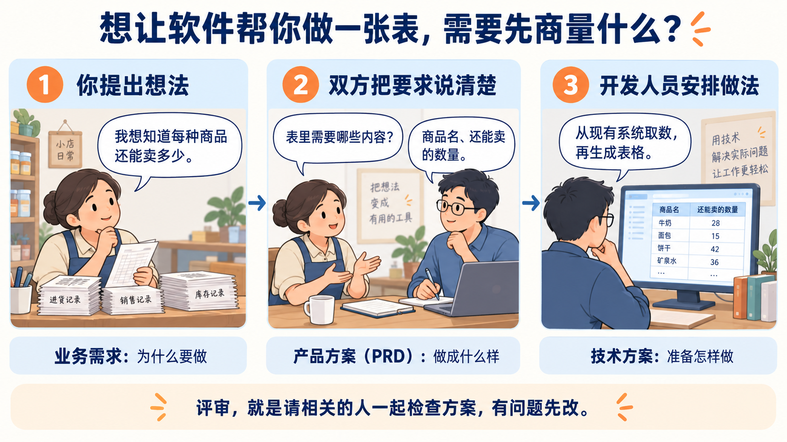
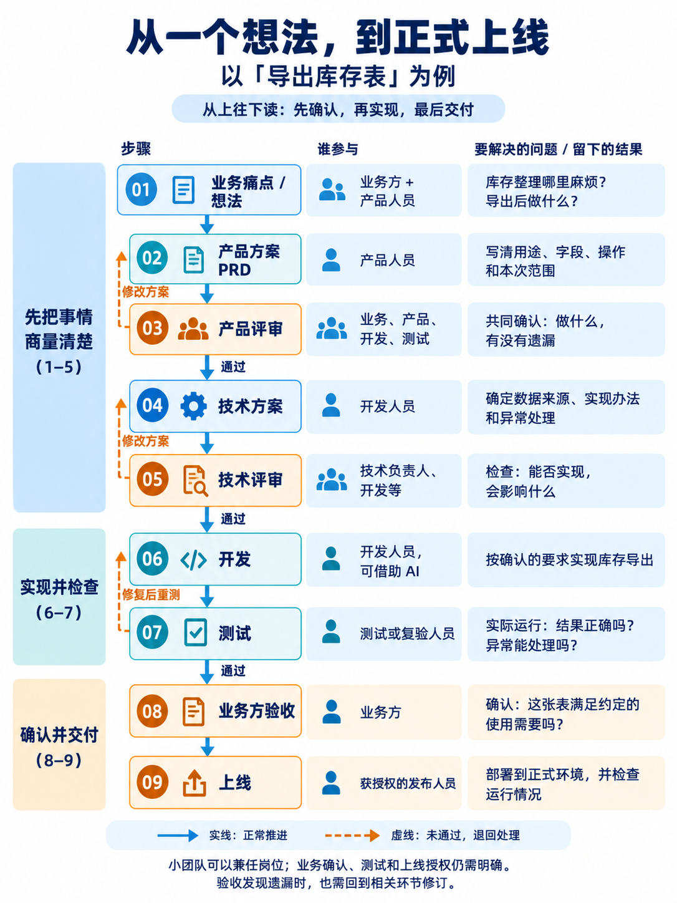
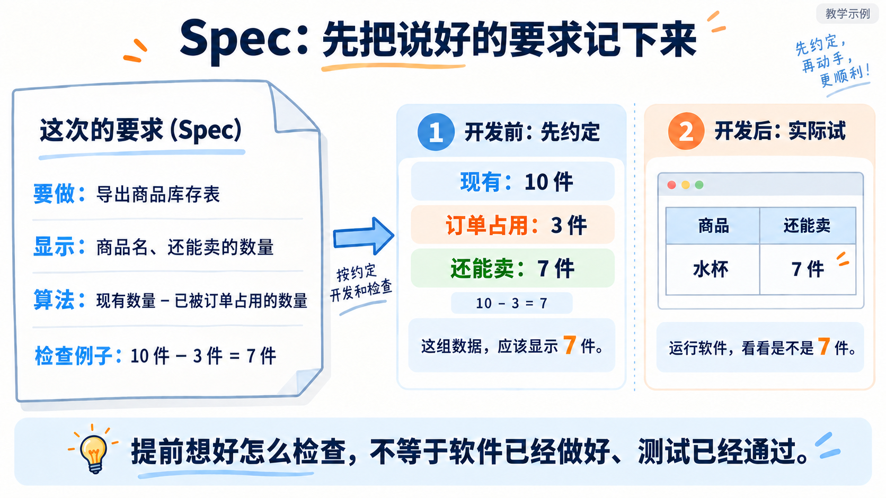
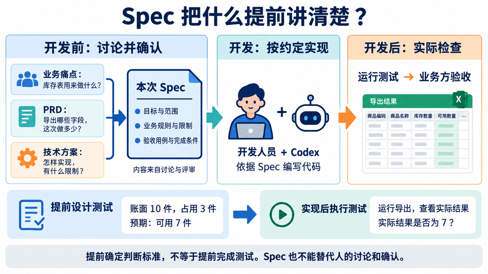
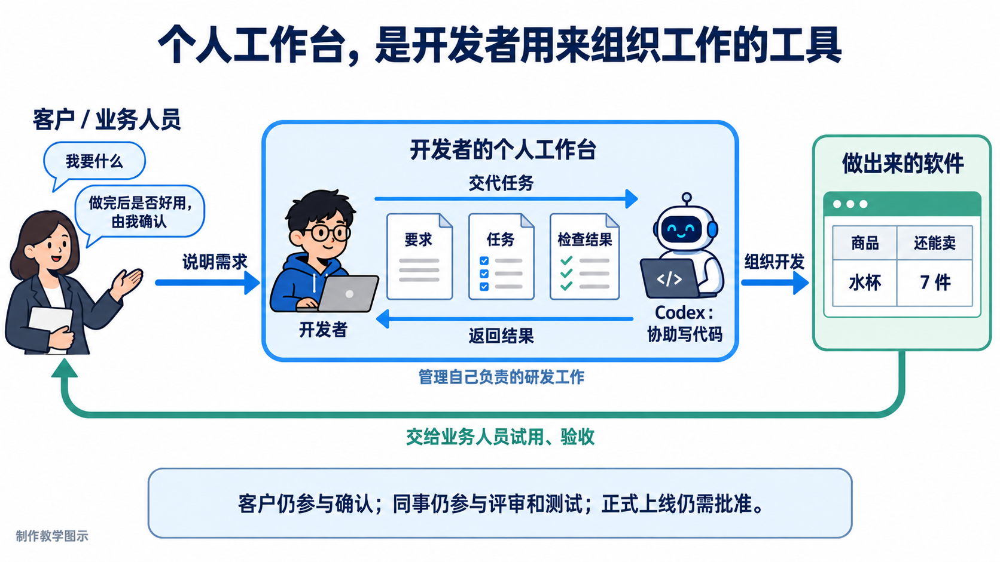
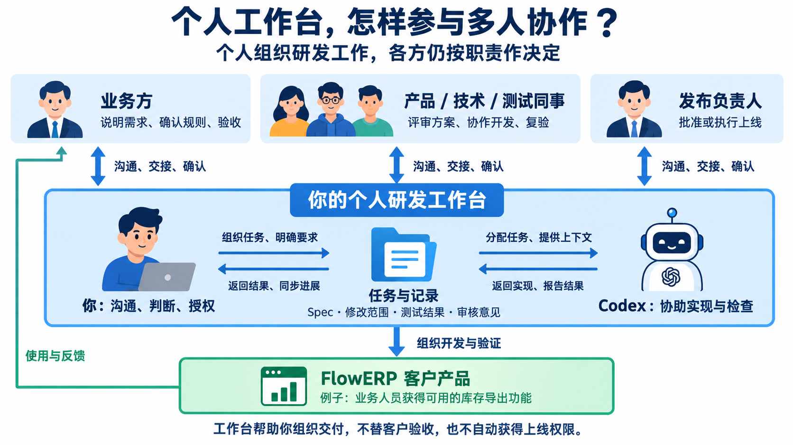

# 从业务需求到上线：理解 Spec 与个人研发工作台

*从“我想要一张库存表”说起*

假设你经营一家店。每天都要手工算每种商品还能卖多少，于是你请人给现有软件加一个功能：“帮我导出一张库存表。”下面就用这个假设的例子，说明开发流程、Spec 和个人工作台。

## 1. 软件公司接到这句话以后，要做什么？

对方不能马上动手，因为“库存表”还不够具体。他需要与你商量：表里有哪些内容？是看现有多少货，还是看扣除已被订单占用的部分后，还能卖多少？

先看下面的三步简图：提出想法、把要求说清楚、安排实现办法。

在软件公司，通常由**产品人员**把你需要的功能整理下来，这份说明叫 **PRD**。大家一起检查有没有遗漏、是否值得做，就是**产品评审**。

接着，**开发人员**考虑从哪里取数据、怎样生成表格，把做法写成**技术方案**。其他技术同事帮忙检查这个办法是否可行，就是**技术评审**。确认后，才按方案编写程序，也就是**开发**。

做好以后，还要过三步：**测试**，实际运行、找出错误；**业务方验收**，由你确认这张表是否满足说好的用途；**上线**，把确认过的功能放进正式使用的软件。

再看完整流程：从上往下依次确认每一步由谁参与、解决什么问题；橙色虚线表示没有通过时要返回修改。

所以，确实需要你与软件公司的不同人员配合。小团队可以一人做几项工作，但这些问题仍然要逐一解决。

## 2. Spec 为什么要在开发前写？测试又怎么能提前？

假设双方商量好了：表里显示商品名和“还能卖多少”。你们还约定，一件商品现有 10 件，其中 3 件已经留给其他订单，表里就应该显示 7 件。

**把这次要做什么、不做什么、怎么算、怎样检查写清楚，就是课程里 Spec 的主要作用。** 可以先把它理解成“本次开发的要求说明”。

先看简图：左边是写下约定，中间是开发前确定正确结果，右边是功能完成后实际运行检查。

图左是双方说好的要求；中间是在开发前写下“应该得到 7”；右边是在开发后实际运行，看看结果是否为 7。

**提前的是“想好怎样检查”，实际测试仍然要等功能做出来再进行。** 如果导出了 10，就要检查哪里做错，修复后再试。

因此，Spec 没有省掉前面的讨论和评审。PRD 说明你需要什么，技术方案说明准备怎样做，Spec 把这次开发要遵守的结论整理好，供开发和检查时使用。小需求可以写在同一份文档里，不必重复写几份。没有问清的问题，也不能靠写一份 Spec 自动得到答案。

下面这张图把完整关系放在一起：先看上半部分的“讨论确认 → 按约定实现 → 实际检查”，再看下半部分的“提前设计测试 → 实现后执行测试”。

到这里，双方已经有了一份可执行、可检查的 Spec。下一步，开发人员要把它带进个人工作台，拆成任务和检查项，组织 Codex 实现，再把结果交回业务方验收。

## 3. 既然需要这些人，为什么课程要做“个人工作台”？

前两节站在店主这个业务方的视角，现在切换到开发人员的视角。他既要记住与业务方说好的要求，又要安排开发、运行检查、整理结果。如果借助 Codex 这个 AI 开发助手，还要告诉它具体做什么，并检查它做得对不对。

**个人工作台，就是帮助他组织这些工作的工具。** 它可以逐步把要求、任务、执行和检查结果放在一起，方便继续处理和交给别人查看。

先看简图：业务方说明需求，开发者通过个人工作台组织自己与 Codex 工作，做出的软件最后仍交给业务方试用和验收。

看图中间：开发者通过工作台安排 Codex 做事。再看左边：你仍然需要说明要求，最后试用并确认结果；公司的同事也仍然参与评审、测试和发布。

“个人”说的是**谁使用这套工具组织工作**，不意味着软件只需要一个人完成。就像一个人使用自己的工作笔记，不代表他不再需要与同事配合。

课程要做的是这样的研发工具，再通过它持续开发 FlowERP 这个供业务人员使用的软件。工作台帮助组织开发，客户仍决定是否接受，正式上线仍需相应人员批准。图中是协作方式示意，具体能力随课程逐步建设。

下面这张图展开了协作关系：中间是你用工作台组织任务、记录与 Codex，上方各方仍负责沟通、评审、复验和发布，FlowERP 的使用反馈再回到后续开发。

## 总结

1. **业务方决定为什么做、结果是否可用。** 开发、测试和发布人员分别完成实现、检查与上线。
2. **Spec 记录这次交付已经确认的范围、规则和判断标准。** 提前写下检查方法，不代表测试已经通过。
3. **个人工作台把 Spec 变成任务和检查项，组织开发者与 Codex 完成交付。** 它不替代人的评审、验收和上线授权。
