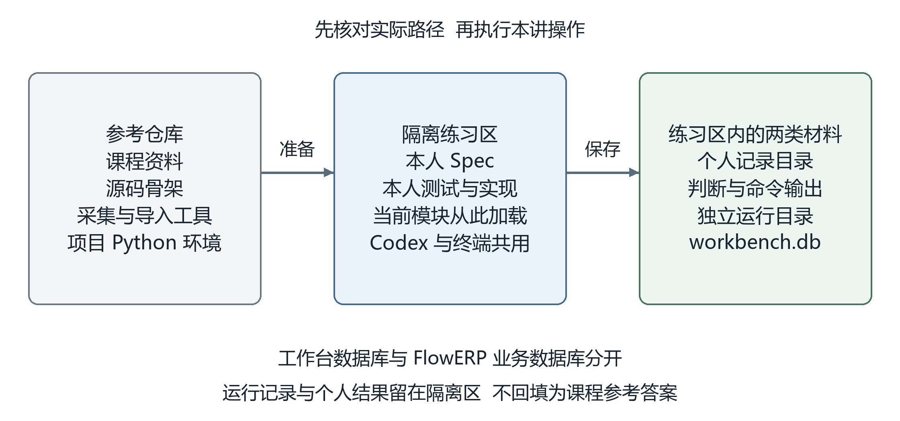
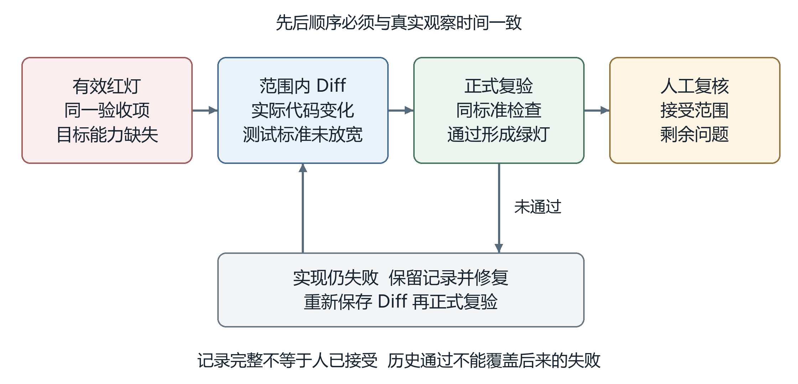
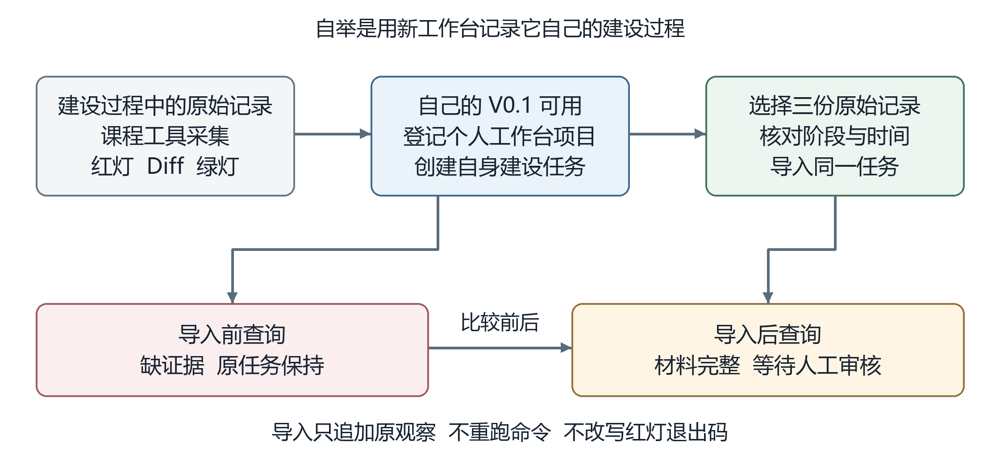
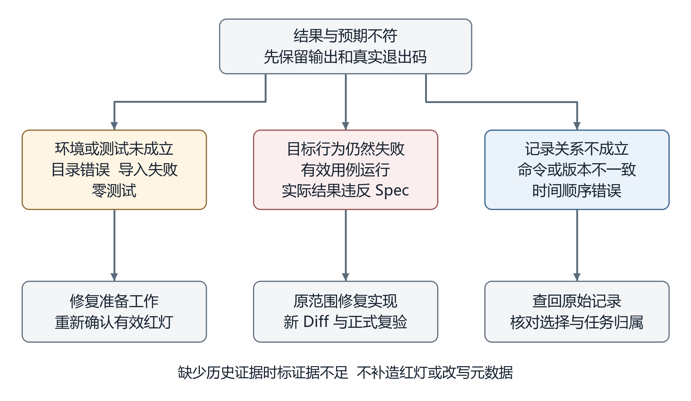

# L01 实践操作手册（macOS 整理版）


## 主要命令
```bash
python3 -X utf8 -m workbench.cli workbench-status
```


> 整理自 [`docs/courses/L01/实践操作手册.md`](../docs/courses/L01/实践操作手册.md)，去掉 Windows PowerShell 部分，命令统一为 macOS / zsh 口径。
> 本资料为课程赠送资料，用来辅助实践练习，非必读。
> 环境：macOS 15.7.5 / zsh　｜　署名：施成业

本手册规定 Workbench V0.1 从隔离准备、需求确认到正式复验与自举的操作流程。最终交付五个可运行的 CLI 命令、本人签署的 Spec、真实红灯与复验结果，以及个人复核结论。**FlowERP 在本讲尚未接入。**

`WORKBENCH_SPEC.md` 的正式位置是隔离区内的 `docs/courses/L01/WORKBENCH_SPEC.md`；参考仓库同名文件是未签署样稿。个人记录由第 1 步创建，测试与实现由第 2～4 步形成，不要从根目录寻找另一份同名 Spec。

动手前先完成 [L00 环境准备](../docs/courses/L00/L00｜课前准备：装好工具，跑通第一次环境自检.md)，并阅读 [辅导资料第 4～6 节](../docs/courses/L01/辅导资料.md)理解需求、设计与检查之间的关系。遇到解释器、路径或输出问题，按 [执行与排错说明](../docs/reference/实操手册执行与排错.md) 核对。

## 执行约定

第 1 步先从参考仓库根目录创建并进入隔离练习区，后续命令均在该隔离区执行。复制命令时只选代码块中的内容，不把说明文字输入终端。长命令可能因页面宽度自动折行；同一条命令仍需完整复制后一次执行。所有路径均相对于当前隔离区，除非工具输出明确给出绝对路径。

**macOS 解释器约定**：先 `source .venv/bin/activate`，之后代码块中的 `python` 就是 `.venv/bin/python`。每开一个新终端都要先激活再进入隔离区。

`workbench-init`、`workbench-status` 等名称在正文中表示子命令，不能单独输入终端；可执行代码块均包含完整的 `python -X utf8 -m workbench.cli` 入口。第 1 步只检查起点，第 2～4 步需要你与 Codex 完成需求、测试和实现，第 5 步复验通过后才能执行第 6 步初始化。

| 对象      | 本讲约定                          | 核对方法                   |
| -------- | -------------------------------- | ------------------------- |
| Python   | 使用参考仓库的 `.venv`             | 核对 `sys.executable`      |
| 实际源码   | 来自当前隔离练习区                  | 核对 `workbench.__file__`  |
| 实现范围   | 已签署 Spec 中的源码写集            | 同时检查全量状态与范围内 Diff |
| 个人记录   | `lesson-01-submission/`          | 按实际输出建立索引           |
| 工作台数据 | `.runtime/course/L01-workbench/` | 同一实验全程使用同一运行目录   |
| 正式运行   | 学员执行并提供真实记录               | Codex 诊断与本人复验分开标明  |

操作前确认输入和目录，操作后核对退出码、输出内容及数据状态。非零退出码可能是预期的失败实验，也可能是环境错误，需根据本步骤的条件判断。

## 步骤总览

| 步骤            | 完成后应得到什么                       |
| --------------- | ----------------------------------- |
| 1. 准备隔离区    | 正确的代码位置、缺能力起点和个人初始判断   |
| 2. 签署需求      | 有范围、失败行为、验收项和本人决定的 Spec |
| 3. 建立有效红灯   | 确实发现目标能力缺失的测试与原始记录      |
| 4. 授权实现      | 在确认范围内实现的五个操作              |
| 5. 审查并复验    | 范围内 Diff 与同一标准下的绿灯          |
| 6. 完成自举      | 新工作台能够查回自身建设记录             |
| 7. 检查失败后状态 | 错误查询被拒绝，原任务仍然完整           |
| 8. 复核与提交    | 个人解释、真实反馈和最终签收结论         |

只运行当前步骤的命令，读完结果再继续。遇到错误可将完整输出交给 Codex 分析，但原始记录要保留。

---

## 1 准备隔离练习区

> **一句话说明：**先创建只属于自己的练习仓库并确认代码从这里运行，参考仓库里的现成功能不能算你的成果。

**前置条件**　已完成 L00，参考仓库可用；本步骤尚未要求工作台功能存在。

先分清三个位置：参考仓库提供课程材料和工具；隔离练习区保存本次修改的源码；`lesson-01-submission/` 保存个人判断与运行记录。隔离区是另一个本地文件夹。

课程提供的 `tools/evidence.py` 负责采集命令输出，`tools/import_evidence.py` 负责导入；你要实现的 Python CLI 程序负责保存、关联和查询记录。两类工作各有分工。

打开参考仓库根目录，执行下面的命令块。



### 1.1 创建并进入隔离练习区

```bash
prepare_l01() {
  source .venv/bin/activate || return 1
  local id="TASK-L01-$(date +%Y%m%d-%H%M%S)-$$"
  local runtime="$PWD/.runtime"
  local metadata="$runtime/course-worktrees/$id.json"
  local target
  printf '正在创建隔离区：%s，请等待……\n' "$id"
  python -X utf8 -m workbench.cli course-prepare --lesson 1 --source working-tree --task-id "$id" --runtime-dir "$runtime" > /dev/null || return 1
  target="$(python -X utf8 -c 'import json,sys; from pathlib import Path; print(json.loads(Path(sys.argv[1]).read_text(encoding="utf-8"))["path"])' "$metadata")" || return 1
  cd "$target" || return 1
  mkdir -p lesson-01-submission || return 1
  cp "$metadata" lesson-01-submission/00-isolation.json || return 1
  printf '隔离区已准备完成：%s\n' "$PWD"
  ls -l lesson-01-submission/00-isolation.json
}
prepare_l01
```

这组命令依次选择课程 Python 环境、创建独立源码副本、进入新目录，并将准备结果保存为 `00-isolation.json`。

正常执行时先显示"正在创建隔离区"，完成后显示隔离目录和 `00-isolation.json` 文件信息；中间复制源码和初始化 Git 时可能暂时没有输出。出现完成提示后再进入 1.2。

副本包含当前源文件，但移除了本讲需要开发的能力，这就是后文的"隔离快照"。图片和 PPT 仍在参考仓库阅读。若创建失败，先处理错误，避免在原目录继续实践。

### 1.2 核对实际运行的代码与起点

**这一步要确认"还没有工作台"。第三条命令预期会报错；看到 `invalid choice: 'workbench-status'` 是本步骤的预期结果。**

```text
python -X utf8 -c "import sys,workbench; print('Python:', sys.executable); print('源码:', workbench.__file__)"
python -X utf8 -c "from pathlib import Path; print('Spec 已存在:', Path('docs/courses/L01/WORKBENCH_SPEC.md').exists()); print('测试已存在:', Path('tests/test_l01_workbench_bootstrap.py').exists())"
python -X utf8 -m workbench.cli workbench-status
```

| 终端结果                                       | 含义                                         |
| --------------------------------------------- | ------------------------------------------- |
| `源码` 路径位于刚创建的隔离区                     | 正在检查自己的练习代码                          |
| `Spec 已存在: False`                           | 第 2 步需要形成首份 Spec                       |
| `测试已存在: False`                            | 第 3 步需要建立验收测试                        |
| `invalid choice: 'workbench-status'`，退出码 2 | 第 4 步需要实现该命令；此时会同时打印很长的用法列表 |

结果一致就进入 1.3。这里无需重新安装、重建隔离区或运行 `workbench-init`；初始化安排在第 6 步。

若 `workbench` 模块根本无法导入，先解决环境；若目标命令直接成功，先核对起点。为 Codex 选择同一隔离目录——终端切换目录不等于另一项 Codex 任务也切换了目录。

**仅当输出是"工作台尚未初始化"时**，才读下面这段分流；看到上述 `invalid choice` 可直接进入 1.3：

```json
{
  "ok": false,
  "error": "工作台尚未初始化，请先运行 workbench-init",
  "flowerp_connected": false
}
```

此时先核对当前目录和实际加载的源码：

```text
python -X utf8 -c "from pathlib import Path; import workbench; print('当前目录:', Path.cwd()); print('源码:', workbench.__file__)"
```

- **刚开始本讲，路径仍是参考仓库**：返回 1.1 执行完整命令块；已创建过时按文末"故障定位与中断恢复"回到原隔离区。
- **路径已是隔离区，但尚未完成第 2～5 步**：按个人记录从未完成步骤继续。不要把"尚未初始化"当成本讲能力缺失的有效红灯，也不要跳到初始化。
- **已完成第 2～5 步且正式复验通过**：进入第 6.1 节，后续查询使用同一 `--runtime-dir .runtime/course/L01-workbench`。

`flowerp_connected: false` 在 L01 是正常状态。

### 1.3 留下开发前的判断

打开根目录 `AGENTS.md`，了解源码范围与验证要求。运行：

```text
python -X utf8 -m workbench.cli course-status
```

`course_ready: true` 只检查课程合同与标签，不能证明本讲能力已实现。

在 `lesson-01-submission/` 中新建四份记录：`00-handoff.md`、`01-problem.md`、`01-first-judgement.md`、`02-design.md`：

```text
python -X utf8 -c "from pathlib import Path; root=Path('lesson-01-submission'); root.mkdir(exist_ok=True); names=('00-handoff.md','01-problem.md','01-first-judgement.md','02-design.md'); [root.joinpath(n).touch(exist_ok=True) for n in names]; print('记录文件已就绪:', root.resolve())"
```

**完成条件**　确认 Codex 与终端使用同一隔离目录；Spec 与本讲测试尚不存在；目标命令尚不可用；已留下开发前的真实想法。

---

## 2 确认并签署需求

> **一句话说明：**把访谈得到的问题写成可验收的需求，自己确认后再允许 Codex 开始实现。

**前置条件**　已核对隔离路径，并保存原始问题、首次判断与个人设计。

将[访谈提示词](../docs/courses/L01/prompts/01-访谈并冻结范围.md)发给 Codex，结合自己的设计逐项回答。提示词发到对话框，终端命令输入终端，两者不要混用。

Spec 保存到 `docs/courses/L01/WORKBENCH_SPEC.md`，至少包括：来源、目标、非目标、项目与任务对象、五个命令的输入输出、失败行为、数据隔离、写集和验收项。本人核对后签署版本、时间与范围。

例如，"拒绝重复任务编号"应写为：先创建任务，再用同一编号提交不同内容；第二次请求被拒绝，原任务及其记录保持不变。前半句描述规则，后半句给出可运行的验收方法。

本讲默认源码写集是 `workbench/bootstrap.py` 和 `tests/test_l01_workbench_bootstrap.py`；Spec 与个人学习记录另行保存。五个子命令通过现有 `workbench.cli` 入口接入，本讲使用 Python 标准库，不另建网页或修改 FlowERP。

### 签署前补一项结构判断

在 `WORKBENCH_SPEC.md` 的约束中，记录命令入口、任务与记录逻辑、存储和测试各自负责什么，列出实际或拟新增位置。让 Codex 提供最小方案，你写明采用理由；未知位置先调查，不复制参考仓库路径作为个人实现事实。

完成时，应能解释一次"保存后重启查询"经过哪些职责。若所有判断都堆在命令入口，先讨论如何分清职责再确认计划；不要求为了分层创建多个服务。第 5 步审查时对照这项决定核对实际 Diff。

**完成条件**　你能把重要要求回指到原始问题、Codex 建议和本人取舍，能说明正常响应与失败后状态；已签署 Spec 的版本、时间和范围，并在 `02-spec.md` 保存决定索引。

---

## 3 准备测试与有效红灯

> **一句话说明：**先写一个确实因为目标能力缺失而失败的测试，环境错误或零测试都不算红灯。

**前置条件**　Spec 已由本人确认，测试写集和验收项已明确。

先用[受控实现提示词](../docs/courses/L01/prompts/02-受控实现WorkbenchV01.md)只创建测试，让 Codex 解释每项测试的输入、操作、预期与失败后状态。确认验收映射后再继续。

确认测试后，由 Codex 将测试文件原样复制到 `lesson-01-submission/03-failure/` 下新的版本目录，记录实际 SHA-256、Spec 版本和原测试路径，在 `02-spec.md` 中追加索引。

采集工具会真实运行 `--` 后的命令，把普通输出、错误输出、退出码、带时区时间与命令参数保存到新目录：

```text
python -X utf8 docs/courses/L01/tools/evidence.py red -- python -X utf8 -m unittest tests.test_l01_workbench_bootstrap -v
```

预期：测试被发现，因目标命令缺失而失败，真实退出码非零。工具末尾给出 `meta.json` 路径；同目录的 `output.txt` 是原始输出。在旁边新建 `reason.md`，写明对应哪条验收项。

语法错误、模块导入错误、没有发现测试均**不能**充当有效能力红灯，修复后另存一次，不删除旧失败。

**完成条件**　你已确认测试确实运行，失败来自目标能力缺失；测试快照、实际 `meta.json`、原始输出和失败原因都可查回。

---

## 4 确认计划并实现

> **一句话说明：**先审查 Codex 的修改计划和允许文件，再实施最小改动，不在实现过程中偷偷扩大范围。

**前置条件**　有效红灯与测试快照可回查，实现代码尚未按本次计划开始修改。

读过真实失败后，核对 Codex 的实现计划和文件清单，再授权实现。修改验收标准需要说明原因、重新确认并重新验证缺能力起点。

把实际 `meta.json` 路径交给 Codex，要求它核验原始输出、测试数量、失败原因与测试快照，再提出实现计划。Spec 签署确认需求，红灯记录证明本次检查发现能力缺失，二者都不能代替对实现计划的授权。

继续使用[受控实现提示词](../docs/courses/L01/prompts/02-受控实现WorkbenchV01.md)，让 Codex 说明五个操作分别修改哪里、如何保存数据和处理错误。你确认计划后，它在授权范围内实现并进行诊断。

**完成条件**　实现已交回，并列明修改文件、诊断结果和未解决问题。Codex 的"已完成"是交接信息，正式检查在下一步由你执行。

---

## 5 审查改动与正式复验

> **一句话说明：**查看真实 Diff，并重新运行目标测试和完整检查，确认绿灯来自本次实现。

**前置条件**　Codex 已按授权交回实现、修改清单和诊断结果。



先查看全部改动，再采集当前 Diff：

```text
git add -N -- workbench/bootstrap.py tests/test_l01_workbench_bootstrap.py
git status --short
python -X utf8 docs/courses/L01/tools/evidence.py diff -- git diff -- workbench tests/test_l01_workbench_bootstrap.py
python -X utf8 docs/courses/L01/tools/evidence.py observation -- git status --short
```

`git add -N` 让新测试出现在改动对照中，不提交代码。状态中的 `M` 表示修改，`??` 表示未跟踪新文件。Diff 只展示指定范围，所以还要阅读全量状态清单。普通 Diff 返回 0 表示命令成功，不表示没有改动。

在 `04-diff.md` 写实际文件、是否越界、测试有没有被放宽。若发现无关改动先处理，不把它藏在范围过滤之外。

比较当前测试与实现前已确认快照，核对断言、测试发现范围和跳过条件。正式复验由你亲自运行：

```text
python -X utf8 docs/courses/L01/tools/evidence.py green -- python -X utf8 -m unittest tests.test_l01_workbench_bootstrap -v
```

预期出现 `OK` 与真实退出码 0。若仍失败，工具照样保存失败；"green"只是采集阶段名，不会把非零退出码改成成功。修复后重新保存 Diff 和复验，保留之前的记录。

**完成条件**　红灯证明检查能发现能力缺失，Diff 说明改了什么，后绿说明同标准检查现在通过。

---

## 6 建立自举记录

> **一句话说明：**用刚建好的最小工作台记录它自己的建设过程，让需求、任务、证据和反馈可以相互追溯。

**前置条件**　本次正式复验通过，所用 Spec、红灯、Diff 与绿灯可对应。

`--runtime-dir` 指定运行数据库位置，`--project-id` 确定任务所属项目，`--task-id` 标识本次任务，`--spec-file` 提供已签署需求。



### 6.1 建立工作台、项目和任务

每个代码块分别执行；看到成功结果后再执行下一个。查看退出码：

```bash
echo "上一条命令退出码：$?"
```

建立工作台身份和本地账本：

```text
python -X utf8 -c "import subprocess,sys; owner=input('请输入真实课程编号：').strip(); owner or sys.exit('课程编号不能为空，未执行初始化。'); sys.exit(subprocess.run([sys.executable,'-X','utf8','-m','workbench.cli','workbench-init','--runtime-dir','.runtime/course/L01-workbench','--name','我的 AI 研发工作台','--owner',owner]).returncode)"
```

检查结果：退出码为 0，输出中的工作台身份与输入一致；若失败，先读取错误，不继续登记项目。

登记当前的个人工作台项目：

```text
python -X utf8 -m workbench.cli workbench-project-add --runtime-dir .runtime/course/L01-workbench --project-id PERSONAL-WORKBENCH --name "个人 AI 研发工作台" --path . --purpose "组织人与 Codex 的研发协同与交付"
```

检查结果：退出码为 0，项目编号为 `PERSONAL-WORKBENCH`，项目路径对应当前隔离区。

创建本次建设任务，并保存 Spec 与原始问题快照：

```text
python -X utf8 -c "import subprocess,sys; actor=input('请输入与初始化时相同的课程编号：').strip(); actor or sys.exit('课程编号不能为空，未创建任务。'); sys.exit(subprocess.run([sys.executable,'-X','utf8','-m','workbench.cli','workbench-task-create','--runtime-dir','.runtime/course/L01-workbench','--project-id','PERSONAL-WORKBENCH','--task-id','CASE-WB-L01-001','--requirement-id','CASE-WB-L01-001','--request','开发 Workbench V0.1，使项目、任务和命令证据可以追溯','--actor',actor,'--spec-file','docs/courses/L01/WORKBENCH_SPEC.md','--problem-file','lesson-01-submission/01-problem.md']).returncode)"
```

检查结果：退出码为 0，任务编号为 `CASE-WB-L01-001`，归属 `PERSONAL-WORKBENCH`。随后通过状态查询核对任务与快照，不仅凭创建成功消息判断。三个操作均不接入 FlowERP。

### 6.2 先查询缺证据，再导入建设记录

先预测"任务存在但没有证据"的查询，再运行：

```text
python -X utf8 docs/courses/L01/tools/evidence.py observation -- python -X utf8 -m workbench.cli workbench-status --runtime-dir .runtime/course/L01-workbench --require-project PERSONAL-WORKBENCH --require-task CASE-WB-L01-001 --require-red-green-evidence
```

预期退出码 1，包含 `same_command_red_diff_green_missing`。核对项目与任务仍在，将这条记录路径填入 `06-bootstrap.md` 的"导入前"记录。

接下来逐条导入第 3、5 步保存的红灯、Diff、成功复验记录。每次复制一个代码块，出现提示后粘贴工具实际输出的 `meta.json` 路径并按回车。路径含空格也无需加引号；不要粘贴 `output.txt` 路径，也不要用"最新文件"代替本人核对。

```text
python -X utf8 -c "import subprocess,sys; p=input('粘贴本次有效红灯的 meta.json 路径：').strip().strip(chr(34)); p or sys.exit('路径不能为空，未导入。'); sys.exit(subprocess.run([sys.executable,'-X','utf8','docs/courses/L01/tools/import_evidence.py',p]).returncode)"
```

```text
python -X utf8 -c "import subprocess,sys; p=input('粘贴本次 Diff 的 meta.json 路径：').strip().strip(chr(34)); p or sys.exit('路径不能为空，未导入。'); sys.exit(subprocess.run([sys.executable,'-X','utf8','docs/courses/L01/tools/import_evidence.py',p]).returncode)"
```

```text
python -X utf8 -c "import subprocess,sys; p=input('粘贴本次成功复验的 meta.json 路径：').strip().strip(chr(34)); p or sys.exit('路径不能为空，未导入。'); sys.exit(subprocess.run([sys.executable,'-X','utf8','docs/courses/L01/tools/import_evidence.py',p]).returncode)"
```

导入工具读取原记录，调用你实现的第四个命令 `workbench-evidence-add`，不会重新执行记录里的命令。返回 0 只证明导入成功，红灯记录内部仍应保持原非零退出码。

### 6.3 再次查询，核对导入后的状态

再次运行 6.2 导入前的完整状态查询命令，保持运行目录、项目编号、任务编号和完整性要求一致。将新记录路径填入 `06-bootstrap.md` 的"导入后"记录。

```text
python -X utf8 docs/courses/L01/tools/evidence.py observation -- python -X utf8 -m workbench.cli workbench-status --runtime-dir .runtime/course/L01-workbench --require-project PERSONAL-WORKBENCH --require-task CASE-WB-L01-001 --require-red-green-evidence
```

| 字段                 | 预期值                  | 结论边界              |
| ------------------- | ---------------------- | -------------------- |
| `ok`                | `true`                 | 本次要求的查询与检查满足 |
| `evidence_complete` | `true`                 | 记录满足程序的完整性关系 |
| `flowerp_connected` | `false`                | 本讲尚未接入 FlowERP   |
| `acceptance`        | `pending_human_review` | 人工审核仍待完成        |

展开输出检查同一命令、任务身份、Spec 快照与严格递增的红—Diff—绿观察时间。

**完成条件**　原始失败仍保持非零退出码，红—Diff—绿记录关联到同一任务；完整性查询通过，并明确等待人工审核。已有对象或证据时先核对再续做，不重复初始化、不清库重演。

---

## 7 验证失败后状态

> **一句话说明：**故意执行一次非法操作，确认失败被记录，而且原有数据和任务状态没有被污染。

**前置条件**　原任务已完成导入与完整性查询，现有内容可用作前后比较。

先预测查询不存在的任务会怎样，再运行：

```text
python -X utf8 docs/courses/L01/tools/evidence.py observation -- python -X utf8 -m workbench.cli workbench-status --runtime-dir .runtime/course/L01-workbench --require-project PERSONAL-WORKBENCH --require-task CASE-WB-L01-MISSING --require-red-green-evidence
```

预期非零退出码和 `required_task_missing`。重新运行第 6 步的原任务查询，应恢复通过且原记录保持不变：

```text
python -X utf8 docs/courses/L01/tools/evidence.py observation -- python -X utf8 -m workbench.cli workbench-status --runtime-dir .runtime/course/L01-workbench --require-project PERSONAL-WORKBENCH --require-task CASE-WB-L01-001 --require-red-green-evidence
```

这里的"恢复"是重新查询正确任务，不是删除失败或修改数据库。将出错前后的任务、需求快照和记录作比较，不能只看第二次命令成功。

**完成条件**　不存在的任务被明确报告；原任务仍可通过查询，已有内容与记录保持不变。若暴露实现缺陷，保留本次失败，在授权范围内修复，再回到第 5 步保存新 Diff 与正式复验。

---

## 8 复核与提交

> **一句话说明：**最后由你或同伴从需求一路回查到测试、Diff 和运行结果，再整理个人提交。

**前置条件**　实现、复验、自举及错误查询记录均可定位；缺项已如实标注。

返回个人设计，说明哪些判断获得验证、哪些只是后续计划。V0.1 验证了任务与证据账，尚未实现完整自动委托、受控执行与审核。请同伴或教师复核一个结论，保留原反馈、自己的回应和修订，完成第二次签字：接受、退回或证据不足，注明范围、理由和剩余风险。无反馈时填"待复核"。

最后完成[辅导资料](../docs/courses/L01/辅导资料.md)中的迁移题：设计另一个项目的任务，解释复用什么、重新确认什么。运行数据库留在本地，证据材料按课程指定渠道提供，**不提交到 Git**。

**提交检查**

- 五个 CLI 操作可运行，已签署 Spec 与真实验收项能够对应。
- 实现前红灯、测试快照、范围内 Diff、同标准绿灯均有原始记录。
- 自举前后与错误查询的记录齐全，失败后原数据保持。
- 你能解释一项设计取舍、一次检查的结论边界，以及新场景中需要重新确认的要求。
- 同伴或教师反馈真实可查；尚未取得则明确写"待复核"。最终签收由你填写范围、依据和剩余风险。

程序通过、记录完整和个人理解分别用相应材料证明。所有实际结果写入自己的记录，不把手册中的预期直接填成已完成。

---

## 故障定位与中断恢复



| 现象                                   | 原因解释                                            | 修复与核对                                                     |
| -------------------------------------- | -------------------------------------------------- | ------------------------------------------------------------- |
| 激活虚拟环境失败                         | L00 尚未完成或终端策略阻止脚本                         | 返回 L00 的 macOS 排错，确认解释器后再创建隔离区                    |
| `ModuleNotFoundError`                  | Python 没找到模块，验收可能没运行                      | 核对当前目录和解释器，保存环境失败但不当能力红灯                      |
| 起点全绿                                | 可能运行了参考终态或空测试                             | 核对隔离路径、目标文件和测试断言                                   |
| `workbench-status` 提示"工作台尚未初始化" | 命令已存在，但所查询运行目录的账本尚未初始化；不等于命令缺失 | 按 1.2 节核对是否误用参考仓库；第 2～5 步完成并复验通过后才进入 6.1 节 |
| `UNIQUE constraint failed`             | 重复使用本应唯一的编号                                 | 查询已有记录，从未完成处继续；新练习用新隔离区                       |
| Diff 没有新测试                         | 新文件未进入对照                                      | 核对状态，登记新文件意图后重新采集                                 |
| 原始输出摘要不一致                        | 记录或输出发生改变                                    | 查原文件，不手改摘要凑通过；必要时重新运行并保留旧记录                 |
| 记录完整仍不通过                         | 命令、时间顺序或最近结果不满足                          | 阅读 `errors`，核对所选记录，不能拼接不同练习                       |
| 查询成功但仍待人审                        | 记录完整不是人工接受                                  | 按实际证据完成复核，工具不会代签                                   |

重开终端时，先到参考仓库激活同一个 `.venv`，再进入先前 `00-isolation.json` 记载的隔离路径，核对模块来源。继续使用原任务和证据；先查状态，不要重复初始化或重复导入。

以下恢复命令只选择已有结果，不创建新任务。先在编辑器或 Finder 中找到本次 `00-isolation.json`；如果准备时解析失败、该文件还没生成，则找到参考仓库 `.runtime/course-worktrees/` 中与本次任务编号一致的 JSON。复制其绝对路径，在提示处粘贴并回车。不要仅凭"最新文件"选择别人的任务。

```bash
resume_l01() {
  source .venv/bin/activate || return 1
  local metadata target
  printf '粘贴本次隔离结果 JSON 的绝对路径（不加引号）：\n'
  read -r metadata || return 1
  target="$(python -X utf8 -c 'import json,sys; from pathlib import Path; print(json.loads(Path(sys.argv[1]).read_text(encoding="utf-8-sig"))["path"])' "$metadata")" || return 1
  cd "$target" || return 1
  mkdir -p lesson-01-submission || return 1
  if [ ! -f lesson-01-submission/00-isolation.json ]; then
    cp "$metadata" lesson-01-submission/00-isolation.json || return 1
  fi
  python -X utf8 -c "import sys,workbench; print('Python:', sys.executable); print('源码:', workbench.__file__)" || return 1
  printf '已回到原隔离区：%s\n' "$PWD"
}
resume_l01
```

恢复后核对打印的源码路径属于所选隔离区，再依据个人记录继续未完成步骤。第 1.2 节中 Spec 和测试为 `False` 只适用于首次起点；完成过第 2、3 步后文件应已存在。

工具每次创建独立时间目录，标准输出与错误输出保存在一起。原始退出码非零时工具本身也返回非零；终端显示失败是事实报告，并非工具坏了。请在个人记录中注明实际操作系统、解释器路径和运行结果。

---

## 学习记录要求

所有文件保存在隔离区的 `lesson-01-submission/`。文件名用于连接提示词、命令与任务，请保持一致。每份记录写清日期、对应任务和依据路径；原始判断保留，修订另加一段。

| 在哪一步建立 | 文件                     | 必须写清的内容                                                                                        |
| ---------- | ----------------------- | --------------------------------------------------------------------------------------------------- |
| 第 1 步     | `00-isolation.json`     | 准备工具的原始结果，含隔离路径；不手工改成预期值                                                            |
| 第 1 步     | `00-handoff.md`         | 当前目录、解释器与模块位置、已有修改、规则与验证入口、接手风险                                                 |
| 第 1 步     | `01-problem.md`         | 原始诉求、来源、使用者、困难和影响；课程情境与真实经历分清                                                    |
| 第 1 步     | `01-first-judgement.md` | 开发前认为需要什么能力、怎样检查、最担心遗漏什么                                                            |
| 第 1 步     | `02-design.md`          | 项目—任务—记录关系、五个操作、选择理由、成本与暂缓能力                                                       |
| 第 2～3 步  | `02-spec.md`            | Spec 路径与签署版本；问题→建议→本人决定→验收项；测试映射、快照路径和实际 SHA-256                               |
| 第 3 步     | `03-failure/`           | 已确认测试的原样快照与版本；有效红灯索引。每次运行目录保留 `meta.json`、`output.txt`，在有效红灯旁写 `reason.md` |
| 第 5 步     | `04-diff.md`            | 实际文件清单、范围检查、测试标准比较、所选 Diff 与绿灯元数据路径、未覆盖项                                      |
| 第 6～7 步  | `06-bootstrap.md`       | 项目与任务编号；Spec／问题快照核对；导入前、导入后、错误查询、恢复查询的预测、实际路径和结论；失败后状态             |
| 第 8 步     | `07-revision.md`        | 原设计与实际结果对照、真实反馈、本人回应、修订或保持原判断的理由                                               |
| 第 8 步     | `08-transfer.md`        | 新场景、复用与重新确认的内容、一个正常例与错误例、检查方法和取舍                                               |
| 第 8 步     | `09-authorship.md`      | 本人决定、Codex 协助、本人执行与解释；接受／退回／证据不足、课程编号、实际签署时间、接受范围、依据和剩余风险         |

最后建立 `SUBMISSION.md` 作为提交总索引，链接上述个人文件和实际运行目录，注明尚缺材料及下一步。Spec 正文仍保存在 `docs/courses/L01/WORKBENCH_SPEC.md`，任务创建命令从那里读取。

采集工具给出的运行目录以实际输出为准。索引记录路径，原始文件保持原样；不要为了凑齐编号移动、重命名或改写证据内容。
